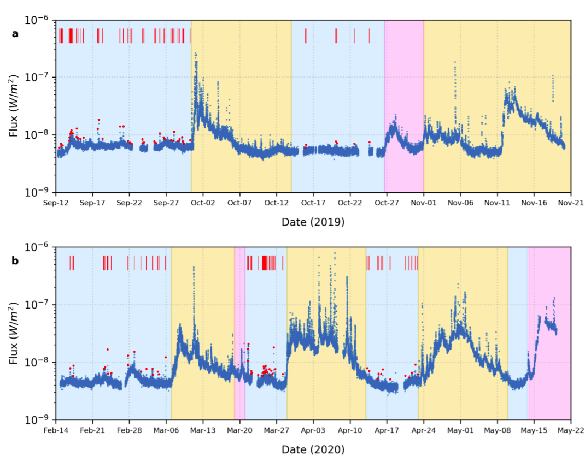

The outer atmosphere (the corona) of the Sun poses a long standing mystery regarding its tem-perature.  The solar corona is composed of plasma (ionised gas) that emits strongly in X-rays andultraviolet radiation.  Its temperature exceeds a million degree kelvin, while the visible surface (thephotosphere)  is  at  6000K.  One  of  the  theories  to  understand  the  so-called  ’coronal  heating  prob-lem’ proposes the occurrence of a large number of small scale explosions (known as microflares andnanoflares) on the Sun.  It is known that these flares are a manifestation of the magnetic field of theSun that is generated in its interior.

Fig.1 - Caption to this image can be  used like this

But the Sun’s magnetic field is not constant, it varies with anaverage period of 11 years, which is known as the solar cycle.  Approximately every 11 years, the Sun’smagnetic field reverses.  In other words, the north pole becomes the south pole, and vice versa.  The flip of the poles is an end product of the slow evolution of Sun’s magnetic field over time.  As the cycle progresses,  all of the Sun’s activities related to its magnetic field (such as sunspots,  flares,  coronalmass ejections) builds to a maximum (when the magnetic field reverses).  Then the Sun settles backdown to a minimum, before the whole cycle starts again.  The Sun was in a very low state of activityduring the minima of solar cycle 24 covering the year 2019.  It was in fact the quietest the Sun has been in the last 100 years!

During this quiet period of the Sun, at the mid of the year 2019, Chandrayaan 2 was launchedwith the several instruments/payloads to observed our moon and the Sun.  Among them CLASS is aninstrument to understand the abundance of elements present on the moon. But this requires knowledgeof the X-rays emitted from the Sun.  Thus, the orbiter also carried an instrument called Solar X-rayMonitor (XSM). XSM observed the Sun during its deepest minima of solar cycle 24, covering the year2019-2020 with a good temporal and energy resolution.  Using observations during this time, SantoshVadawale and his team has uncovered some fascinating information about the quiescent Sun.  Theyhave shown that during this period small scale transients, so-called microflares (smaller counterpartof the conventional solar flares) are occurring everywhere on the solar disk.Solar flares are eruptions of electromagnetic radiation of all wavelengths from the Sun.  They lastfrom a few minutes to a few hours.  Flares are classified depending on the energy they release during its  peak  in  the  soft  X  rays.   Though  the  number  of  large  flares  increase  with  the  progress  of  thesolar cycle, this study suggested that small flares, called microflares, keep exploding on the Sun at alltimes.  Though the definition of microflares has varied though the years due to the sensitivity of theinstrument, in this study flares having a peak flux below 10−8W m−2are considered as microflares.During this period of extremely quiet solar corona when no active regions were present on the disk,Santosh  Vadawale  and  team  identified  a  total  of  98  microflares  from  76  days.   The  microflares  aremarked in the lightcurve (Figure 1).  Most of the microflares were seen to behave similar to largerflares having a fast rise and a slow decay.  Some microflares did not follow this behaviour possibly1
due to blending of multiple microflares or they intrinsically have a different origin.  The temperatureand emission measure of these microflares are determined.  Temperature tells how hot the plasma getsduring the explosion while the emission measure gives an idea about the density of plasma emittedat that particular temperature.  The temperature is found to be between 3-6 MK and the emission measure is in the order of 1046cm−3.

The  XSM  microflare  locations  are  identified  in  the  extreme  ultraviolet  images  obtained  fromNASA’s ‘Solar Dynamics Observatory’ and from the X-ray images obtained by the Japanese HINODEX-ray Telescope. Most microflares were seen to be associated with X-ray Bright Points. ‘Solar Dynam-ics Observatory’ HMI magnetograms were used to analyse the corresponding photospheric magneticfield.  They observed the microflares to be associated with magnetic bipolar regions having weakerfield strengths, which indicates magnetic reconnection happening at smaller scales (Figure 2).This is also the first statistical survey of X-ray microflares outside active regions.  By plotting thefrequency distribution of microflares, the team has given evidence for the hypothesis that small scaleheating events occur everywhere on the Sun and they contribute to coronal heating.

**Original paper:**
<a href="https://iopscience.iop.org/article/10.3847/2041-8213/abf0b0" target="_blank"> Observations Of The Quiet Sun During The Deepest Solar Minimum Of The PastCentury With Chandrayaan-2 XSM – Sub-A Class Microflares Outside Active Regions</a>

**First Author:** Santosh Vadawale

**Co-authors:** N. P. S. Mithun, Biswajit Mondal, Aveek Sarkar, P. Janardhan, Bhuwan Joshi, AnilBhardwaj,  M.  Shanmugam,  Arpit  R.  Patel,  Hitesh  Kumar  L.  Adalja,  Shiv  Kumar  Goyal,  TinkalLadiya, Neeraj Kumar Tiwari, Nishant Singh, Sushil Kumar

**First author’s Institution:** Physical Research Laboratory, Ahmedabad

<noscript>Please enable JavaScript to view the <a href="https://disqus.com/?ref_noscript">comments powered by Disqus.</a></noscript>
