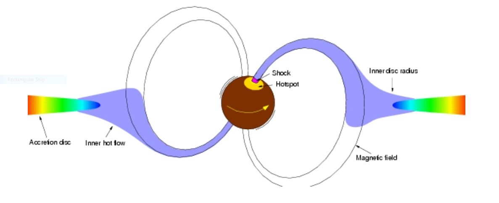

### Estimating the strength of the magnetic field of a neutron star in a binary star system 'Cen X-3'

---
>Researchers from Raman Research Institute (RRI), Bangalore, report the detection of cyclotron resonant absorption feature (CRSF) in the X-ray spectrum of the binary star system ‘Cen X-3’. The magnetic field of the neutron star in Cen X-3 is estimated from the CRSF. This work is a step forward in understanding the nature of humongous magnetic fields of Neutron Stars.
>
---

Researchers from Raman Research Institute (RRI), Bangalore, report interesting findings about the binary star system **‘Cen X-3'** from the constellation 'Centaurus', one of the most luminous X-ray sources in our galaxy and the first-ever X-ray pulsar to be discovered. Their findings published in the *Monthly Notices of Royal Astronomical Society*, uses data from the **Nuclear Spectroscopic Telescope Array (NuSTAR)** of *NASA* and **Suzaku**, an X-ray satellite operated by *Japan Aerospace Exploration Agency*.  Cen X-3  is a two-star system consisting of a pulsar - a highly magnetized neutron star beaming X-rays - and a companion star. The magnetic field of a neutron star in Cen X-3 is estimated in this work. The findings also provide insights into understanding the nature of humongous magnetic fields of Neutron Stars.
Imagine a star as massive as our Sun but only a few kilometers across in size: that’s a **neutron star!** It is so dense that the mass of the entire living human population could fit into a sugar cube-sized neutron star matter. In other words, it is like an entire Mount Everest squeezed to fit inside a coffee cup. Owing to their extreme density, the gravitational field of a neutron star is the strongest except for black holes. In fact, if they were any denser, they would become black holes themselves. Neutron stars have some pretty bizarre properties. Their gravity is strong enough to bend light. They are extremely hot, with a surface temperature of nearly a million degrees Celsius.
Even stars hate to be alone! The majority of the neutron stars like the one in Cen X-3 are a part of a binary star system with the main sequence or post main sequence star as a companion. The neutron star gravitationally accretes matter from its companion star. The accretion disk is formed around the neutron star when the angular momentum of the accreted matter is too large for the direct impact onto the neutron star surface.

  

 Figure 1: Inside the magnetosphere, the accreting matter is channeled along the magnetic field lines and onto the magnetic poles forming an accretion column. 
Image used here is available at  <a href="http://www.issibern.ch/teams/observephysics/">this</a> URL.

Accretion of matter onto a compact object such as a neutron star or black hole is one of the most efficient ways known for extracting energy from matter. The denser the object, the higher is the efficiency! Part of this energy is emitted in the form of electromagnetic radiation. The magnetic field of a neutron star is almost a *trillion* times greater than that of the Earth. Such a high magnetic field dictates the accretion flow inside the magnetosphere. The accreting matter is channeled along the magnetic field lines and onto the magnetic poles forming an accretion column. The neutron star's rotational axis is not necessarily aligned with its magnetic axis. Such misalignment gives rise to *highly periodic pulsations* hence the name **'pulsars'**.

  

 Figure 2: Illustration of an accretion-powered pulsar. The magnetic axis sweeps earth in every rotation of the neutron star due to misalignment between the rotational axis and the magnetic axis giving rise to highly periodic pulsations. 
The image used here is available at <a href="https://www.nrao.edu/images/pulsar_web.jpg"> this </a> URL.

According to the principles of quantum mechanics, all particles show wave-like characteristics. The wavelength associated with the particle is called the *De Broglie wavelength* (λde broglie = Planck's constant/momentum). The length scales that we deal with in day-to-day life are much larger than the De Broglie wavelength of the particles. The wave nature of the particles and associated quantum mechanical phenomenon becomes apparent only when the length scale of the system is comparable to its *De Broglie wavelength*.

  

 Figure 3: Landau quantization and resonant scattering 
Image courtesy: <a href="https://in.linkedin.com/in/ashwin-devaraj-975802119">Ashwin Devaraj (IISc-JAP)</a>

In the presence of a magnetic field, the charged particles in the accretion column rotate around the magnetic field lines in a *helical trajectory*. Larger the magnetic field, the smaller the radius of gyration. The orbits and corresponding energies are quantized due to a phenomenon called landau quantization; however, its effect becomes significant only in the presence of an extremely strong magnetic field where the radius of the gyration of the infalling particle is of the order of its De Broglie wavelength.
The photons generated during the accretion undergo scattering with the relativistically infalling matter in the accretion column. Due to resonance, the likelihood of scattering i.e. the scattering cross-section is maximum at the quantized Landau energy levels resulting in the absorption-like feature at those energies in the X-ray *spectrum* (energy distribution of the incident light). This feature is called a **cyclotron resonant scattering feature (CRSF)**. Figure 3 illustrates the quantization of the orbits and the resonant scattering of photons.
**Gunjan Tomar (RRI, Bangalore) and the team** studied CRSF originated due to the scattering of photons with electrons in the X-ray spectrum of Cen X-3. The energy of the CRSF is directly related to the strength of the magnetic field. It is the only direct way to measure a neutron star’s magnetic field strength. The energy of the electron CRSF feature was observed to be around **30 KeV**. The neutron star magnetic field can be estimated to be around **2.6 x 1012**  Gauss from this.
The strength of the magnetic field of the neutron star increases steeply as one approaches the stellar surface. The CRSF energy is related to the magnetic field strength and thus depends on where the CRSF originates. The matter accretion rate which is directly related to the source luminosity is thought to affect the location of the origin of the CRSF feature. The relation between the CRSF energy and the source luminosity would strengthen the above argument. However, researchers could not find any such relation.
This research is a step forward in **understanding the gigantic magnetic field of a neutron star** and its role in the accretion of matter.

**Original paper:**
<a href="https://ui.adsabs.harvard.edu/abs/2021MNRAS.500.3454T/abstract" target="_blank"> New measurements of the cyclotron line energy in Cen X-3</a>

**First Author:** Gunjan Tomar

**Co-authors:** Pragati Pradhan, Biswajit Paul

**First author’s Institution:** Raman Research Institute, Bengaluru

<noscript>Please enable JavaScript to view the <a href="https://disqus.com/?ref_noscript">comments powered by Disqus.</a></noscript>

----
