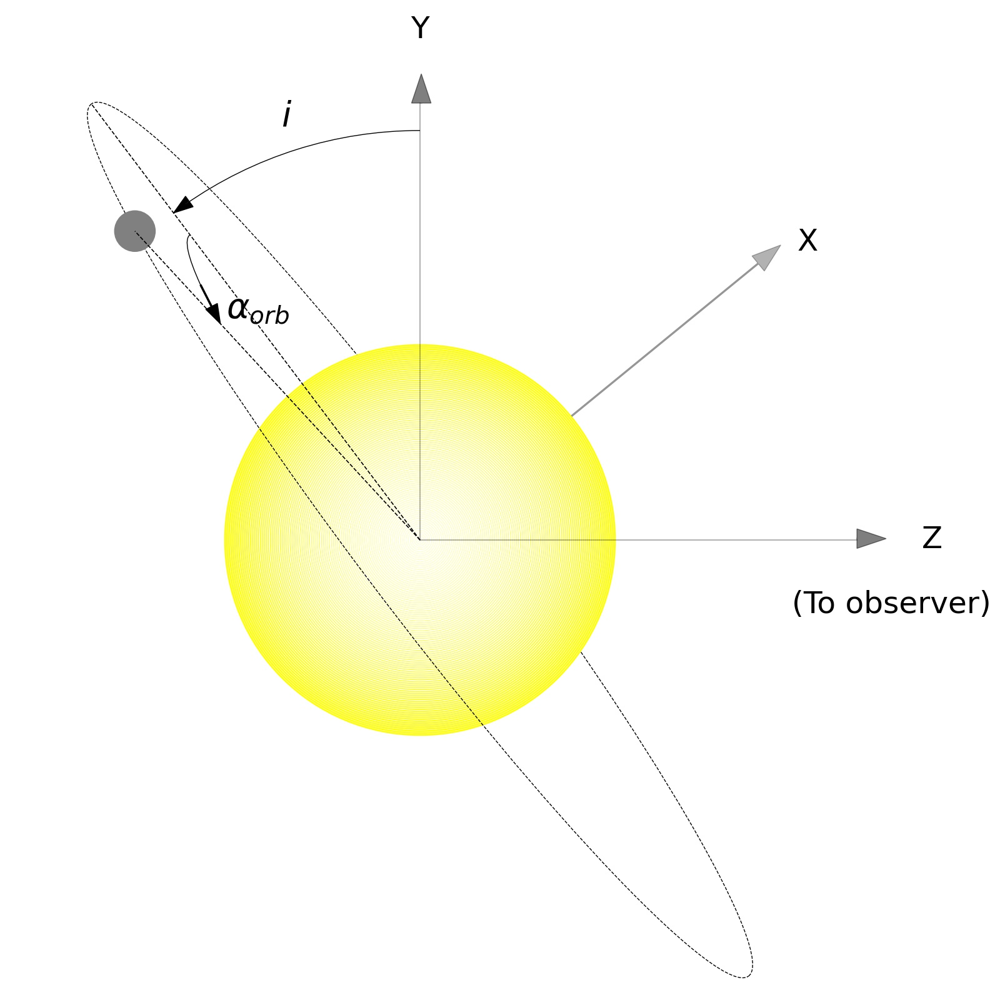
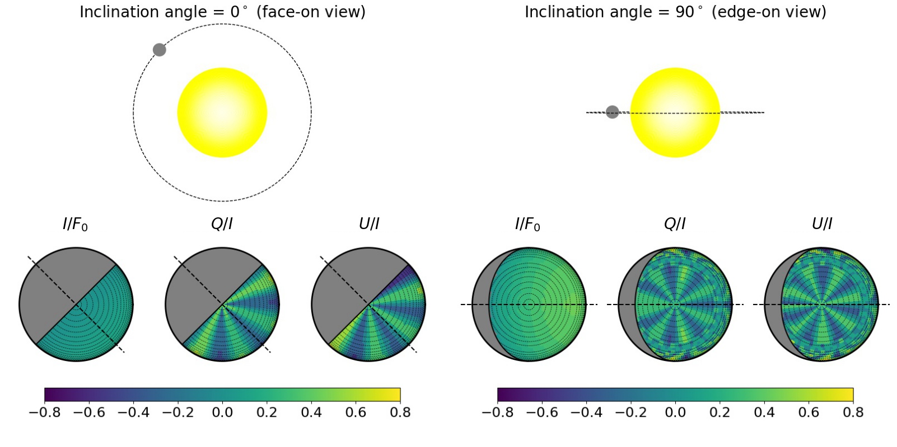

>Polarization is an emerging technique in the field of exoplanets. Understanding the basic physics behind the polarization of the light observed from the planets can help us study them in detail. One such aspect is to study the polarization of the reflection from the exoplanets, which can tell us about their atmospheres, especially the clouds present in them and also, the surface features. Several big-budget missions are being planned for polarimetric observation of the exoplanets. Theoretical simulation and modeling of planetary polarization plays an important role in this regard as they help us decide the targets as well as prepare the roadmaps for those missions.
>
---

After the discovery of thousands of exoplanets, the scientists are on a desperate quest to arrive at new direct and indirect techniques to get a complete picture about the formation, dynamics and the atmospheres of the exoplanets. In that regard, polarimetric techniques have opened a new window into the study of the exoplanets by overcoming many of the limitations of the traditional techniques.
Light is a wave of electric and magnetic fields. These waves oscillate at random direction perpendicular to the propagation of light. When light gets scattered by atoms, molecules or cloud particulates in the atmosphere or reflected by a surface, the waves oscillate in a particular direction. Then the light is called to be linearly polarized. An instrument called a polarimeter can measure the amount of polarization as it allows light waves oscillating only in a particular direction to pass. For example. if we watch the sky by using polarized sunglasses, we can see a change in the brightness of the sky at different directions. This is because of the fact that sunlight gets polarized due to scattering by the molecules and the dust particles in the atmosphere. Similarly, when planets reflect the light of the parent star, that light gets polarized. As a consequence, the reflected light of all the planets in the Solar system is polarized. So, we can leverage this property of light to study the reflecting exoplanets as well. Detecting light reflected from the exoplanets is difficult as the reflected light is feeble compared to the starlight itself and on top of that, only a small fraction of that reflected light is polarized. Moreover, in the case of planets that cannot be resolved from their host stars, the light from the host star contaminates the planetary light and the observable polarization in such a case can be as low as a few parts per million (10-6 order). As a result, detecting this polarization is extremely challenging. However, there are a few high-end instruments such as <a href="http://newt.phys.unsw.edu.au/~jbailey/hippi.html">HIPPI</a>, <a href="http://newt.phys.unsw.edu.au/~jbailey/planets/polarimeter.html">PlanetPol</a>, <a href="https://iopscience.iop.org/article/10.1086/595966">POLISH</a>, among others which are capable of detecting a polarization signal at parts per million (ppm) level. We have worked on a detailed theoretical calculation of the polarization observable from the Jupiter-like exoplanets. This will guide the existing instruments in framing observational strategies and will also help in the design of the future sophisticated instruments for detecting polarization from exoplanets. We published this work in the Astrophysical Journal (link given below). The projection of a 3D planet on sky facing us is a 2D disk (for example, the lunar disk) which is almost circular in shape. We developed a Python-based radiative transfer code (see Ref. 4) for the numerical simulation of the polarized intensity at each point on such a disk of a planet. We, then, calculated the total intensity by averaging this intensity over the disk, since we cannot resolve the planetary disk. The polarization of light from opposite hemispheres tend to be in opposite directions (see Figure 2). As a result, after disk averaging, the opposite polarizations tend to cancel out each other. This is why the disk averaged polarization from a star or a fully illuminated planet is close to zero. However, since the illuminated portion of the planetary disk varies with its phase angle (αorb; like when we see different phases of the Moon), the degree of polarization also changes. Polarization of the light reflected from a planet is maximum at half phases (αorb= 900 or αorb= 2700) and minimum at full phases (αorb= 00 i.e. when fully illuminated or αorb= 900 i.e. when fully dark). Another factor determining the degree of observable polarization is the orbital inclination (i) of the planet (angle at which we view the orbital plane of the planet; see Figure 1) i.e. whether the planetary orbit is at an edge-on view (transiting planets; i=900 ), or at a face-on view (i=00 ) or is at an intermediate angle.

  

 Figure 1: Schematic diagram of a planet at an orbital phase αorb orbiting with an inclination angle i.

---

  

 Figure 2: Intensity of the total reflected light and the polarized light (Q/I and U/I) in the visible wavelengths at different points of the partly illuminated face (orbital phase being 450) of the Exoplanet orbiting at face-on and edge-on views, two extreme cases of orbital inclination. Positive (greenish) and negative (bluish) polarizations produced at different longitudes tend to cancel out each other. The net non-zero detectable disk-averaged polarization arises because of an incomplete cancellation owing to the geometric asymmetry.

---

  

 Figure 3: Predicted percentage of detectable disk-averaged polarization in the visible wavelength region and at different orbital phase angles of a cloudy exoplanet orbiting at different inclination angles. The polarization is constant with time if the planet is viewed face-on (i=00). For all other inclination angles, the polarization is maximum during the two half phases of the planet and minimum during the full phases i.e., when the day (αorb=00) and the night (αorb=1800) sides face the observer.

---

Unlike the traditional and popular methods such as Transit Photometry and Radial Velocity methods which can detect planets only if they are viewed almost edge-on, polarimetric method can detect and probe exoplanets orbiting with a broad range of orbital inclination angles. Hence, we can use this technique to detect exoplanets in future. Moreover, polarimetric studies can complement the other studies providing us with deeper insights into the structure of the atmospheres, especially about the clouds and hazes in the atmospheres as well as the surface features (for rocky planets) of the exoplanets. Using this powerful technique, we will be able to even detect liquid water on the surface of the exo-Earths in the future!

*For more details, Aritra Chakrabarty (aritra@iiap.res.in) can be contacted*

**References:**
1. Bott, K., Bailey, J., Kedziora-Chudczer, L., et al. 2016, <a href="https://academic.oup.com/mnrasl/article/459/1/L109/2589655">MNRAS, 459, L109</a>
2. Berdyugina, S. V., Berdyugin, A. V., Fluri, D. M., & Piirola, V. 2008, <a href="https://iopscience.iop.org/article/10.1086/527320">ApJL, 673, L83</a>
3. Chakrabarty, A., & Sengupta, S. 2020, <a href="https://ui.adsabs.harvard.edu/abs/2020ApJ...898...89C/abstract">ApJ, 898, 89</a>
4. Chandrasekhar, S. 1960, Radiative Transfer (New York: Dover)
5. Lucas, P. W., Hough, J. H., Bailey, J. A., et al. 2009, <a href="https://academic.oup.com/mnras/article/393/1/229/1084577">MNRAS, 393, 229</a>
6. Sengupta, S. 2008, <a href="https://ui.adsabs.harvard.edu/abs/2008ApJ...683L.195S/abstract">ApJL, 683, L195</a>
7. Sengupta, S., Chakrabarty, A., & Tinetti, G. 2020, <a href="https://ui.adsabs.harvard.edu/abs/2020ApJ...889..181S/abstract">APJ, 889, 181</a>
8. Stam, D. M., de Rooij, W. A., Cornet, G., & Hovenier, J. W. 2006, <a href="https://www.aanda.org/articles/aa/abs/2006/23/aa4364-05/aa4364-05.html">A&A, 452, 669</a>
9. Wiktorowicz, S. J., Nofi, L. A., Jontof-Hutter, D., et al. 2015, <a href="https://ui.adsabs.harvard.edu/abs/2015ApJ...813...48W/abstract">ApJ, 813, 48</a>

**Original paper:**
<a href="https://iopscience.iop.org/article/10.3847/1538-4357/ac0bb7" target="_blank"> Generic Models for Disk-resolved and Disk-integrated Phase-dependent Linear Polarization of Light Reflected from Exoplanets</a>

**First Author:** Aritra Chakrabarty

**Co-authors:** Sujan Sengupta

**First author’s Institution:** Indian Institute of Astrophysics, Bengaluru

<noscript>Please enable JavaScript to view the <a href="https://disqus.com/?ref_noscript">comments powered by Disqus.</a></noscript>
