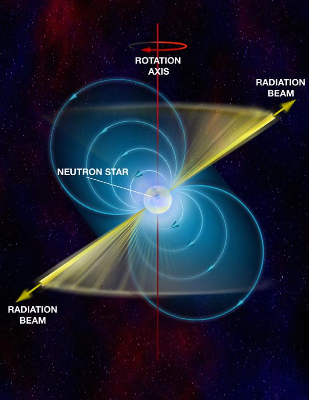
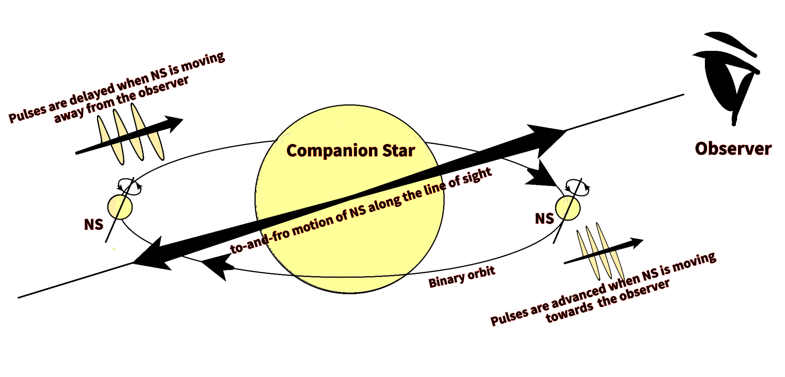

>Researchers from Inter-University Centre for Astronomy and Astrophysics (IUCAA), Pune, present the new measurements of the spin and orbital parameters of the binary star system ‘Cen X-3’. This work is a step forward in understanding the complex dynamics of the binary star systems and their evolution.
>
---

**‘Cen X-3’** is a binary star system observed in the constellation *‘Centaurus’*. It is one of the most luminous X-ray sources in our galaxy and the first-ever X-ray pulsar to be discovered.
Scientists from the Inter-University Centre for Astronomy and Astrophysics (IUCAA), Pune present the **new measurements of spin and orbital parameters of ‘Cen X-3’**. The results are crucial in **understanding the life-cycle and evolution of X-ray binary systems**. The work is published in the *‘Journal of Astrophysics and Astronomy on AstroSat: Five Years in Orbit’*. Researchers used the data from the **Large Area X-ray Proportional Counters (LAXPCs)** onboard **Astrosat**, for the analysis. **Astrosat** is India's first dedicated multi-wavelength space telescope launched by the *Indian Space Research Organisation (ISRO)* in 2015.

**Cen X-3** is a two-star system consisting of a **pulsar**, a *highly magnetized neutron star beaming X-rays*, and a companion star. The neutron star is an extremely compact object; *as massive as our sun but only a few kilometers across in size!* The neutron star in Cen X-3 gravitationally accretes matter from its companion star. The kinetic energy of the infalling matter is converted to other forms of energy including electromagnetic radiation. The neutron star’s magnetic field dictates the accretion flow inside the magnetosphere. The accreting matter is channeled along the magnetic field lines and onto the magnetic poles forming an accretion column. The neutron star’s rotational axis is not necessarily aligned with its magnetic axis. Such *misalignment* gives rise to *highly periodic pulsations* hence the name **'pulsars'**.

 Figure 1: Illustration of an accretion-powered pulsar. The magnetic axis sweeps earth in every rotation of the neutron star due to misalignment between the rotational axis and the magnetic axis giving rise to highly periodic pulsations. 
The image used here is available at <a href="https://www.nrao.edu/images/pulsar_web.jpg"> this </a> URL.

Both stars are gravitationally bound and revolve around each other. The binary orbit can evolve due to matter exchange between the stars, mass loss from the binary system, and due to tidal interaction between the two stars. Studying the evolution of the orbit of such systems is important in understanding stellar structure and evolution. The results of these studies can be a **direct test for stellar structure models and evolution theories**. The **first step in doing such a study is to determine the binary orbit**.   

Figure 2: Determination of a binary orbit from the doppler shift  (NS: Neutron Star), Image courtesy: Author

In systems like Cen X-3, the companion star is almost 10-15 times heavier than the neutron star. Thus the center of mass of the binary system is much closer to the center of the companion star than the neutron star. In such cases, one can visualize the binary orbit, as illustrated in figure 2 where the neutron star is orbiting around the companion star.  Due to its motion in the binary orbit, the neutron star moves back and forth along the line of sight. The observed frequency of the pulses from the neutron star is shifted due to this motion owing to the phenomenon called the **‘Doppler effect’**. Due to this effect, *when the neutron star is moving towards the observer, the pulses arrive faster and when the neutron star is moving away from the observer, the pulses are delayed* as shown in figure 2.
This results in a periodic variation with time in the observed pulse frequency. The rate of this variation corresponds to the orbital period of the system. For a perfectly circular orbit, the pulse frequency variation is sinusoidal. The deviation from the sinusoidal behavior is indicative of the eccentricity in the orbit. Eccentricity is a measure of how elongated the orbit is. The eccentricity of a perfectly circular orbit is zero. The higher the eccentricity, the more elongated the orbit.

The binary orbit can be **determined completely** from this. For a system with a nearly circular orbit like Cen X-3, **parameters that can describe the system dynamics** completely are:

- Neutron star spin period and its rate of change
- Period of the binary orbit and its rate of change
- Orbital velocity and radius
- Eccentricity

The evolution of the orbit can be understood by comparing the orbital parameters at various instances of time.

**Parisee Shirke (IUCAA, Pune) and the team** found that the **spin period** of the neutron star has reduced to **4.80s** from **4.81s**. This means that the neutron star is **spinning up** which is as per its known behavior. However, the rate at which the neutron star is spinning up has halved. This can be due to **variation in the rate of matter accretion from the companion star**. The **orbital period** was found to be around **2.03 days**. The rate of change of the orbital period was observed to be **substantially large compared to the previously reported values**. The authors state that this **could be due to short time-scale variations** in the orbital period. The **orbital velocity** is measured to be around **410 Km/s** which agrees with the previous measurements. The **projected radius** of the orbit has decreased from **39.66 lt-s** to **38.23 lt-s**. This change is **in accordance with the observed orbital decay** in Cen X-3. The binary orbit is observed to be **nearly circular** with a very small eccentricity.

This work is a step forward in understanding the **complex dynamics of the binary star systems and their evolution**.

**Original paper:**
<a href="https://ui.adsabs.harvard.edu/abs/2021JApA...42...58S/abstract" target="_blank"> A New Measurement of the Spin and Orbital Parameters of the High Mass X-ray Binary Centaurus X-3 using AstroSat</a>

**First Author:** Parisee Shirke

**Co-authors:** Suman Bala, Jayashree Roy, Dipankar Bhattacharya

**First author’s Institution:** Inter-University Centre for Astronomy and Astrophysics, Pune

<noscript>Please enable JavaScript to view the <a href="https://disqus.com/?ref_noscript">comments powered by Disqus.</a></noscript>

---
