> A general article exploring some of the most extreme stars of the universe. Each one of them deserves the word 'most' for varied reasons. Just read and enjoy the mysterious cosmos sitting at home.

>
---

## Introduction

The splendor of the night sky has fascinated mankind since time immemorial. The divine beauty of the numerous twinkling stars caught the attention of the human beings since the ancient historic periods. I was also not an exception. I have loved the stars since childhood days. I watch them, observe their properties, research some of them and also like to write about them. The stars are not only for the astronomers, it is for all of us. In fact, recent advances in astronomy have proved that – “we are all Star Childs.” Yes, it may seem unbelievable to anybody who is not aware about astronomy, but it’s true that the elements with which we all and everything around us (like the chair, table, rockets, food, all animals etc.) are made of, were once created inside the centers of the stars. There are as many different kinds of stars, as there are stars themselves, each an individual. The nature of these stars, understanding their properties and evolution tell us the story of our own existence - the birth and death of the Sun on which we all depend.
So, once in a sky observation camp at Murguma, Purulia district, West Bengal of India during the chill cold nights of November, 2007, I suddenly started thinking about the most extreme stars – the record holders in the stellar worlds! Within a year, I collected the details of more than 100 of such stars. Let us discuss about some of them today. After much hard work of about a month, I have selected 14 of them to talk. Though these are my personal favorites, I am sure some of my favorites will become yours also.
Enough of introduction, now let’s dive into the bizarre worlds of the most extreme stars and try to appreciate the immense range of sparkling night sky beauties that nature has to offer.

## Stars of Extreme properties

### 1. ADHARA

<i>
The brightest ultra violet star of the sky known till now.
</i>

  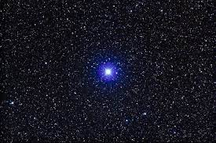

 Fig. 1: Adhara 
Image courtesy: <a href="http://astropixels.com/stars/Adhara-01.html">astropixels</a>

The Northern Hemisphere constellation Canis Major is mainly appreciated for the star “Sirius” – the apparently brightest star of the night sky. But just near it twinkles another second magnitude (visual mag:- 1.51) star – Adhara. Situated at a distance of around 425 light years it marks the western foot of the mythical ‘Great Dog’ – Canis Major. Though we may neglect Adhara, but it is about 50 times further than Sirius – and still a bright second magnitude star. It is visually about 3700 times brighter than the Sun. But when we consider the ultraviolet radiation radiated from its surface, it is about 15,000 times brighter than our Sun! The radius of Adhara is about 13 times that of the Sun.
It has left the main sequence stage and started its journey towards death. Combining these properties it has gained the status to be the brightest ultraviolet star of the sky as seen from Earth. So, if we could have seen in the ultraviolet band of the EM spectrum, Adhara would have been the brightest star of the night sky – not apparently but absolutely!

### 2. BARNARD’S STAR

<i>
The fastest moving star of the sky known
</i>

Located in the constellation Ophiuchus and at a distance of 6 light years – Barnard’s star is one of the closest stars to Earth. Its visual magnitude is 9.5 and is too dim to be observed by naked eye.

  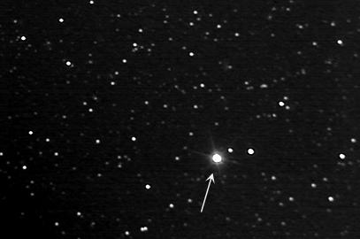

 Fig. 2: Location of Barnard's Star, ca. 2006 (south is up) 
Image courtesy: <a href="https://en.wikipedia.org/wiki/Barnard%27s_Star">Wikipedia</a>

As all the stars of our galaxy go around the Milky Way galaxy on slightly different orbits, their positions change relative to each other. Such motions are extremely slow and
are known as the ‘proper motion’ of stars. These motions are so slow that they are just unnoted and their positions change over a time longer than the history of the printed world. But discovered in 1916 by E.E. Barnard, Barnard’s star moves across the sky at a tremendous speed of 10 seconds of arc per year. Over an average human lifetime, it will move by two – tenths of a degree – almost half the angular diameter of the Full Moon. This may seem incredibly small to anyone reading this article. But it is a celestial record!! Barnard’s star is the fastest moving star known till date.
It will leave Ophiucus for Hercules (on its way to Draco) in about the next 3300 years. When translated to a linear scale, its speed is measured as 140 kms per second – about seven times the speed of an average star. We need a modest telescope and a good star map to observe this ‘Usain Bolt’ of the starry sky. Just try to watch it once.

### 3. CD - 380 245

<i>
The most metal poor star known
</i>

Located at a distance of about 5000 light years in the Southern Hemisphere constellation ‘Sculptor’ this star was first catalogued during the ‘Southern Hemisphere’ sky survey during 1885 to 1930 at the Cordoba Observatory in Argentina. The catalogue of these stars is known as CD. Our star’s bizarre name CD – 380 245 means that it is the 245th star within the band that lies between 380 and 390 South ‘declination’ in the ‘CD’ catalogue.
CD – 380 245 is a record holder due to one of its mind-boggling property. It is the most metal poor star known! Due to its extremely low metal abundance, it becomes difficult to classify this star in a spectral classification scheme. From its spectrum, its iron content is measured to be about ten – thousandth of that of the Sun! It is also one of the oldest known stars.
The Universe was created by an event called Big Bang. It is thought that the Big Bang event created only Hydrogen, Helium and very less amount of Lithium. So, the first stars (i.e. the oldest stars) that formed after Big Bang should have very less metal content. But the point is - we do not find much of these types of metal–poor stars. The question is: where are these first generation stars? Thus, we see that CD – 380 245 not only holds a record, but points to a deep mystery. It is really one of those rare, very old stars whom you can call; hello, the stellar Grandfather!

### 4. ESO 439 – 26

<i>
The faintest known White Dwarf
</i>

When low mass (0.8 – 2.5 Solar mass) or intermediate mass (about < 9 Solar mass) stars die, their carbon–oxygen core become exposed. These end states of low and medium mass stars are called white dwarfs – as they are very hot (so, white) and of very small size (like that of Earth) with diameter of about 10,000 kms (so, dwarf). The density of white dwarfs are extremely large – one sugar cube size mass of a white dwarf will weigh a ton! These white dwarfs are by nature very faint. Generally maximum white dwarfs are spotted in near distances (as we cannot see them at great distances due to their faintness) like the disks of our Galaxy. Their average absolute magnitude is about 16.
But our star – ES0 439-269, located at a distance of about 140 light years in Hydra constellation, has an absolute magnitude of 17.4. This makes it the faintest known white dwarf less than one hundredth the apparent brightness of Pluto! But, just wait friends…
May be it is the faintest – but not the coolest. As we may expect that the faintest white dwarfs will also be the coolest ones – not true for ESO 439-26. It’s surface temperature (4560K) is warmer than the current record of 3500 K (surface temperature) for a bit brighter companion
WDO 346+246 – the coolest known white dwarf. So you see, our general assumptions about nature does not always hold.

### 5. Gamma – 2 Velorum

<i>
A double star with the brightest known Wolf Rayet star
</i>

Also called ‘Ragor’, this star is located about 840 light years away in the constellation Vela. With a visual magnitude of 1.78 it is visually about 11,000 times more luminous than the Sun. Moreover, it is a double star. The components take 76 days to orbit each other and are completely inseparable except by means of sophisticated interferometry. Its spectrum depicts that one of the component is a Wolf Rayet (WR) star.
WR stars were discovered by French astronomers Charles Wolf and Georges Rayet in the nineteenth century. The most striking property of WR stars is that they do not contain hydrogen - the main content of any other type of main sequence star! WR stars are very hot, rare, extremely luminous, and superbly blue in color. They are also losing mass madly. The type of WR star which we are concerned is a ‘WC’ star. It is one of the two kinds of WR stars. WC stars shine the spectra of helium and carbon. Our Gamma – 2 Velorum consist a WC star. Its estimated surface temperature is around 50,000 K. Though it is brilliantly luminous in the visual band of the EM spectrum, its most of the radiation is in ultraviolet spectrum. If all the radiation is combined, this WC star (a component of the double star of Gamma – 2 Velorum) is around 50,000 – 1,00,000 times more luminous than the Sun!
This is the brightest WR star known till date. The WC star has lost almost 20 - 30 times the mass of Sun since its birth and till loses mass at a rate of nearly a ten – thousandth of a solar mass per year. This rate is just horrific. It is around 1 billion (100,00,00,000) times the flow in the solar wind. This wind of the WC star carries out the carbon that was created through helium fusion. The carbon enriches the nearby stellar environment from where new stars may born in distant future. Just think a bit. We can see the primary process which ultimately forms new stars, then may be planets around it and then may be life timming in one of those distant future planets. This particular star thus gives us the flavor of star formation process to be witnessed. Moreover, this star is visible through naked eye from any place south of 400N latitude in the constellation Vela during any suitable time of the year. It is designated as ‘Spectral Gem of the Southern Skies’.

### 6. Geminga

<i>
A weird radio-quiet Gamma Ray pulsar
</i>

A massive star (9 - 25 Solar mass) dies in a violent supernova explosion leaving behind a highly magnetized, extremely dense and small (around only 15 - 20 kms diameter) core made up of completely neutrons. This dead core is called a neutron star. It spins extremely fast (many times per second). As a neutron star spins, its magnetic axis wobbles. It radiates energy along this magnetic axis which is titled to its rotational axis. If the Earth is in the way of such a magnetic axis of any neutron star, then we receive a shot of energy or ‘pulses’ from that particular neutron star. This is why; neutron stars are also called “pulsars” .The magnetic fields of pulsars are about 100 million times that of earth’s magnetic fields. The pulsars spin so fast and energetically that they radiate not only in radio waves, but also in the optical, x-ray and even in high energy gamma-ray domains. These pulses originate from the magnetic fields through the energy of rotation of the pulsars. As pulsars become older, they lose energy and also pulses from top down. The high-energy gamma ray pulses first vanish, then gradually disappear x-ray and optical and at last they are left with only radio pulses.

  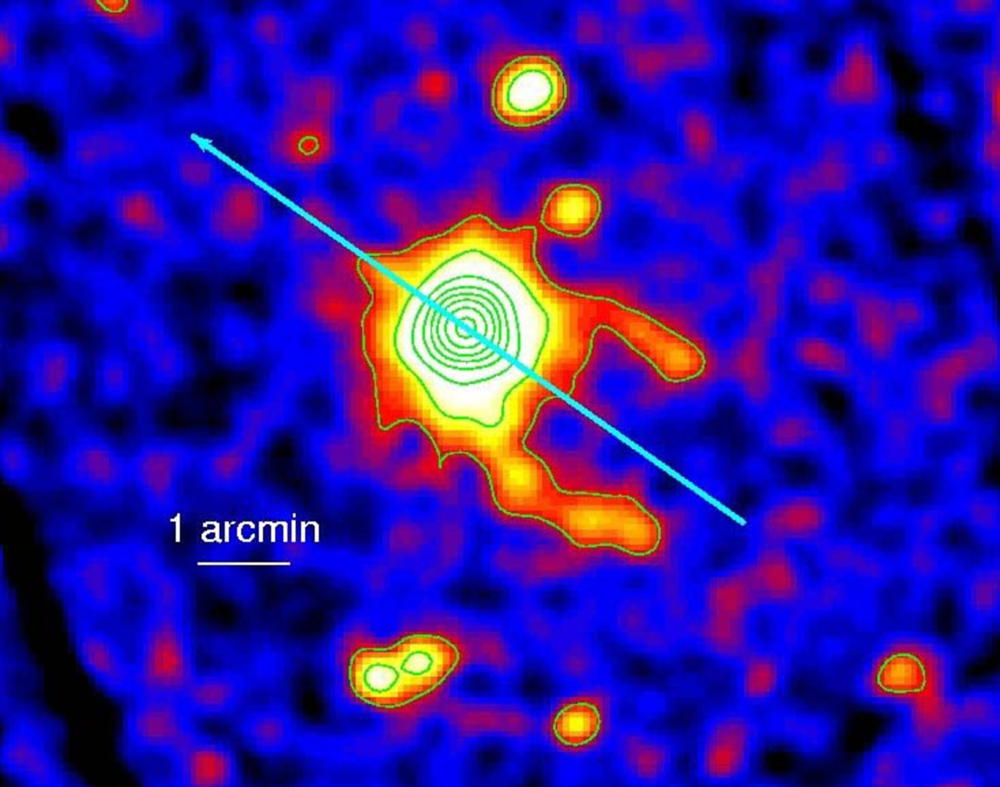

 Fig. 3: Geminga 
Image courtesy: <a href="https://www.esa.int/Science_Exploration/Space_Science/ESA_is_hot_on_the_trail_of_Geminga">ESA</a>

But every radio astronomer got shocked in the year 1973. In 1973, an object was found in the constellation Gemini which was a bright gamma–ray source. More precise observations showed that it is pulsing at x-ray energies with a period of 0.237 seconds (4.2 times per second). It was named “Geminga”. Located 800 light years away, the field of the sky showed few stars when photographed. After much tenuous research, one very dim star (visual apparent magnitude 25.5) was identified as “Geminga”. The bizarre thing is that it is a pulsar which is radiating only high energy gamma rays and x-rays, not in optical and not even in radio! Its surface temperature is between 2,00,000-3,00,000 K and the age is estimated at around 3,40,000 years. It is the first known Gamma-Ray pulsar and extremely rare in its breed. Where are the radio waves? Is it really not emitting any radio emission? Or, is there something else? The answers to all these questions is,
<i>“Nobody knows”...</i>
Just think about “Geminga” which literally means ‘not there’!

### 7. HD93129A

<i>
Probably the most luminous star
</i>

The Southern Hemisphere sky has a spectacular constellation (other than crux the Southern Cross) to watch-Carina. It contains Eta-Carinae: the most massive confirmed star in our Galaxy. Also it has another wonder not quite visible to the naked eye (visual magnitude 7.3):- HD93129A - possibly the most luminous star of the Galaxy.
This star is the luminary of a young dense cluster known as Trumpler 14 which is situated around 9000 light years away. It is a member of a binary system. Both it and its companion (HD93129B) is O3 star. Our star HD93129A, which is a supergiant, has an absolute magnitude of -6.7. If it was as close as the bright star Vega, it would have been far brighter than Venus. The two stars are estimated to have an orbit of at least 50,000 years.

  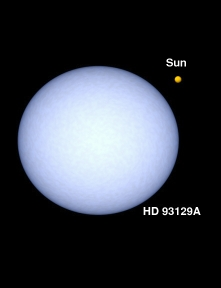

 Fig. 4: HD93129A 
Image courtesy: <a href="https://www.windows2universe.org/the_universe/HD93129A.html">windows2universe</a>

Now look for its luminosity. With surface temperature of about 52,000 K it pours most of its radiation in the ultraviolet range. Combining all types of radiation, it is around 25, 00,000 (2.5 million) times brighter than Sun—somewhat less than Eta Carinae. But there is a catch. It has been revealed that about 1.7 magnitudes of its radiation are absorbed by intervening interstellar dust between it and us. If this absorption would not have absorbed HD93129A’s radiation and considering the huge uncertainties in distance, it could in fact top Eta Carinae’s luminosity. Its birth mass may have been greater than 120 solar masses.
To orbit this star and receive the same radiation as we receive from the Sun on Earth, out Earth would have to be at a distance of 1600A.U away from the star i.e. 40 times the distance between Pluto and Sun. If the companion B star was not there, this hypothetical earth would take about 4800 years to complete one orbit. Just think of a severe harsh winter of 1200 years with temperature falling well below -200 degree Celsius!

### 8. ETA CARINAE

<i>
The most massive known confirmed star in our Galaxy
</i>

  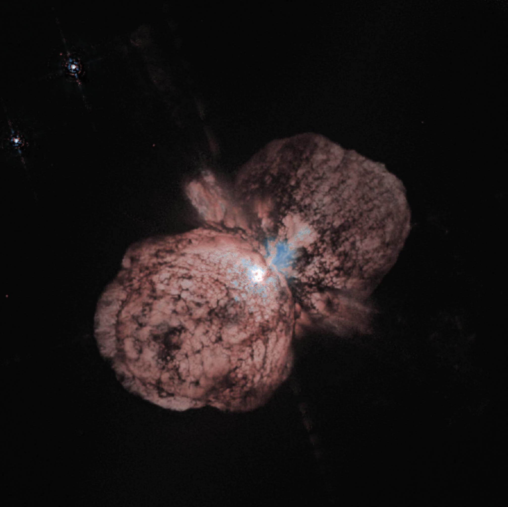

 Fig. 5: Hubble Space Telescope image showing Eta Carinae and the bipolar Homunculus Nebula. 
Image courtesy: <a href="https://en.wikipedia.org/wiki/Eta_Carinae">Wikipedia</a>

Almost 8000 light years away in the constellation Carina lays a monster of the stellar world—Eta Carinae. One of the farthest visible naked eye star (apparent magnitude 5.0), it is around 50,00,000 times brighter than the Sun and buried in a dense cloud of its own making (the ‘Homunculus’ nebula as it is called ). It is an extremely violent star which became brighter than Vega (app.mag-1) in 1840 due to a massive
eruption. Again shining to sixth magnitude in 1890, it faded away later and recently has become visible to the naked eye.
Hubble Space Telescope (HST) revealed that the Homunculus is made of two oppositely moving (speed 400 kms/second) lobes nearly a light year across. They were created in the Great Eruption of 1840. The star’s terrific luminosity suggests a present mass of around 100 solar masses making it the most massive known confirmed star in our Galaxy.
Modern observations in the nebular spectral lines also suggest a 5.6 years orbit pointing to the fact that may be Eta Carinae is a massive binary star system. Current estimates tell that the “primary” star has a mass of around 80 solar mass and the “secondary” has around 60 solar mass. The two may have been born with 200 solar mass.
Recently in 2010, a star named R136a1 has been discovered in the ‘Tarantula Nebula’ of our nearby galaxy ‘Large Magellanic Cloud’. It is estimated to have a present mass of around 260-265 solar mass and is thought to have been born with about 320 solar masses! Though it is under close scrutiny till now, if the mass revealed is true then this will be surely the most massive star known till now.

### 9. R LEPORIS

<i>
The sky’s reddest naked eye star
</i>

Have you seen the constellation Lepus (the Hare) just below Orion? Perhaps some of you know it for the blazing globular cluster M79. But leave M79, Lepus contains a record holding star in it – R Leporis or Hind’s Crimson star discovered by J.R. Hind in 1845. It is a long period variable like ‘Mira’ changing its brightness over a long 430 days period by a factor of 300 (visual magnitude 5.5 to 11.7). Located at a distance of about 820 light years and still to be a ‘Mira’ type variable, R Leporis must be a cool giant. Cool stars are reddish (recall Betelgeuse, Antares). It is 300 times more luminous than the Sun. But as it is a cool star, it emits mainly in the infrared region.

  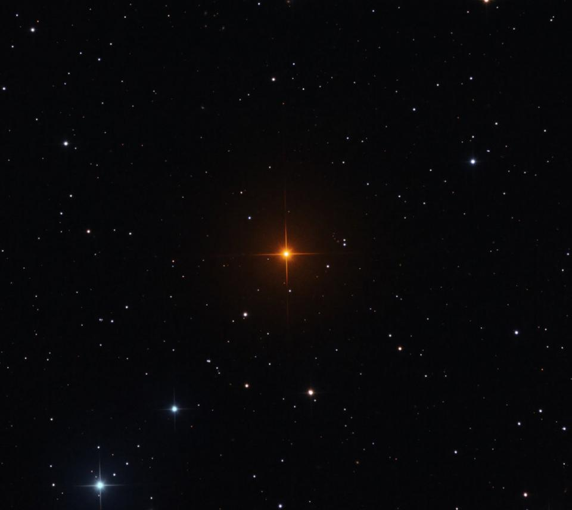

 Fig. 6: The superb red color of R Leporis 
Image courtesy: <a href="https://science.nasa.gov/r-leporis-vampires-star">NASA</a>

There are two factors which contribute to its extreme red color. First it has exceptionally low surface temperature of about 2050K, making it one of the coolest giants known. Second, R Leporis is an arch ‘carbon star’. It is now a full blown carbon star. Injecting this carbon into interstellar space R Leporis is gradually forming a planetary nebula.
Carbon molecules (mainly cyanogen) absorb a huge amount of blue light. So the more amount of carbon and the cooler the star, more and more blue light is absorbed. Thus, carbon stars are very red in colour. R Leporis, due to its extremely low surface temperature takes this redness to the highest limit. It is the reddest naked eye star of the sky!!
Most of the carbon in our Galaxy seems to come from stars like this one. Every one of us is made of stellar dust which was parts of such long gone stars!

### 10. VV CEPHEI

<i>
The largest known star
</i>

About 2000 light years away, in the constellation Cepheus lays a 4.91 visual magnitude (absolute mag – 6.75) M2 class supergiant star VV Cephei. It can dwarf any other known star in the sky due its massive size i.e. radius. It is the largest known star considering its radius. Being a part of a binary system its companion is a hot dwarf star whose spectral class is not properly known. Having a surface temperature of around 3,300 K, this super giant primary star VV Cephei has a luminosity of around 315000 times that of the Sun. From these properties, the radius of this star derived is about 8.0 A.U i.e. 85 percent the size of the orbit of Saturn!!

  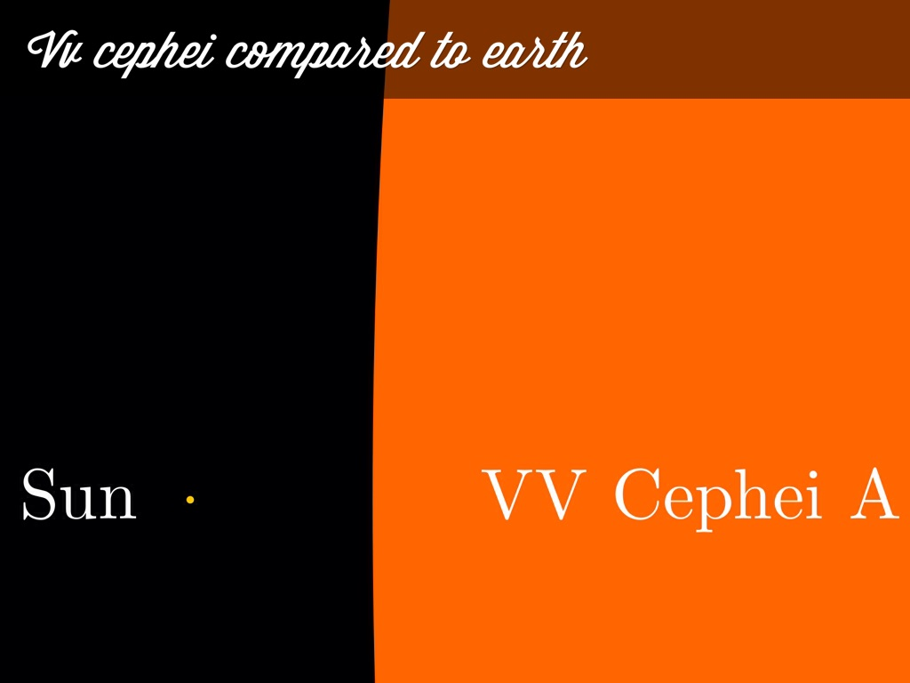

 Fig. 7: Size comparison of VV Cephei A with our Sun 
Image courtesy: <a href="https://stardate.org/radio/program/vv-cephei">StarDate</a>

As it is a part of an eclipsing binary system, its companion dwarf star hides itself every 20.2 years behind this M supergiant. These orbital studies predict the approximate radius of the supergiant M star to be 8.8 A.U. Even a conservative analysis yields 7.4 A.U. This grand supergiant’s size is roughly half the size of its companion star’s orbit! Both the stars are estimated to have 20 solar masses.
VV Cephei is closely followed in the size race by another supergiant (this time a single, not binary) in the same Cepheus constellation: MU Cephei (also called Herschel’s Garnet star). It is the second largest known star with a radius of about 7 A.U i.e. 40 percent larger than Jupiter’s orbit. Its visual magnitude is 4.1 and lies just a bit south of VV Cephei. So both the largest and second largest known stars of the sky can be seen through naked eye.

### 11. ACHERNAR

<i>
The flattest known star
</i>

  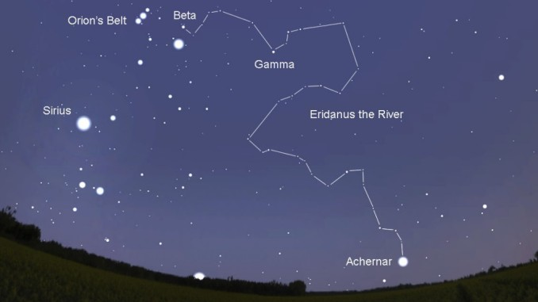

 Fig. 8: Location of Achernar in Eridanus Constellation 
Image courtesy: <a href="https://www.astronomytrek.com/star-facts-achernar/">astronomytrek</a>

The constellation Eridanus starting from just below the brightest star of Orion i.e. ‘Rigel’ is a large constellation with many famous stars. It stretches through the sky towards south and ends at a bright star named Achernar- the brightest star of Eridanus. Not only this, Achernar is also the flattest star known till date! Having an apparent magnitude of 0.5 and at a distance of 143 light years it is rotating at a tremendous speed. This caused an appreciable equatorial bulge. Across its equator it is 55% wider than across its poles. Thus, the star’s equatorial regions are less dense and cooler than the areas near the poles. This phenomenon is called ‘gravity darkening’. Being a very bright star, it is easily observable through naked eye. This makes it a very rare celestial beauty- one of the very few stars in the sky with gravity darkening effect that can be observed easily with unaided eyes.

  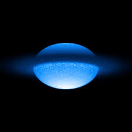

 Fig. 9: Achernar: the flattest star known 
Image courtesy: <a href="https://www.astronomytrek.com/star-facts-achernar/">astronomytrek</a>

### 12. SGR 1900 + 14

<i>
Ultra –Magnetic neutron star that ionized the earth’s atmosphere
</i>

Looking at the beautiful sparkling stars far away from us, please do not think that they cannot create any harm to us from such huge distances. They can really reach us and show how excessively powerful they are- and how extremely helpless and insignificant we are compared to them!
One such major caution came on August 27, 1998 at 10:22 Greenwich Mean time (i.e. 15.52 P.M. IST) from a distance of about 20,000 light years in the direction of Aquila constellation.
A newly formed pulsar is so dense that it develops a solid crust that re-adjusts as its rotation rate slows. The equator is bulged out due to its fast rotation. During this re
adjusting phase, severe star quakes take place releasing immense energy. The bursts of this power can be unbelievable. Some of these pulsars emit relatively low energy gamma rays that last about a hundredth of a second. Such pulsars are called ‘Soft Gamma ray Repeaters’ or in short ‘SGR’.
SGRs are very rare – only four have been found in our Galaxy till now. Two of them, SGR 1806-20 and our one i.e. SGR 1900 + 14 are well studied. SGRs are not only neutron stars – they are radio quiet pulsars like ‘Geminga’. SGR 1900+14 carries pulses of period 5.16 seconds.
In 1992, theoreticians suggested that some supernovae can create neutron stars with unimaginable magnetic strengths, if conditions are correct. They are called ‘magnetars’. The more powerful the magnetic field, the greater the slowing down rate of their spin. The above mentioned two SGRs are actually magnetars with magnetic fields 500 billion times that of the Earth. They carry the strongest magnetic fields of the universe!!
But the story does not stop here. On August 27, 1998 at 10.22 GMT, the magnetar SGR 1900+14 blasted an immense amount of energy towards us - 500,00,00,000 (five billion) times the energy produced by Sun per second. The intense energy radiated from this tremendous outburst immediately saturated the electronics aboard orbiting spacecrafts. Also our atmosphere got terribly affected! The ionosphere we know about is at a height of around 85 kms from Earth’s surface during night time. During day, sunlight ionizes the air and as a result the ionosphere comes to a height of around 60 kms from Earth’s surface.
The outburst from SGR 1900+14 drove the ionosphere from the standard night time level to its standard day time level! SGR 1900+14 is 20,000 light years away. If it would have been 100 light years away- the earth would have been shattered within seconds!
SGR 1900+14 showed the gigantic powers that stars can posses. It also taught us- “Earth is not at all a safe place from the sudden dangers of deep space.”
So you see, the twinkling stars of the sky are not only mere dots, they can reach to us and even touch us!!

### 13. OGLE – TR – 122B

<i>
Smallest known main sequence star whose  radius is measured
</i>

Come to the southern constellation Carina again. Though not visible through naked eyes, it contains another star which is a record breaker among the stellar world. It is OGLE-TR-122B – the smallest known main sequence star whose radius is measured. Being a part of a binary system, this star was spotted by a sophisticated survey called OGLE i.e. Optical Gravitational Lensing Experiment. It has a radius which is only about 20% larger than Jupiter – around 1, 80,000 kms only (our Sun’s radius is 7, 00,000 kms). Its radius is about only 0.12 times the solar radii and mass about 0.1 solar masses. Thus, the average density is about 50 times that of the sun.

  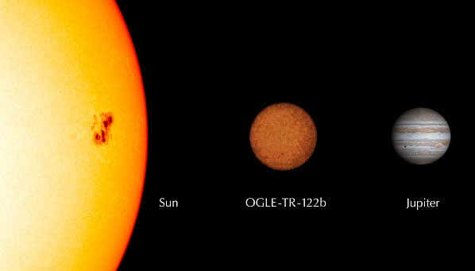

 Fig. 10: Size Comparison of OGLE-TR-122B with our Sun & Jupiter 
Image courtesy: <a href="https://www.newscientist.com/article/dn7098-planet-search-reveals-smallest-star-ever/">newscientist</a>

OGLE-TR-122B has a mass which is close to the lowest possible mass a star can possess for starting hydrogen fusion in its core. It is truly a ‘Little Master’ of the sky, so little that it is a record holder little one.

### 14. Epsilon Aurigae

<i>
The most unusual variable star system known
</i>

Epsilon Aurigae (ε-Aurigae) is a star in the constellation of Auriga. It is one of the most mysterious variable star known till now. Traditionally known as *Almaaz, Haldus* or *Al Anz*, it is a completely unusual eclipsing binary system which consists of a F0 class supergiant star and a companion whose proper identity is unknown till now.
This star is of utter interest due to the nature of its eclipse. Every 27 years, Epsilon Aurigae’s apparent visual magnitude (i.e. brightness) starts to drop down from +2.92, and within a period of 640-730 days (about 2 years) the magnitude drops to +3.83. Then gradually again the brightness starts increasing due to the end of the eclipse.
Also within those 2 years of eclipse process, in addition to this eclipse, the system has a low amplitude pulsation with a non consistent period of about 66 days.
Epsilon Aurigae is an easily visible naked eye star of the sky. But it was the German astronomer Johann Fritsch who first suspected it to be a variable star in 1821. Later observations of Edward Heis and Friedrich Wilhelm Argelander during 1842-1848 confirmed the fact. By their observations it was revealed that ε Aurigae did not just vary over a long period (640-730 days), but also experienced short term variations in brightness as well.
We know that our Moon sometimes eclipses the Sun completely (Total Solar Eclipse). This eclipse time can be up to a maximum of 7 minutes and 29 seconds. But in case of Epsilon Aurigae, the companion object which eclipses the star goes on eclipsing it for a continuous 640-730 days. Also this unknown companion does not emit as much radiation (or light) as expected for an object of such a huge size which can eclipse a supergiant star for 640-730 days! Then what this companion object can be? What is its nature and properties?
This unseen, unknown companion and the mysterious eclipse pattern of the star system have made this star the most unusual, debatable variable star of the sky. The distance of this system from the Earth is also a subject of debate, but modern astronomers place it about 2000 light years from Earth.
This eclipsing component is the center for all attraction today. No one knows properly the nature of the eclipsing component. It emits very negligible amount of light and thus remains invisible to the naked eye. A heated region has been discovered at the center of this object.
The last eclipse of ε-Aurigae started in the International Year of Astronomy: 2009. So, AAVSO (American Association for Variable Star Observation) started a project called Citizen Sky to observe and report the data of this star system. Trained participants also analyzed data while testing their own theories. It was a three year project funded by National Science Foundation which can shed light to the mystery of the star system. The eclipse ended on May 12, 2011. Data was submitted by around 400 observers all over the world.

  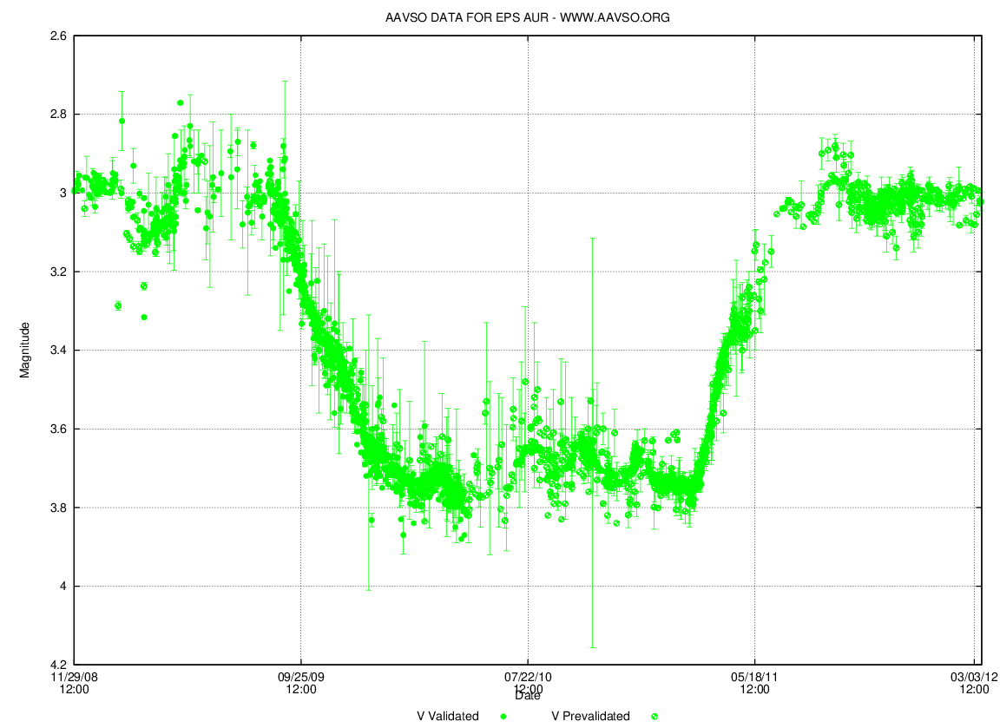

 Fig. 11: The dimming of Epsilon Aurigae with course of time after the start of eclipse 
Image courtesy: <a href="https://en.wikipedia.org/wiki/Epsilon_Aurigae#/media/File:Epsilon_Aurigae_eclipse_light_curve.png">Wikipedia</a>

Many probable theories and hypothesis concerning the nature of this object have come forward. But till now the mystery remains an unsolved mystery. The true nature of the eclipsing component is still a matter of debate.

#### Conclusion

After a journey through the bizarre stellar beauties, one can understand that they are not only tiny twinkling dots in the sky- all of them have a story to tell. Next time when you look towards a clear night sky studded with all these small dots, which we call stars, just think about their amazing powers, extreme size, devastating eruptions from them, unbelievable luminosities and so on. You will surely become quiet, speechless and feel an unearthly peace in mind.

<noscript>Please enable JavaScript to view the <a href="https://disqus.com/?ref_noscript">comments powered by Disqus.</a></noscript>

----
----
