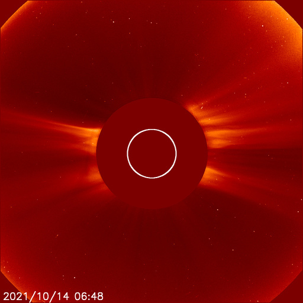

> One of the science goals of the Aditya L1 is to map the coronal magnetic field topology. The infrared channel of the VELC payload of the Aditya L1 is equipped with a spectropolarimeter to perform full stokes spectropolarimetric observations in the Fe XIII 1074.7 nm line to measure the vector magnetic field. This article discusses the design and the working of the spectropolarimeter of the VELC. This article also discusses the challenges associated with the spectropolarimeter of the VELC, which are to optimize the data volume to be sent to the ground as no onboard data processing is planned, and the other is to account for the change in polarimeter characteristic due to mismatch in retarder rotation frequency and the length of signal detection time.
>
---

<a href="https://www.isro.gov.in/aditya-l1-first-indian-mission-to-study-sun">Aditya L1</a> is the first Indian space-based Solar observatory that will continuously observe the Sun to study coronal heating, solar wind acceleration, coronal magnetometry, origin, and monitoring of near-UV solar radiation. It is equipped with seven payloads. One of the payloads is Visible Emission Line Coronagraph (VELC), developed by the <a href="https://www.iiap.res.in/">Indian Institute of Astrophysics (IIA)</a> to study the diagnostic parameters of solar corona and dynamics and origin of Coronal Mass Ejections and magnetic field measurement of the solar corona.

A coronagraph is a telescopic instrument that blocks the light of a star so that the nearby objects which would otherwise be hidden in the star’s glare be resolved. A solar coronagraph occults the bright solar disc to resolve the corona. The VELC is equipped with a spectrograph as a backend instrument. A spectrograph disperses the polychromatic light and records the intensities over a range of wavelengths called the spectrum. We study the properties of the spectrum to estimate the plasma parameters like velocity, electron density, temperature, etc.

  

 Figure 1: A <a href="https://en.wikipedia.org/wiki/Large_Angle_and_Spectrometric_Coronagraph">LASCO</a> C2 Coronagraph. LASCO consists of three coronagraphs (C1/C2/C3) onboard NASA’s Solar and Heliospheric Observatory satellite. 
Image courtesy: <a href="https://www.swpc.noaa.gov/products/lasco-coronagraph">NASA</a>

The VELC is designed to record spectra simultaneously in three spectral lines at 530.3 nm due to Fe XIV (green channel), 789.2 nm due to Fe XI (red channel), and 1074.7 nm due to Fe XIII (IR channel). It is a multi-slit spectrograph (4 equispaced slits) covering the FOV up to 1.5R⊙, where R⊙ is the radius of the Sun. The IR channel is equipped with a polarimeter to carry out full Stokes polarimetric observations of the Fe XIII line. The <a href="https://en.wikipedia.org/wiki/Polarization_(waves)">polarisation</a> of electromagnetic waves refers to the path or the locus of the electric field vector. If the electric field oscillates in a single direction, it is called linear polarisation. If the electric field rotates in a circular plane as the light travels forward, it is called circular polarisation. The plasma’s magnetic field information is encoded in the polarisation of the spectral lines via the Zeeman effect and the Hanle effect.

The <a href="http://hyperphysics.phy-astr.gsu.edu/hbase/quantum/zeeman.html">Zeeman effect</a> is the splitting of the spectral line in the presence of an external magnetic field. The Zeeman splitting of the spectral line gives rise to three spectral components, <a href="http://sun.stanford.edu/~sasha/PHYS780/SOLAR_PHYSICS/L5/Lecture_05_PHYS780.pdf">𝞼+, 𝞼-, and 𝜋 components</a>, which are right circularly polarised, left circularly polarised, and linearly polarised, respectively. If the magnetic field is along the line of sight, in that case, only the 𝞼+, 𝞼- components are observed. If the magnetic field is perpendicular to the line of sight (LOS), all three components are observed as linearly polarised. Also, the separation between these components, an observable quantity, is directly related to the magnitude of the magnetic field. Hence by measuring the polarisation in spectral lines, we can estimate both the magnitude and the direction of the magnetic field in the solar atmosphere.

  

 Figure 2: Subfigure (a) shows the break in the degeneracy between magnetic sublevels in the presence of an external magnetic field, and this break or split of the levels produces three spectral components (𝞼+, 𝞼-, and 𝜋). In subfigure (b), we see if the magnetic field is perpendicular to LOS, then 𝞼+, 𝞼-, and 𝜋 components are observed as linearly polarized. In the subfigure (c), the magnetic field direction is into the plane of the screen (i.e., along the line of sight), therefore only 𝞼+, 𝞼- components are observed as right and left circularly polarized respectively. 
Image courtesy: Author

The Hanle effect is observed when the splitting or separation between energy levels of a spectral line, in the presence of an external magnetic field, is less than or equal to the natural width of that line. The anisotropic radiation coming from the underlying photosphere or chromosphere gets scattered by the atoms in the upper layers like the transition region and corona (TR-corona). This scattering process leads to linear polarization of the emitted spectral lines. This is valid even when there is no external magnetic field. Now, in the weak magnetic field regions such as TR-corona (where expected field strength is 1 to 300 Gauss), there will be a modification of the scattering or linear polarization as well as rotation of the plane of linear polarization of the emitted lines. This effect of modification in the line polarization is called the Hanle effect. By measuring this change in the polarization of the lines, the weak magnetic field can be estimated in the TR-corona of the sun.

As described above, we can estimate the magnetic field in the solar atmosphere by measuring the polarization in spectral lines. A polarimeter is an instrument used to measure polarization. A polarimeter consists of a polarization modulator and a linear polarizer/analyzer. First, the unpolarized light from the Sun enters the polarization modulator which changes the state of input polarization. Then the polarized light from the modulator enters the linear polarizer which cuts the intensity of light perpendicular to its orientation. Hence, we measure at the detector the intensity allowed by the linear polarizer, which in turn depends on the output from the polarization modulator, which in turn depends on the polarization state of the input light of the Sun. By measuring at the detector the output intensity of the incident light of the Sun through the polarimeter and knowing the characteristics of the polarimeter, we can estimate the input polarization.

  

 Figure 3: Figure showing a Retarder acting as a Polarization Modulator and Linear polarizer acting as an analyzer. 
Image courtesy: <a href="https://www.cambridge.org/core/books/introduction-to-spectropolarimetry/78F63E2346A17DA2D401DF3A7D180F49">Introduction to Spectropolarimetry</a>

The VELC polarimeter consists of a continuously rotating wave plate (RWP) followed by a polarizing beam displacer (PBD) as the polarization analyzer. The PBD produces two beams that are orthogonally polarized, which are simultaneously recorded by the detector. This setup is commonly known as a dual-beam polarimeter. The main advantage of dual-beam setup is to reduce the spurious polarisation, i.e., cross-talk from Stokes I to Q, U, and V. The light enters the polarimeter setup (RWP + PBD), and a frame is recorded on the detector. Then RWP is rotated by an angle, and another frame is recorded. To measure the four Stokes parameters (I, Q, U, and V), a minimum of 4 such measurements, called samples, are required at different orientations of RWP. This is called modulation of the polarization state of light. One modulation cycle constitutes 4 samples per half rotation of the wave plate, so one complete rotation of the RWP provides 2 modulation cycles.

Due to the limited number of photons in the solar corona, large integration times are required to build the required signal-to-noise ratio. <a href="https://en.wikipedia.org/wiki/Signal-to-noise_ratio">Signal to noise ratio</a> (SNR) is the ratio of the desired signal strength to the background noise level. When SNR is low, we need to add the signal for many time intervals (integration time), which adds up the signal and reduces or cancels the noise as the noise is assumed random. It poses several challenges concerning the polarimeter of the VELC. One of them is the increased data volume to be sent to the ground station as no on-board data processing is planned. The second is the change in the polarimeter characteristic. In typical polarimeters, first RWP rotates, then the detector frame is recorded, However, in the case of VELC, the RWP rotates, and the detector records independently of each other. There is a mismatch between the retarder’s rotation frequency and the length of the signal detection time, which causes a change in the characteristic of the polarimeter after one cycle of measurements. Nagaraju and the team discuss the above problems and suggest a potential solution to optimize the data volume and account for the change in polarimeter characteristics in successive modulation cycles.

To optimize the data volume, Nagaraju and the team discuss the optimal efficiencies of measuring Stokes parameters as a function of the number of samples per half rotation (n) of the wave plate (RWP) and provide efficiencies when the retarder’s rotation frequency does not match the signal detection time. They find that efficiency slowly increases with an increase in the number of samples per half rotation of the wave plate. They find that the increase in efficiency of measuring Stokes I and Stokes U is close to 10% for the case of n=5 to n=95, for Stokes Q, it is about 8%, and for Stokes V, it is about 4%. However, as the number of samples per half rotation will increase from n=5 to n=95, the data size will proportionally increase, and this will offset any gains in efficiency. They estimate the data size of 3.14 Mb per second for n=4 to 74.19 Mb per second for n=95. Hence they suggest that the number of modulation steps or the samples per half rotation be chosen by considering the data volume and other measurement aspects.

  

Image courtesy: <a href="https://ui.adsabs.harvard.edu/abs/2021ApOpt..60.8145N/abstract">Original article</a>

Nagaraju and the team discuss the change in the elements of polarimeter characteristics with time to understand the effect of the mismatch between retarder rotation frequency and signal detection time. They model this change for the different number of samples per half rotation of the wave plate. They find a cyclical/periodic variation in the elements with time. They find that the larger the time difference between the retarder rotation frequency and signal detection time, the faster is the variation in the elements of polarimeter characteristics with time. Despite the significant variation in individual elements, the efficiency of measuring Stokes parameters does not change significantly throughout integration time. They suggest this change in the elements of the polarimeter characteristics can be taken into account through calibration. They notice that the elements corresponding to measuring Stokes Q and Stokes U vary two times faster than elements corresponding to measuring Stokes V. Hence, recording the calibration data to cover one entire cycle within which elements of polarimeter characteristics corresponding to measuring Stokes V complete one period of variation may suffice.

  

Image courtesy: <a href="https://ui.adsabs.harvard.edu/abs/2021ApOpt..60.8145N/abstract">Original article</a>

Hence, they find that the data volume can be optimized by choosing an appropriate number of samples per half rotation of the wave plate (RWP) without significantly affecting the efficiency of the Stokes parameters. The variation of elements of polarimeter characteristic with time is also addressed due to a mismatch between the retarder rotation frequency and signal detection time, and a potential solution is suggested.

## Acknowledgment:
I would like to thank Raveena Khan, JRF, IIA, for helping simplify the explanation of the Hanle effect and doing the the editing.

**Original paper:**
<a href="https://ui.adsabs.harvard.edu/abs/2021ApOpt..60.8145N/abstract" target="_blank"> Spectropolarimeter on board the Aditya-L1: polarization modulation and demodulation</a>

**First Author:** K. Nagaraju

**Co-authors:** B. Raghavendra Prasad, Bhavana S. Hegde, Suresh Venkata Narra, D. Utkarsha, Amit Kumar, and Varun Kumar

**First author’s Institution:** Indian Institute of Astrophysics, Bengaluru

---

<noscript>Please enable JavaScript to view the <a href="https://disqus.com/?ref_noscript">comments powered by Disqus.</a></noscript>

---
---
