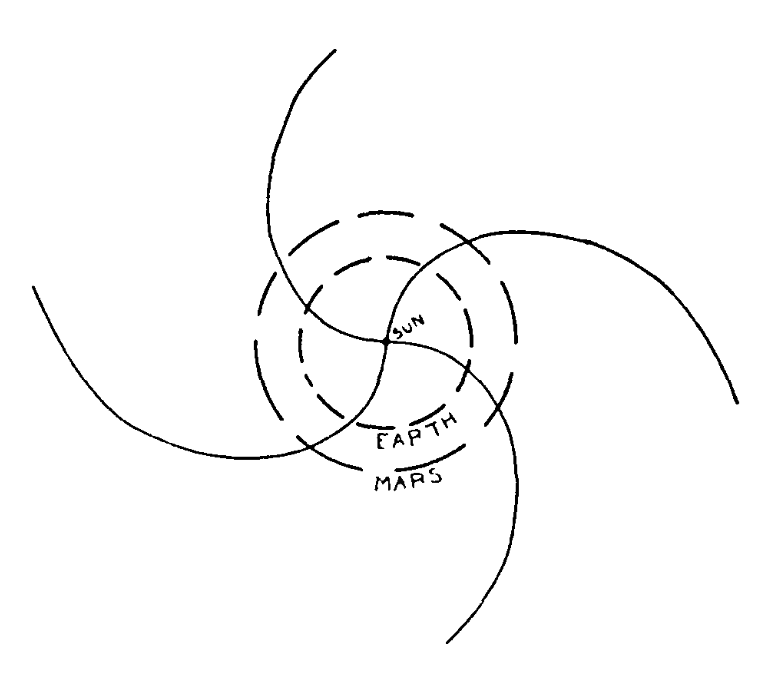
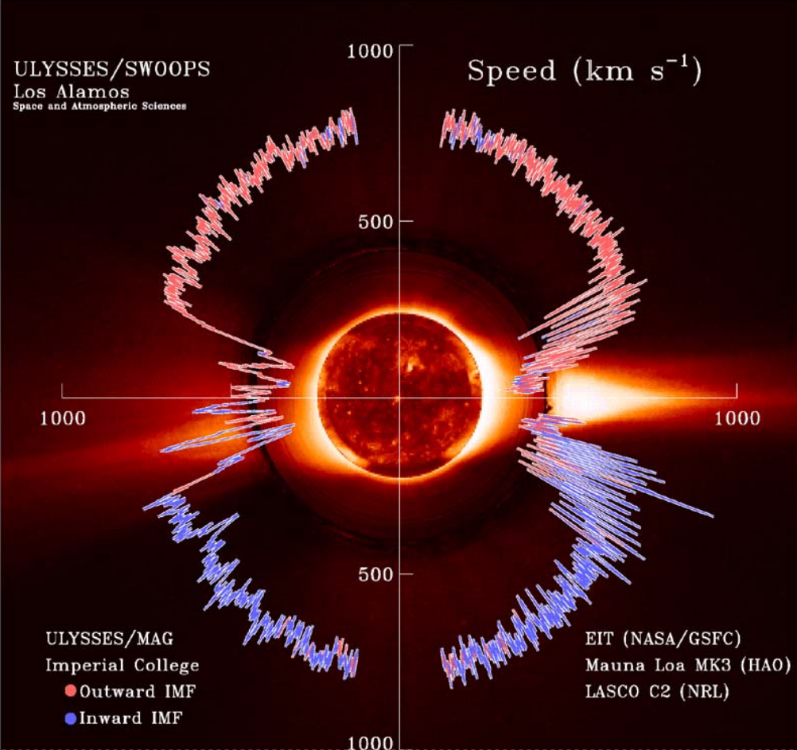
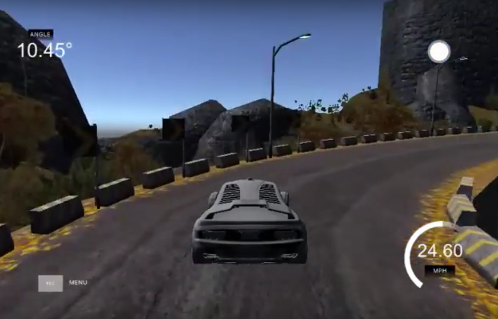
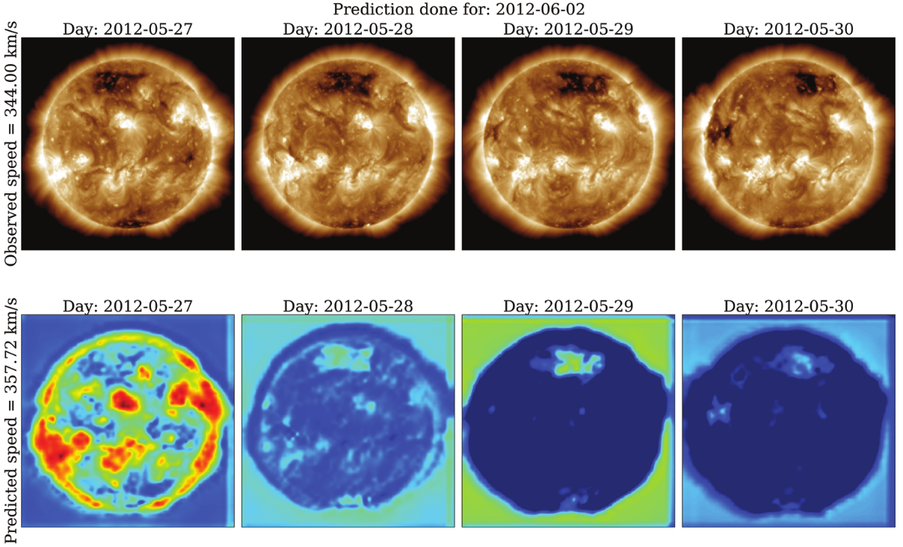

> The focus of this article is solar wind. I first take the reader through the theory & observations, and various properties of solar wind. Then, I take a detour through machine and deep learning which form the basis of our work. Finally, I take the reader through our work on predicting, and investiagting sources of solar wind using deep learning.

>
---

**Note:**
 
 This article was originally given as a talk to the students of the Astro club of Fergusson college, Pune on 24 August 2021 .

---

The night sky is one of the most primal sources of curiosities for many living creatures - more so for humanity. If you live in a village/town without the glaring lights and pollution, you can see the beautiful night sky dotted with stars, and possibly also the majestic *Ganga of the heavens*[^1]. In the backdrop of these stars which follow regular paths in the sky lie the wanderers, who seem to move like kids in a park. Though these wanderers (or Planets, as we know them now) seem to move here and there, they also move in periodic paths that can *very nearly* be predicted. However, humans would see very different objects once in a while- sometimes with a tail of smoke, sometimes falling to the Earth, and sometimes as a guest star. These *apparently unpredictable* events would cause panic in people, and lead to associating such events with ‘good’ or ‘bad’ omens. One such class of objects which have long been observed, and feared by humans is the comets.

Many thousand years have passed since, and now we know what these comets are (and hopefully given up on the superstition!). These are rocky balls covered with dust and ice which orbit the Sun in highly eccentric orbits. This means we see many of these comets extremely rarely -- for instance, we can see Halley's comet only once in 76 years[^2]!

In Fig.1, an image of the comet Hale-Boop is shown. This image came in as an *Astronomy Picture Of the Day*. You will notice that by and large the comet has two general parts -- a “nucleus” and a “tail”. The nucleus is the core, rocky body of the comet, while the tail is the fuzzy smoke-like stream coming out from the nucleus. As you will further notice, there are two tails for this comet. These tails are the white “dust” tail and the blue “ion” tail. If you draw a line connecting the Sun and the comet’s nucleus, the ion tail points directly away from the Sun, while the dust tail lags a bit.

This observation was not missed by astronomers in the 1940s and 50s, and many sought to explain why this was the case. Then, in 1951, Ludwig Biermann proposed that while the dust tail comes due to the nucleus getting hot (so ice simply evaporates), the ion tail comes due to charged particles hitting the comet [(Biermann L., 1951)](https://ui.adsabs.harvard.edu/abs/1951ZA.....29..274B/abstract).

  

 Fig. 1: Dust and Ion Tales of Comet Hale-Bopp. Credit & Copyright: <a href="https://apod.nasa.gov/apod/ap001227.html">John Gleason APOD 27/12/2000.</a>

This was a rather startling proposition. Remember, just a little over 50 years prior to this paper, Michelson and Morley had shown that interplanetary space is empty, with no matter. Then where would these charged particles come from?

In 1958, Eugene Parker at the University of Chicago submitted a paper to The *Astrophysical Journal* on “Interplanetary gas and magnetic field”. He had asked the question: what happens to a star like the Sun, with a hot atmosphere[^3], as we move away from it? Parker had found that the atmospheric pressure pushes the atmosphere into a wind of particles, streaming across the solar system, and into the interplanetary medium. He called this the solar wind. Now, there was no shred of evidence *yet* for such a large scale wind (remember, Biermann had only hypothesized - science needs evidence[^4]), and the referees[^5] rejected the paper while not finding any particular fault with it! But the journal’s editor was Subrahmanyan Chandrasekhar - the man who had theoretically, among other things, predicted that a white dwarf can be stable only within a certain mass limit now called the Chandrasekhar limit [(Venkataraman G., 1992)](https://www.goodreads.com/book/show/2514598.Chandrasekhar_And_His_Limit). Chandrasekhar found Parker’s paper to be well done mathematically, and hence overrode the referees to publish it [(Arnab Rai Choudhuri, 2014](https://www.goodreads.com/book/show/23615374-nature-s-third-cycle)[; Parker, E. N., 1958)](https://ui.adsabs.harvard.edu/abs/1958ApJ...128..664P/abstract).

Parker predicted quantities like velocity and pressure of the solar wind. He also performed a calculation of how the magnetic field of the Sun would look like in the solar wind. He found that the field lines would be buffeted in an Archimedian spiral, shown in Fig.2. In 1959, the Soviet probe [Luna 1](https://nssdc.gsfc.nasa.gov/nmc/spacecraft/display.action?id=1959-012A) was launched with experiments to the moon. However, it performed measurements across the interplanetary space and found signatures of these high speed particles coming from the Sun. Thus, observationally, the hypothesis of the solar wind was validated!

Fig 2: The “Parker Spiral”, taken from Eugene Parker’s original paper. Image source: <a href="https://ui.adsabs.harvard.edu/abs/1958ApJ...128..664P/abstract">Parker, E. N., 1958 </a>

This caused an explosion of science on the solar wind. Then, sometime in the 1990s, the spacecraft Ulysses was launched to study the Sun from its equator to its poles. It tried to associate, on average, the source of the solar wind on the Sun. This observation is shown as the complicated Fig. 3, with an image of the Sun in the background, and the solar wind speed measurements as the lines. To read this plot, imagine that you are moving on a circle around the Sun’s image. The smaller your circle (closer to the Sun), slower is the wind -- larger your circle, the faster the wind is. Ulysses found that the solar wind that comes approximately from the equator is slow - less than 500 km/s  - and highly variable. The solar wind coming from the poles is much faster, peaks at around 700 km/s, and is quite steady. This observation suggested that the solar wind comes in two *modalities* - slow and fast.

Fig. 3: Overlay of SWOOPS solar wind speed and EIT/LASCO/Mauna Loa images of the solar corona. Image credit: <a href="https://sci.esa.int/web/ulysses/-/12399-swoops-solar-wind-speed-data"> ESA </a>

This opened Pandora's box. Scientists started tackling these observations with two questions:
- What are *all* the differences between the fast and the slow wind?
-   Which regions in the Sun give rise to the two wind modalities?
-     What physical processes give rise to the two wind modalities?

Meanwhile, scientists found some clues on all the differences and which regions in the Sun give rise to the two modalities. First, both the winds have quite different compositions. This is an extremely technical topic for a later day, but it is enough to know that different ions are present in different proportions in the slow wind. But what about the “source regions” of the solar wind?

In Fig. 4, I show the results obtained by Wang and Sheeley in 1990. They studied areas on the Sun called Coronal Holes [(Wang and Sheeley, 1990)](https://ui.adsabs.harvard.edu/abs/1990ApJ...355..726W/abstract) (henceforth, I call them CHs), which are seen as dark structures in the solar corona, and represent regions where magnetic field lines are open. Wang and Sheeley found that the fast wind speed showed variations similar to the CH area. So they hypothesized that the fast wind comes, at least in some measure, from CHs.

  
  

Fig 4: Solar wind speed and Coronal hole area comparison across the solar cycle. Notice that as CH area increases, the wind speed increases, and so on. Image courtesy: <a href="https://ui.adsabs.harvard.edu/abs/1990ApJ...355..726W/abstract"> Wang and Sheeley, 1990. </a>

The slow wind, on the other hand, is very tenuous. David Brooks and collaborators measured the composition of the solar corona, and attempted to narrow down on the origin of the solar wind [(Brooks D. et al., 2015)](https://www.nature.com/articles/ncomms6947). Brooks and others found that the Active Regions (ARs)  boundaries show composition similar to the slow wind, and conjectured that the slow wind comes from these regions. The ARs are bright, complex structures that consist of numerous closed loops of magnetic field, holding hot plasma. However, in 2019, the Parker Solar Probe observations showed that the slow wind seems to come from CHs near the equator [(Bale S. et al., 2019)](https://pubmed.ncbi.nlm.nih.gov/31802007/). These are shown in Fig. 5. In summation, these observations showed how we could find potential sources of the solar wind by mapping the “wind properties” to “solar coronal properties”.

  
  

Fig. 5: Left: Slow wind from <b> Active region boundaries </b> by Brooks et al 2014. The blue image is an example of the solar corona, with the bright areas depicting the ARs. The red and green patches show the slow wind sources. Right: <b> Equatorial Coronal hole </b>. The region marked “Perihelion” is the location of the Parker Solar Probe, and the corresponding dark patch below is the potential source region. Image courtesy: <a href="https://pubmed.ncbi.nlm.nih.gov/31802007"> Bale S. et al., 2019 </a>.

Meanwhile, I and collaborators (or rather, my mentors!) were studying a slightly different problem. We were trying to develop a model that can *predict* what the solar wind measured near Earth, given coronal data. Since we don’t know the exact locations of the sources of different solar wind modalities, we were trying to understand how best we can circumvent this problem and automatically figure out the solar wind given an approximate source region. What inspired us?

Artificial Intelligence (AI). When we started our work, we were at the cusp of rapid development and revival of machine & deep learning algorithms. AI is a cool word that generally makes us think of Ultron, Jarvis, Transformers, or even the robot TARS from Interstellar. But in reality, it is a broad term for a set of algorithms that can ‘tune’ and ‘learn’ from the data. A simple example is shown in Fig. 6. What you see here is a game, like Need for Speed. Generally, a player controls the steering and throttle of the car, ensuring it stays in lane (or at least follows a trajectory). Fig. 6 is similar, except that the throttle and steering angle are adaptively ‘learned’ by an AI as we keep feeding in the car images at each instant. The core idea is similar to what is employed by self-driving cars. How cool is that?

Fig. 6: A game showing the motion of a car along a road. No human is playing this game -- rather, a machine learning algorithm is predicting what the steering angle and throttle are, given each frame. Image Credits: <a href="https://sergioskar.github.io/Self_driving_cars/"> Sergios Karagiannakos </a>

We interpreted from such development that the core idea behind such self driving car setups is to consider a time series of images, and generate a set of real values. The AI automatically figures out what the car is, where the car is, how fast it is moving, and so on. The AI does this by “predicting” the throttle and steering angle, matching the actual needed throttle and steering values, and iteratively reducing the error. Think of it as studying for an exam - you attempt to practise tests, and sure you will not get all the questions correct. But as you keep studying, you will keep learning more and more, and keep getting better and better. But what has this got to do with the Sun?

We figured out that we study the Sun simply through a bunch of “images” of the Sun, while the solar wind speed is just a bunch of real values. And so, the solar wind speed prediction is pretty much complimentary to getting self-driving cars moving correctly!

We then went ahead, and developed a complex AI called “WindNet”, which takes in images from the Sun and puts out the solar wind speed as a prediction. The WindNet showed pretty good performance -- in fact, it was much better than the heuristically used models, and could predict 5-7 days in advance! This was a pretty cool result for a model which has no physics as input -- we did not quite tell the model where the solar wind comes from!

Till now people have asked what the solar wind is like, if you give an intelligently guessed region on the Sun. But our work has shown that we can ask the reverse question: with an AI which can predict the wind speed, can we ask which regions on the Sun it thinks are important for wind speed prediction? We asked an AI, trained purely on data, and not fed in with any physics, to answer a physics problem. Will it replicate known physics, or will it answer garbage?

The first question we asked our model was: Where does the fast wind come from? The answer is shown in Fig. 7. The AI thinks that CHs are important for a fast wind prediction, and that too four days before prediction. This was pretty cool -- we have seen that the CHs can give rise to fast wind, and the time taken to reach Earth is within the time frame of fast wind travel time!

Fig. 7: The fast wind prediction, with the solar image on top, and importance map in the bottom. Blue corresponds to less important regions, while red corresponds to more important regions. Image courtesy: Author.

Next, we asked our model: where does the slow wind come from? The response is shown in Fig. 8. The AI thinks that the ARs are important slow wind sources 5-7 days prior to prediction. This is in line with the observation of Brooks and collaborators. However, our AI also thinks the CHs are just a *teensy bit* important for the slow wind prediction. This is in line with the observation of Bale and collaborators. This was very interesting to us - AI systems have the potential to figure out the sources of the solar wind, without explicitly feeding in any physics mapping! How cool is that!

Fig. 8: The slow wind prediction, with the solar image on top, and importance map in the bottom. Blue corresponds to less important regions, while red corresponds to more important regions. Image courtesy: Author.

Finally, we evaluated this result statistically. That is, for all CHs, and all ARs, if one looks at this *average importance*, does it quite conform to known physics? Technical details apart, we found that the fast wind association to CHs was seen clearly by AI, with even the timing coming correct. However, while the slow wind showed strong relation to the ARs, the timing was quite wrong. This tells us that AI presents a potential way of studying the Sun, and the connection between Sun and Earth. However, it also needs to be perfectly trained to generate the mapping, and needs as much data as possible.

This is a new era we enter, with the assimilation of AI with physics to generate models, target specific tasks, and even do good science. Let us take a giant leap forward in a quest to figure out the secrets of the Universe, aided by AI!

[^1]: Akashaganga, or the Ganga of the heavens, is another name for our home galaxy, The Milky way.
[^2]: Oh by the way, Halley’s comet is called a short period comet!
[^3]:If you want to know why the solar corona is hot, check out my other [article](/vishal-machile-learning-solar-corona).
[^4]:According to the old Indian schools of philosophy, Biermann had an Anumana, but lacked the pramana to validate it!
[^5]:Scientists who verify your paper to deem it worthy for publication or not. It is a service we scientists render to the community for proper verification of scientific results.

**Original paper:**
<a href="https://ui.adsabs.harvard.edu/abs/2020SpWea..1802478U/abstract" target="_blank"> Solar wind prediction using deep learning</a>

**First Author:** Vishal Upendran

**Co-authors:** M.C.M Cheung, Shravan Hanasoge, Ganapathi Krishnamurthi

**First author’s Institution:** Inter-University Centre for Astronomy and Astrophysics, Pune

<noscript>Please enable JavaScript to view the <a href="https://disqus.com/?ref_noscript">comments powered by Disqus.</a></noscript>

----
----
