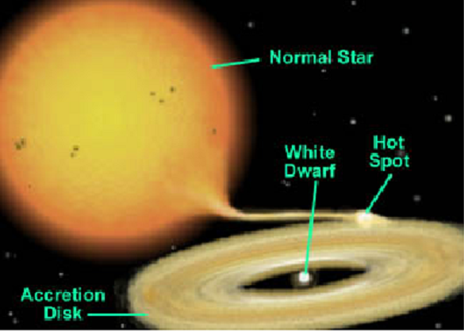
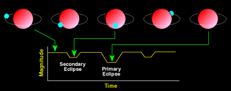

>Curiosity is what has driven mankind to observations of new phenomena. Every twinkling star in the night sky is definitely not due to the atmospheric refraction of earth. Rather, one might be looking at a variable star, each with a different origin story to tell. A study of variable stars enhances our understanding of the universe.
>
---

### 1.	Introduction

One of the first nursery rhymes I might have been introduced to was the popular rhyme, “Twinkle twinkle little star”. Over the years, the verse took a different form once we were introduced to the astronomically correct idea of a star. Now the rhyme reads somewhat like below.

<i>
Twinkle twinkle little star 
You look small cause you are far 
Lightyears out from here to there 
Your light is distorted by the air 
So you twinkle twinkle little star 
</i>

Elementary physics lectures have introduced us to the idea of atmospheric refraction, due to which observed starlight seems to vary in intensity. This phenomenon of twinkling is attributed to the varying densities of the atmosphere. However, not all twinkling stars attribute their twinkle to atmospheric refraction. Some twinkle due to their inherent properties. Such stars are called variable stars.

The time scales associated with stellar evolution are generally so large that the Universe has been traditionally viewed as a static phenomenon. However, we have long known short human time scale events, such as Solar System events and stellar explosions. With the advent of robotically controlled telescopes and high cadence near all-sky monitoring in the last decade of the 1990s, the study of astronomical events on ever shorter time scales has exploded. With access to this new stream of data, our understanding of many phenomena has increased significantly. However, the number of unanswered questions have increased multiple times. One such question addressed the dilemma of why many celestial bodies varied in their brightness. This led to the study in the field of Time-Domain Astronomy and variable stars.

### 2.	Time Domain Astronomy

Time domain astrophysics is a field of observational astronomy that studies the universe on all timescales from less than milliseconds to more than decades and at all wavelengths. This became possible due to the availability of great detectors and computing advances over the past decades. The idea of observations and analysis have now moved beyond the one-off photographic surveys in the past. Beginning from the 1990s, the MACHO(massive astrophysical compact halo object), OGLE(Optical Gravitational Lensing Experiment), and SuperWASP projects used large field of view, highly sensitive cameras on manual or robotic optical or near-infrared telescopes and obtained deep digital images of large swathes of the sky. These scans were repeated to build up vast databases of time-resolved images.

If we were to describe the elementary ideas of time-domain astronomy, we could explain it in the following manner. Observe a particular section of the sky. Note the physical limits visible in that section. After some time t, observe the area under consideration. If any of the physical quantities have changed from earlier, we tag the particular body in the database for future study. The time it takes for the instrument to re-observe the same patch of sky is referred to as the “cadence.” The old strategy of looking deep and far into the Universe is used, and sources of a given brightness methodically mapped out in a three dimensional volume. In time-domain astronomy, sources that vary by some brightness with a rate equal to the inverse of the instrument cadence can be steadily mapped out. In a way, the time-domain adds another dimension, given by the frequency equal to the inverse cadence, to the properties of observed phenomena. The study of variable stars is an essential section of time-domain astronomy.

### 3.	Variable Stars

Omicron Ceti was the first variable star to be identified in 1596 by David Fabricius. Johannes Holwards observed Omicron Ceti pulsating in a regular 11-month cycle in 1638. This discovery debunked the theory that the stars were eternal and invariable as ancient philosophers such as Aristotle had believed.
Variable stars change in brightness over time. These changes can vary from as small as a few parts in a million or by a considerable factor. The changes observed can also range from a few milliseconds to a few years or decades, for that matter. Since many astronomical bodies can qualify as a “variable star”, an array of techniques are devised to discover and analyse the possibility of a variable star. The next obvious question is on the importance of studying variable stars. The study is of importance as the variations provide unique insights about nature, the origins, evolution and often the future trajectory of the star under observance. This information helps us deduce more fundamental knowledge about our universe.

The variations may be due to the rotational motion executed by a spotted star, or due to a star being eclipsed by its companion star, or even by an unseen planet. The variations may also be due to the vibrations of a star. If these vibrations are complex, we might be able to get a rough picture of the internal structure and composition of this star. The variations may be due to eruptions on a star (flares), or an accretion disc (dwarf novae) or major explosions on a star (novae), or to the total disruption of a star in a supernova. Supernovae are one of the most violent incidents in the known universe. However, the existence of life is an indirect result of supernovae. They help to recycle the atoms created in stars into space. Some of these atoms became part of the Sun, others into planets, and for that matter, even the biosphere. It is deduced that the elements heavier than iron were mostly created in the supernova explosion. Supernovae may be dramatic and extreme, but they represent only one of the many roles that variable stars play in modern astrophysics and in our understanding of the universe and the processes which govern it. The organised study and recording of observations led to the establishment of the Variable Star Section of the British Astronomical Association (BAAVSS) in 1890, followed soon after by the establishment of variable star studies at Harvard College Observatory, which eventually led to the founding of the American Association of Variable Star Observers (AAVSO) in 1911.

### 4.	Classification of Variable Stars

The General Catalogue of Variable Stars (GCVS) recommends an official classification system of variable stars based on:

1. Light Curve
2. Temperature
3. Luminosity
4. Population type

Based on this system, a family tree of variable stars can be constructed. Such a tree is called a Variability Tree. A simplified version of the variability tree is given below.

 Figure 1: Variability tree, denoting the various classes of variable stars. The image can be found <a href="https://starlifecycleastro.weebly.com/variable-stars.html">here</a>.

The variable stars are classified into two groups based on the reason of variability in the observed intensities, Intrinsic and Extrinsic variable stars. They are further categorised into sub-classes, which are discussed below.

### 5.	Intrinsic Variable Stars

Intrinsic variable stars vary their light output, hence their brightness, due to the physical variation in the star or stellar system. This type of star provides a large amount of information about the internal structure of the star that helps astronomers to model the stellar evolution. Pulsating stars and eruptive or cataclysmic variable stars belong to this category.

##### 5.1.	Pulsating Variable Stars

Pulsating variables are the stars that show periodic expansion and contraction of their surface layers. The change in brightness occurs due to the change in size or shape. Most of the pulsating stars simply expand and contract repeatedly in a continuing cycle of size changes and this is known as the fundamental mode of pulsation. Some of the changes not only in their size but also in their internal arrangement of material. Some others vibrate in more than one way at the same time and this makes the system complex. Like most vibrating systems, pulsating variables repeat their changes and they tend to be periodic. Depending on the period, on the mass and evolutionary status of the star, pulsating variables are classified into many categories. We shall discuss each sub-category briefly.

##### Cepheid variable stars

Cepheid variables form an important class of pulsating variables. These are large yellow stars pulsating with periods from 1 to 70 days, with an amplitude of light variation from 0.1 to 2 magnitudes. They are very bright objects and have periodic oscillations. Cepheid light curves are distinctive and show a rapid rise in brightness followed by a more gradual decline that is shaped like a shark fin. The spectral class of Cepheid actually changes as it pulsates, being about an F type at maximum luminosity and down to G or K at minimum.

Cepheids follow a period-luminosity relation. Period luminosity relationship states that ‘more luminous cepheids pulsated more slowly’. This concept was put forward by Henrietta Leavitt in 1912.
The period of cepheid can be calculated from its light curve which can be used to estimate the Cepheid’s luminosity. Knowing its magnitude and luminosity we can calculate the distance using the relation

<i>
m - M = 5 log(d/10)
</i>

where *m* is the apparent magnitude, *M* the absolute magnitude and *d* the distance to the star in parsecs.

  

Figure 2: Light curve of cepheid Delta Cephei. The image can be found <a href="https://www.eso.org/public/outreach/eduoff/aol/market/collaboration/varstar/pg2.html">here</a>.

#### Long-period variables

One of the largest population of pulsating variables are the long-period variables (LPVS). They are pulsating red giants or supergiants with periods ranging from 30 to 1000 days. Long-period variables are further subdivided into two major subclasses, the Mira type and the semiregular variables.

##### a.	Mira variable

These are periodic red giant variables that vary with periods of 80 to 1000 days in magnitudes as high as 2.5 in the visible bands. Mira type variables are red giant stars, often of enormous size. Their high luminosity means that they can be detected at large distances. Many of them are slowly ejecting a steady stream of matter into the surrounding space and this mass loss has dramatic consequences on their future evolution. They have weak outer layers in their atmosphere which gets heated from regular pulsations. These are interesting due to their similar size as the Sun and that they are undergoing a late stage of the same evolutionary path that all one-solar mass stars, including the Sun, will experience.

##### b.	Semi-regular variable

Semiregular variables are giants or supergiants which show appreciable periodicity accompanied by semiregular or irregular light variation. Their periods range from 30 to 1000 days, generally with amplitude variations of fewer than 2.5 magnitudes.

##### RR Lyrae

RR Lyrae stars are of short period (.05 to 1.2 days), pulsating white giant stars, usually of spectral class A. They are older and less massive than Cepheids. The amplitude of variation of RR Lyrae is generally from .3 to 2 magnitudes.

##### RV Tauri Star

RV Tauri stars are yellow supergiants having a characteristic light variation with deep and shallow minima. Their periods, defined as the interval between two deep minima range from 30 to 150 days. They show brightness variations of up to 3 magnitudes. Some of these stars show long term cyclic variations from hundreds of thousands of days. Generally, their spectral class ranges from G to K.

  

 Figure 3: Light curve of RV Tauri star R Scuti. Image courtesy: <a href="https://en.wikipedia.org/wiki/R_Scuti"> Wikimedia commons </a>

#### 5.2.	Cataclysmic variable stars

Eruptive variables are stars varying in brightness because of violent outbursts caused by thermonuclear processes in their surface layers. They exhibit significant and rapid changes in their luminosity which is usually accompanied by mass outflow in the form of stellar winds of variable intensity. These are a system of two stars (binary system) orbiting very close to each other. One of them is a normal sunlike or giant star, while the other is a white dwarf. Some of the outermost material from the larger star is pulled away by the white dwarf’s gravity, but this material does not fall directly onto the white dwarf. Instead, it builds up in a disk called an accretion disk, which orbits the white dwarf. Thus, the eruptive variable star is a combination of normal or giant stars, white dwarf and accretion disk as shown in the following figure.

  

 Figure 4: A cataclysmic variable star. The image can be found <a href="http://astrosurf.com/vdesnoux/catvar/catvar.html">here</a>.

The combination of main-sequence or giant stars, white dwarf and accretion disk lead to celestial fireworks. So, instead of varying like pulsating variables, eruptive variables exhibit outbursts of activity. Some events may result in the destruction of the star while others can reoccur one or more times. These are called recurrent novae. The changes in their light curves are usually very unpredictable and tend to be sudden and dramatic.

#### 5.3.	Supernovae

Supernovae are examples of such cataclysmic variable stars. These occur either during the last evolutionary stages of a massive star or when a white dwarf is triggered into runaway nuclear fusion. The original object(progenitor) either collapses to a neutron star or black hole or gets destroyed. We will now look briefly into the types of supernovae.

##### Type I supernovae

These do not exhibit any hydrogen lines in spectra. Type Ia supernovae are understood to arise from white dwarf stars in a close binary system. As gas from the companion star accumulates on the white dwarf, the white dwarf is continuously undergoing compression. At the Chandrasekhar Limit, the white dwarf has accumulated too much mass to resist the force of gravity, thus setting off a runaway nuclear reaction inside. This leads to a cataclysmic supernova outburst. Type Ia supernovas are employed as "standard candles" to measure cosmic distances because they are believed to blaze with equal brightness at their peaks. Hence, they can be used as standard candles to determine the distance to a galaxy once the stretch factor is accounted for.

##### Type II supernovae

A pre-requisite for a star to explode as a Type II supernova is that the star must be several times more massive than the sun (around 8 to 10 Msolar). Once the core of this star runs out of hydrogen and then helium at its core, it moves ahead with the nucleosynthesis process to create heavier metals. As a result, heavier elements accumulate at the centre, similar to a layered onion. Lighter elements are found in the outer regions of the star. Once the star's core becomes heavier than the Chandrasekhar limit, the star begins to implode. This is why these supernovae are called core-collapse supernovae. Eventually, the core starts to heat up and becomes denser. The implosion bounces back off the core and expels the stellar material into space, forming the supernova. Type II supernovae show hydrogen lines in their early spectra.

#### 6.	Extrinsic Variable Stars

Extrinsic variable stars are those in which the light output changes due to some process external to the star itself. The two main classes of extrinsic stars are the eclipsing binaries and rotating variables.

##### 6.1.	Eclipsing binaries

Eclipsing binaries are binary star systems whose members eclipse each other, blocking one another’s light. As a result, the system looks occasionally fainter to observers on earth. The light curve of an eclipsing binary depends on the sizes and brightness of the stars, their separation from each other and the geometry of view from the earth. The process of eclipsing and the corresponding light curve of an eclipsing system is shown in the figure below.

  

Figure 5: Eclipsing binary star. The image can be found <a href="http://www.ifa.hawaii.edu/users/kud/teaching_15/6_DEB.pdf">here</a>.

##### 6.2.	Rotating star

Rotating variables are rapidly rotating stars, often in binary systems, that undergo small amplitude changes in light due to dark or bright spots on the star’s surface which is much similar to sunspots on the sun. Stars with sizeable sunspots show significant variations in brightness as they rotate. Stars that have ellipsoidal shapes also exhibit variation in brightness when they present varying areas of the surface to the observer.

#### 7.	Conclusion

Curiosity is what has driven mankind to observations of new phenomena. Every twinkling star in the night sky is definitely not due to the atmospheric refraction of earth. Rather, one might be looking at a variable star, each with a different origin story to tell. A study of variable stars enhances our understanding of the universe. Cepheid variables help in determining distances to galaxies and determining the age of the Universe. Mira variables help us in making an understanding of the future evolution of the Sun. Accretion disks in cataclysmic variables help us to understand the activity inside active galaxies with supermassive black holes. Type Ia supernovae have helped us conclude on the accelerated expansion of the Universe by acting as a standardisable candle. Transiting extrasolar planets provide clues into the processes of planetary formation.

*(This article is part of the author’s Masters dissertation)*

<noscript>Please enable JavaScript to view the <a href="https://disqus.com/?ref_noscript">comments powered by Disqus.</a></noscript>

----
----
