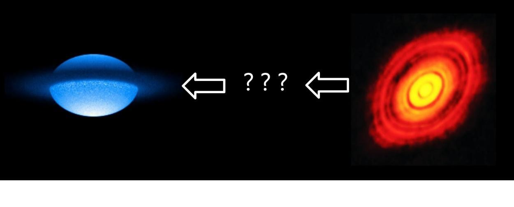
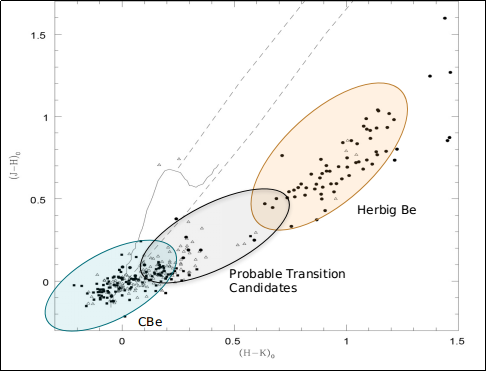

>Pre-main-sequence (PMS) stars evolve into the main-sequence (MS) phase over a period of time. Interestingly, we found a scarcity of studies in the existing literature that examine and attempt to better understand the stars in the PMS to MS transition phase. The purpose of this study is to detect such rare stars, which we named ‘transition phase’ (TP) candidates – stars evolving from the PMS to the MS phase. We identified 98 TP candidates using photometric analysis of a sample of 2167 classical Be (CBe) and 225 Herbig Ae/Be (HAeBe) stars. This identification is done by analyzing the near- and mid-infrared excess and their location in the optical colour–magnitude diagram. The TP candidates are found to possess rotational velocity and colour excess values in between CBe and HAeBe stars, which is reconfirmed by generating a set of synthetic samples using the machine learning approach.
>
---

#### Introduction

A clear night sky offers an ever-changing display of fascinating objects to see - the Moon, planets, stars, even a good number of star clusters and nebulae. Observing the night sky and studying it has a historical place in both ancient and modern cultures. Modern science and present-day technology have certainly provided us the opportunity to view the universe in much depth, thus revealing the deep insights of different cosmic objects, which otherwise remained hidden from human eyes for centuries. We now have a pretty good understanding of the stars, their properties, and their evolution.

It is known that the star formation of massive stars proceeds through well-studied, definitive stages such as the protostar and pre-main sequence phase, before reaching the main sequence. A protostar is a very young star that is still gathering mass from its parent molecular cloud. The protostellar phase is the earliest one in the process of stellar evolution. For a low-mass star (i.e. that of the Sun or lower), it lasts about 500,000 years. In essence, this is the period of a star's infancy. Next, Pre-main sequence (PMS) stars are those which are gradually attaining youth. Hydrogen fusion has not yet started in their cores, but the temperature is gradually rising. Loosely, we can say this is the child cum adolescent stage of a star. Later, when such PMS stars graduate to youth, we call them Main sequence (MS) stars. This is certainly the youth stage of stars where Hydrogen is fusing to helium in their cores, like our Sun.

  

 Figure 1: On the left is a physico-mathematical model of the Be star Achernar, a main sequence star (Image courtesy: <a href="https://www.astronomytrek.com/star-facts-achernar/">astronomytrek</a>). The picture on the right captured by Atacama Large Millimeter array, is of HL Tauri, a pre-main sequence star. (Image courtesy: <a href="https://www.eso.org/public/images/eso1436a/">ESO</a>).

Pre-main sequence (PMS) stars evolve into the main sequence (MS) phase over a period of time. However, whether there exist stars that are in some transition phase between the PMS to MS stage remains an open question among astronomers. An understanding of the transition from the PMS to MS phase is vital to address the astrophysical aspects connected to disc dynamics and the rotation rate evolution of stars. Interestingly, a scarcity of studies is found in the existing literature that examines and attempts to better understand the stars in PMS to MS transition phase. This dearth of study naturally raises a few pertinent questions such as, ‘Why is such a scarcity in the studies of stars in the transition phase from PMS to MS?’ and ‘Which stellar parameter is a clear and definitive indicator to identify such candidates?’. In this context, we conducted a study in the work "Identification of emission-line stars in the transition phase from pre-main sequence to main sequence" to delve into such essential questions.

##### Present Paper: <a href="https://ui.adsabs.harvard.edu/abs/2021MNRAS.507.3660B/abstract" target="_blank"> Identification of emission-line stars in transition phase from pre-main sequence to main sequence</a>

#### Aim

As mentioned earlier, we found a scarcity of studies in the existing literature that examines and attempts to better understand the stars in the PMS to MS transition phase. The purpose of the present study is to detect such rare stars, which we named ‘Transition Phase' (TP) candidates - stars evolving from the PMS to the MS phase. We identified 98 TP candidates using photometric analysis of a sample of 2167 classical Be (CBe) and 225 Herbig Ae/Be (HAeBe) stars. Both CBe and HAeBe examples of a rather uncommon class of stars known as ‘emission-line' stars, which exhibit emission lines of several elements in their spectra.

#### Emission-line stars

Stars usually show absorption lines in their optical spectra. However, there exist stars that also exhibit emission lines of different elements. Broadly known as ‘emission-line stars’, they belong to different categories such as T Tauri, Herbig Ae/Be, Of/ Oe/ Be/ Ae stars, Wolf Rayet (WR) stars, etc. Fig. 2 presents the representative spectra of one Be star HD 55606 showing different spectral features.

A HAeBe star is an intermediate mass PMS star (between 2 and 8 times the mass of our Sun) with a gaseous disc surrounded by a dusty outer envelope <a href="https://www.annualreviews.org/doi/10.1146/annurev.astro.36.1.233">(Waters & Waelkens, 1998)</a>. On the other hand, a CBe star is a type of massive B-type main sequence star that is surrounded by a geometrically thin, equatorial, gaseous, decretion disc that orbits the star in Keplerian rotation <a href="https://www.aanda.org/articles/aa/abs/2007/10/aa4848-06/aa4848-06.html">(Meilland et al., 2007)</a>. The existence of such a circumstellar, gaseous disc was first suggested by <a href="https://ui.adsabs.harvard.edu/abs/1931ApJ....74..225S/abstract">Struve (1931)</a>. One may read the article “Study of exotic Classical Be stars using optical spectroscopy” by Gourav Banerjee to know more about CBe stars and recent developments in the field of CBe star research.

  

 Figure 2: Representative spectra of the star HD 55606 showing different spectral features in the wavelength range of 3800 – 5850 Å. Figure from <a href="https://ui.adsabs.harvard.edu/abs/2021MNRAS.500.3926B/abstract">Banerjee et al. (2021)</a>. The representative emission and absorption lines are indicated with arrows.

Fig 3 shows the connection between absolute magnitude and spectral type of stars, which was not random but instead seemed to fall into discrete groupings, this figure is known as HR diagram or Hertzsprung-Russell diagram. The enclosed regions in the illustration indicate the locations of various kinds of emission-line stars on the diagram. It is clear that emission-line stars are primarily concentrated in the region corresponding to early and late-type stars.

  

 Figure 3: Distribution of different types of emission-line stars in the HR diagram. Figure is taken from <a href="https://ui.adsabs.harvard.edu/abs/2007ASSL..342.....K/abstract">Kogure & Leung (2007)</a>.

#### Brief summary

Some recent studies (e.g. <a href="https://academic.oup.com/mnras/article/388/4/1879/982557">Mathew et al., 2008</a>, <a href="https://www.aanda.org/articles/aa/full_html/2015/07/aa25473-14/aa25473-14.html">Jamialahmadi et al., 2015</a>) presented convincing evidence that stars might possess an unseen and rare transition phase between PMS to MS. One reason why such stars remain unseen to date might be this: during the protostar and PMS phases, a star is usually surrounded by thick discs of dust and gas. This makes it difficult to observe such stars using ground based facilities. <a href="https://academic.oup.com/mnras/article/388/4/1879/982557">Mathew et al. (2008)</a> studied 207 open clusters younger than 100 Myr and identified 152 CBe stars in 42 clusters. Interestingly, they also detected a few more stars that are situated in a region somewhere in between HAeBe and CBe stars in the near-IR color-color diagram. Fig. 4 presents the result which was observed by <a href="https://academic.oup.com/mnras/article/388/4/1879/982557">Mathew et al. (2008)</a>.

  

 Figure 4: The diagram of 157 identified emission-line stars (open triangles) as found by <a href="https://academic.oup.com/mnras/article/388/4/1879/982557">Mathew et al. (2008)</a>. The known CBe stars (filled squares) and HBe stars (filled circles) are also shown in the figure. It is seen that a few stars are located in a region somewhere in between HBe and CBe stars. For representation purposes, the region containing the most concentration of CBe and HBe stars are marked with blue and red ellipses, respectively. The candidates which appear to fall in between these two regions are marked with a grey ellipse. This grey region constitutes stars which we termed as ‘Transition Phase' candidates.

Then it was found by <a href="https://www.aanda.org/articles/aa/full_html/2015/07/aa25473-14/aa25473-14.html">Jamialahmadi et al. (2015)</a> that the star 51 Oph might be a probable example of this class of rare transition stars. According to them, ‘this star appears to be a peculiar source in an unusual transitional state’. This was the motivation for starting our ambitious research project. We analyzed a sample of 2167 CBe and 225 HAeBe stars. The main reason for selecting these two classes of stars is this: HAeBe stars are in the PMS phase, whereas CBe stars are in the MS stage. Hence, our selection helped us to detect those rare stars which are in the transition phase between HAeBe and CBe: meaning stars in between PMS and MS phase. Photometric analysis was performed on the sample of these HAeBe and CBe stars, which were obtained from the literature. Through developing machine learning and statistical technique and analysis, we were able to identify a sample of 98 stars evolving from PMS to MS phase (follow the paper for a detailed understanding of the methodology and analysis).

This separate category of stars is termed as ‘Transition Phase' (TP) candidates by the authors. They are likely to exhibit properties of both HAeBe and CBe stars. Interestingly, the detected 98 TP candidates are indeed found to possess rotational velocity in between CBe and HAeBe stars, which is reconfirmed by the machine learning approach. This provides compelling evidence that these stars might truly be passing through the rare transition phase between PMS and MS. Previous studies reported 14 among these 98 candidates to be HAeBe stars, whereas the other 84 were classified as CBe stars. We estimated the age and mass of 58 among the 98 TP candidates to be ranging within 0.1-5 million years and 2-10.5 times that of the Sun, respectively. However, the detailed properties of these newly identified stars are still unknown.

#### Future Scope

To the best of our knowledge, this is the first and also the largest study till date to detect and characterize TP candidates. Our study will motivate the community of emission-line star research about the significant need of detecting and studying TP candidates in more detail. Since the disc formation mechanism in CBe stars (known as the ‘Be phenomenon’) remains poorly understood after more than 150 years of CBe star research, identification and characterization of a larger number of TP candidates may shed new light on the evolutionary phases of various types of emission-line stars. We were unable to conduct a spectroscopic investigation on our samples since spectra are currently unavailable for the majority of TP candidates. As a result, we want to perform such a study for our newly identified sample of TP candidates in the future utilizing high resolution spectra. Spectroscopic investigations of TP candidates, as well as the comparison of their spectral features with that of CBe and HAeBe stars, will assist in the understanding of their disc characteristics.

**Original paper:**
<a href="https://ui.adsabs.harvard.edu/abs/2021MNRAS.507.3660B/abstract"> Identification of emission-line stars in transition phase from pre-main sequence to main sequence</a>

**First Author:** Suman Bhattacharyya

**Co-authors:** Blesson Mathew, Gourav Banerjee, R. Anusha, KT Paul, Sreeja S Kartha

**First author’s Institution:** CHRIST (Deemed to be University)

<noscript>Please enable JavaScript to view the <a href="https://disqus.com/?ref_noscript">comments powered by Disqus.</a></noscript>

---
---
