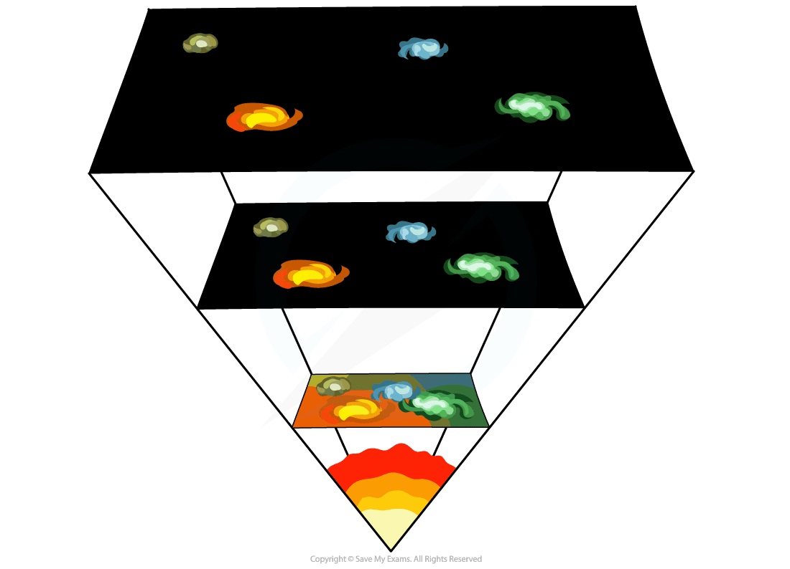
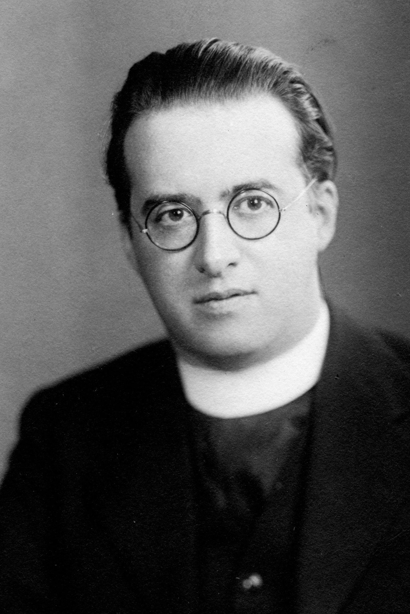
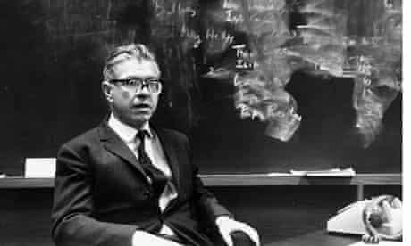

>A popular article exploring how the age of the Universe was calculated.
>
---

## Introduction

The <a href="https://cosmicvarta.in/measuring-the-age-sun-moon-gourav">previous article</a> has already provided a flavour of how scientists use mathematics combined with knowledge obtained from physics to reveal numerous hidden secrets of nature such as the age of the Earth, the Moon and even the Solar System. But the story does not end here. It literally cannot. This is because the curiosity of human beings is unquenchable. Naturally, any curious mind will ask the next question, what is the age of the universe? Fortunately, the power of human intellect combined with the supreme efficiency of mathematics and physics have provided an answer to this almost impossible to solve question also. We now know with reasonable confidence that our universe is around 13.8 billion (i.e. 1380 crore since 1 billion = 100 crore) years old. But, how do we measure the age of the universe? To know the answer, one has to study ‘cosmology’. This might be one of the most thrilling detective stories of all time.

Cosmology is the study of the size, structure and evolution of the universe — in other words, the *geography* of the universe as a single system. In cosmology, our subject is the whole universe, defined as all matter and energy in existence anywhere, observable or not.

## Birth of cosmology

One of the most fundamental questions of humanity is the question of origins:
> Where did we come from?
>

This question runs deeper than the origins of any one person and delves into questions of where did life, our planet, and the entire universe come from. Many cultures have avoided the notion of an origin to the universe by placing their creation stories in a cycle. Buddhist and Hindu origins stories measure the birth, death, and rebirth of the universe in units of 4 trillion years, which is a day in the life of Brahma. At night, all matter is absorbed into the spirit of the sleeping Brahma. At dawn, when Brahma awakes, matter reappears and the cycle continues. The Greek Stoics saw the universe as being created from fire, only to be destroyed by fire, and so on. Cosmological cycles are also found in the cultures of the Maya and the Aztec.

The story of modern cosmology began with Albert Einstein and Edwin Hubble. From Einstein's theories, the shape of space is described as being warped by gravity. From the observations of Hubble, we learned the universe is expanding. Together these two men described the evolving shape of space and they opened up a new field of science called cosmology.

## The Big Bang model

The modern theory of the origin of the universe starts with the idea of expanding space. Georges Lemaître was a priest and a mathematician, an unassuming man who had beaten the giants of physics to the punch in deducing that the universe could be expanding. In 1929, Lemaître was the first to hypothesize a revolutionary idea: at one time, the universe might have been as small as an atomic nucleus. He proposed that the universe derived from a cosmic singularity, *a day without a yesterday* when the universe was infinitely small and infinitely curved, and all matter and energy were concentrated in a single point. Many astrophysicists found the idea bizarre and distasteful and English theorist Fred Hoyle disparaged the idea with the name *big bang*. The label stuck, and scientists continue to call the description of the creation of the universe the Big Bang model.

  

 Figure 1: According to the Big Bang model, the universe expanded from an extremely dense and hot state and continues to expand today
Image source:<a href="https://en.wikipedia.org/wiki/History_of_the_Big_Bang_theory">Wikipedia </a>.

The Big Bang model forces us to consider the idea of cosmic evolution. The universal recession of galaxies implies that the universe is evolving, and it has not always been in the same state. Our observations of nearby galaxies represent a single frame in a movie that has been playing for billions of years. We can wind the tape backwards, seeing snapshots of a progressively older universe, by observing sets of galaxies at progressively larger distances, and thus at progressively larger look back times. (Since light takes time to travel, we see objects far away as they looked when the light was released rather than as they are now.)

As we look back into the early universe, we can see the galaxies move closer together. Observationally, we can't see all the way back to the first moments, but we can see times when galaxies were just forming, and the large scale structures — the cosmic walls and voids — were just starting to form. If we could look further back, we'd see that as the universe gets smaller; its volume contracts until all the mass are smashed together in a tiny universe. The mass that formed galaxies and stars breaks down into a seething hot gas, as the universe tends toward a state of infinite temperature and density. Thinking of the Big Bang as an explosion is tempting, but it is also misleading. In an explosion on Earth, debris flies through space. In the Big Bang, the initial singularity contains all space and matter. Time itself begins with the big bang. The evolution of the universe is the unfolding of time and space from a condition of incredible heat and density to cold and enormous state billions of years later. This bang had no center, it had no past and it simply was the sudden beginning of everything in an expanding geometry that may or may not be finite.

The scientific story of creation says that everything — you and the Earth and the Sun and the Milky Way and all the billions of galaxies — emerged from a tiny dense dot of energy and matter that unfolded into the universe we see now. It sounds as fantastic as any of the creation myths of older cultures. How do we know that the big bang actually occurred? There are three primary pieces of evidence:

- Galaxies are taking part in a universal expansion as indicated by the linear relation between distance and redshift (the Hubble relation).
- The abundance of the lightest elements can be explained by fusion in the universe when it was young and dense and hot (cosmic nucleosynthesis).
- Space is filled with the radiation from the early hot phase, now diluted and reduced in energy to the level of microwaves (the cosmic microwave background).

Describing each of these concepts is beyond the scope of this article. But the Hubble relation mentioned in the first point bears huge importance in measuring the age of the universe. Hence, I shall take the opportunity to discuss in brief the Hubble relation.

## Hubble relation or Hubble’s law

The Hubble relation, popularly known as the Hubble's law or Hubble–Lemaître law is considered the first observational basis for the expansion of the universe and today serves as one of the pieces of evidence most often cited in support of the Big Bang model. Although widely attributed to Edwin Hubble, the notion of the universe expanding at a calculable rate was first derived from the general relativity equations in 1922 by Alexander Friedmann. Friedmann published a set of equations, now known as the Friedmann equations, showing that the universe might expand, and presenting the expansion speed if this was the case. Then Georges Lemaître, in a 1927 article, independently derived that the universe might be expanding, observed the proportionality between the recessional velocity of and distance to distant bodies and suggested an estimated value of the proportionality constant, which when corrected by Hubble became known as the Hubble constant. Then in 1929, Edwin Hubble confirmed the existence of cosmic expansion and determined a more accurate value for the constant that now bears his name. Hubble inferred the recession velocity of the objects from their redshifts, many of which were earlier measured and related to velocity by Vesto Slipher in 1917.

  

 Figure 2: Georges Lemaître
Image source:<a href="https://en.wikipedia.org/wiki/Georges_Lema%C3%AEtre">Wikipedia </a>.

  

 Figure 3: Edwin Hubble
Image source:<a href="https://www.britannica.com/biography/Edwin-Hubble">Britannica </a>.

  

 Figure 4: Fred Hoyle
Image source:<a href="https://www.theguardian.com/science/2010/oct/03/fred-hoyle-nobel-prize">The Guardian </a>.

The law is often expressed by the equation:

v = H0D   (1)

where, v is the recessional velocity, typically expressed in km/s.
H0 is Hubble's constant and corresponds to the value of H (often termed the Hubble parameter which is a value that is time-dependent and which can be expressed in terms of the scale factor) in the Friedmann equations taken at the time of observation denoted by the subscript 0. This value is the same throughout the universe for a given comoving time.
D is the proper distance (which can change over time, unlike the comoving distance, which is constant) from the galaxy to the observer, measured in megaparsecs (Mpc), in the 3-space defined by given cosmological time.
The reciprocal of H0 is the Hubble time. This constant term H0 help us to estimate the age of the universe. Let me now discuss in brief how it does so.

## Age of the Universe

When Einstein, Lemaitre, and others solved the equations of general relativity, they were able to describe how the size of the universe has changed with time. Astronomers use the symbol R to represent the scale or size of the universe at any time. You can think of R as the size of the universe, but more accurately it represents the distance between any two well-separated places. The cosmological principle says that any two points are moving apart at the same rate. Thus, the entire history of the universe is described by the way that R varies with time. Since the universe is expanding, R has been continuously increasing for billions of years. Remember that R describes the expansion of space that carries galaxies apart — the galaxies themselves are not expanding. Galaxies are just markers of expanding space.

The Big Bang model even provides a prediction for the age of the universe. If we imagine the evolving universe as a movie, the birth of the universe is the time in the distant past when all matter and radiation was crushed in a state of infinite temperature and density. The scale factor, R, was zero. Space had not yet begun to unfold. There are three ways to constrain the age of the universe. But in many ways, looking at the expansion rate of the universe is one of the easiest ways to figure out the universe's age. This technique looks at the current expansion rate and then running it backwards to determine when today's universe must have been compressed down to a single point. Mathematically, the age of the universe is:

t0 = 1 / H0f (Ωr Ωm Ωλ;...)    (2)

Where t0 is the current age, H0 is the current expansion rate, and f is a correction that takes into consideration the mass, energy, and other characteristics of the universe. For this method to work, you need to not only know the current expansion rate but also how this rate has changed over time due to the effects of gravity and the effect of dark energy (Ωλ;), which is pushing the universe apart. The best published value for the expansion rate is H0=70.6 ± 3.1 (km/sec) / Mpc. This means that every Megaparsec of space expands roughly 70.6 km each second.

Based on stellar evolution models, we estimate the oldest globular star clusters are between 11 and 13 billion years old. Apart from these two techniques, the most trusted means of determining the age of the universe comes from very precise measurements of the cosmic microwave background (CMB) radiation. The CMB is a diffuse, uniform background of microwave radiation that comes from all directions in the sky. This CMB is the electromagnetic radiation which is the remnant from an early stage of the universe, also known as *relic radiation*. First observed accidentally by the radio engineers Arno Penzias and Robert Wilson in 1965, CMB is a crucial piece of evidence that supports the big bang model for the origin of the universe.

Three space missions, in particular, have been instrumental in measuring this radiation in finer and finer detail and with better and better precision. NASA's Cosmic Background Explorer (COBE) took data from 1989 to 1996 and it was the first to detect tiny variations in the intensity of the radiation. Next came the Wilkinson Microwave Anisotropy Probe (WMAP), launched by NASA in 2001. WMAP took data for a decade and its very accurate measurements put constraints on a set of parameters of the big bang model. The current state-of-the-art experiment is ESA's Planck mission, launched in 2009. The level of accuracy of Planck data is tens of thousands of times greater than the discovery measurements of Penzias and Wilson. Based on the WMAP measurements and theoretical models, the universe is estimated to be 13.82 ± 0.12 billion years old. This is the most quoted age used by astronomers and is consistent with both other measurements within their errors. Remarkably, you can see that this value is very close to what has been estimated using the Hubble constant in equation 2.

## Conclusion

Very early in the history of mankind, ignorance of nature and fear of the unknown naturally made men religious. So God played a central role in primitive societies. They tried to answer every question with the help of God. As time passed, with experience and intellect men could understand more and more of the natural phenomenon. I have mentioned in my previous article that if one looks at the long march of human understanding, one will find that science begins with the idea that we can understand our role in the universe using logic and observation. Today humans have come a long way. And mathematics has truly acted as the most essential weapon in almost every known field, including astronomy. By now any reader will understand that in these two articles, I’ve discussed in brief how mathematics in simple form also has helped in the development of astronomy and human knowledge as a whole.

**References:**
1. The Birth of Time: How We Measured The Age Of The Universe; John Gribbin; Weidenfeld & Nicolson; 1999. <a href="https://books.google.co.in/books/about/The_Birth_of_Time.html?id=aWG3QgAACAAJ&redir_esc=y">Reference 1 </a>
2. Astronomy: The Solar System and Beyond; Michael A. Seeds, Dana E Backmann; Wadsworth Publishing Co Inc; 6th Ed: 2009. <a href="https://www.goodreads.com/book/show/6765882-astronomy">Reference 2</a>
3. Planetary Science; Michael M. Woolfson, George H.A. Cole; CRC Press; 2013. <a href="https://books.google.co.in/books/about/Planetary_Science.html?id=B17OBQAAQBAJ&redir_esc=y">Reference 3</a>
4. History of Astronomy: A Very Short Introduction; Michael Hoskin; Oxford University Press; 2008. <a href="https://www.journals.uchicago.edu/doi/abs/10.1086/589339?journalCode=isis">Reference 4</a>
5. Astrophysical Techniques; C R Kitchin; CRC Press; 2013. <a href="https://www.researchgate.net/publication/266150873_Astrophysical_Techniques_Sixth_Edition_by_CRKitchin">Reference 5</a>

<noscript>Please enable JavaScript to view the <a href="https://disqus.com/?ref_noscript">comments powered by Disqus.</a></noscript>

---
---
