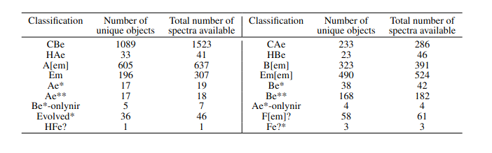

---

layout: post
title:  "Identifying emission-line stars from a large spectroscopic database"
author: Shridharan Baskaran
permalink: sridharan_emission_stars_database
categories: [Solar and Stellar Astrophysics]
tags: [Emission-line stars, Catalog]
class: [Review article]
image: ../assets/images/sridharan1_emission_stars_database/image_cover.png
featured: False
hidden: False
review: true
---
>We present a catalog of 3339 hot emission-line stars (ELS) identified from 451,695 O, B, and A type spectra, provided by the LAMOST DR5 release. We developed an automated python routine that identified 5437 spectra having a peak between 6561 and 6568~Å. False detections and bad spectra were removed, leaving 4138 good emission-line spectra of 3339 unique ELS. We re-estimated the spectral type of 3307 spectra as the LAMOST Stellar Parameter Pipeline (LASP) did not provide accurate spectral types for these emission-line spectra. As Herbig Ae/Be stars show higher excess in near-infrared and mid-infrared wavelengths than Classical Ae/Be stars, we used 2MASS and WISE photometry to distinguish them. Finally, we report 1089 Classical Be, 233 Classical Ae, and 56 Herbig Ae/Be stars identified from the LAMOST DR5. In addition, 928 B[em]/A[em] stars and 240 CAe/CBe potential candidates are identified. From our sample of 3339 hot emission-line stars, 2716 ELS identified in this work do not have any record in the SIMBAD database and they can be considered as new detections. Identification of such a large homogeneous set of emission-line spectra will help the community to study the emission phenomenon in detail without worrying about the inherent biases when compiling from various sources.
>
---

To understand what emission line stars (ELS) are, one needs to know about the spectrum of a star. Each star has its own unique spectrum, analogous to the fingerprint of humans. A spectrum can be used to identify the properties of the star such as its temperature, chemical composition and (indirect) physical constraints. So clearly, spectroscopy of cosmic objects can reveal lots of information about the universe.

Now, let us ask a more basic question. What is a spectrum? To understand this, imagine a rainbow on a rainy day. A rainbow is formed when the sunlight passes through the water molecules suspended in the air after the rain. As the sunlight moves through a spherical water droplet, it gets dispersed into various colours ranging from Violet to Red. This is a real-life example of spectroscopy. The light from a stellar object, when passed through a slit or a prism (the optical equivalent of the spherical water droplet), gets split into various colours. If the light from the star is as ideal as white light is, which is made up of all the colors with equal intensity, we would get a beautiful color gradient with all colors shining equally. However, the universe is not that simple. The spectrum of a star will have bright and dark lines, similar to the way we have ridges and valleys in our fingerprint (Figure 1).

  

 Figure 1:  A representative high-resolution spectrum showing the visible light of alpha Boo. The black lines in this spectrum are caused due to various metallic elements present in the photosphere of the cool giant alpha Boo.
Image source:<a hrefsridharan1_emission_stars_database="https://noirlab.edu/public/images/noao-arct/">N.A.Sharp, NOIRLab/NSF/AURA)
 </a>.

These bright and dark lines (or emission and absorption lines) are the most crucial information of the spectrum. They tell us about the atomic and molecular processes going on in the top most layer of the star which is known as the photosphere.

An absorption line is formed in the spectrum when light of a certain wavelength is absorbed by an atom or a molecule. Similarly, an emission line is formed when light of a certain wavelength is emitted (or radiated) by an atom or a molecule. To put it simply, when an atom ‘absorbs’ light, it goes into a higher energy level and when it ‘emits’ light, it comes down to a lower energy level as shown in Figure 2.

  

 Figure 2: The above plots show the absorption and emission process as caused by the excitation and de-excitation of electrons around the nucleus.
Image source:<a href="https://www.webassign.net/labsgraceperiod/ucscgencheml1/lab_6/manual.html">webassign </a>.

The spectrum of a star is the information that gives us the intensity at each wavelength of light. An observed stellar spectrum consists of the blackbody continuum, absorption lines and in some cases, emission lines. The blackbody continuum in the visible and infrared region is due to the thermal emission of the star and the absorption lines are seen because the ‘cooler’ photosphere absorbs light at certain wavelengths. These two components are seen in the spectrum of all the stars because it arises due to the basic structure of stars. Now let us come to the topic of this article, ELS. Emission lines arise from a hot, gaseous region around the star that is formed due to some special nature of the star. The type of stars that show emission lines in their spectrum are called Emission line stars (ELS). You can call them the rebellious group of star families, who want to be unique by showing emission lines.

There are various types of ELS known to us today (and its analogues)
Pre-main sequence (PMS) stars - young, naughty teenagers creating chaos
Classical Be stars - people with midlife crisis
Wolf-Rayet stars - old, wise people
Even though ELS comprises stars in various evolutionary phases, in most cases the emission arises from the equatorial circumstellar disc which is made of gas and dust. The formation mechanism of circumstellar disc varies between different classes. For example, in PMS stars the circumstellar disc is the accretion disc through which material is added to the star from its surroundings. In Classical Be stars, the disc is formed due to rapid spinning of the star which pushes away material from the star to its surroundings. So it should be noted that even though we put stars with emission lines into a single category of ELS, they are very different from each other. Hence, we need to classify them based on their photometric properties.

## Aim:

As large-scale spectroscopic surveys collect a large number of spectra every night, we need to identify special classes of stars such as ELS and classify them into different categories for the research community to study various emission mechanisms. This is the motivation for the work titled “Discovery of 2716 hot emission-line stars from LAMOST DR5''.

## Data:

The Large Sky Area Multi-Object Fiber Spectroscopic Telescope (LAMOST) is a multi-object telescope that can observe around 4000 stars in one night. By its 5th data release (DR5), it had accumulated around 9 million spectra from 2011-2017 which are available to the community. We made use of this huge database to increase the number of ELS stars known to us. One interesting fact about LAMOST is that the majority of  observed stars are in the Galactic anticenter direction. This is particularly important because the earlier studies which have identified ELS have not looked into this direction of the sky. So this opened up an opportunity to study ELS in previously less explored parts of the sky.

## Analysis:

In this work, we took O, B and A type stars (Teff ranging from 30000 K to 10000 K) from the LAMOST DR5 database (for an explanation of different spectral types, look into Anusha R’s CAe article). We restricted ourselves to these spectral types because the main aim of this was to identify new Classical Be/Ae and Herbig Be/Ae stars. Once we removed bad quality (Signal-to-noise ratio (SNR) < 10)[^1] spectra from our list, we used an open-source python package called ‘scipy.signal’ to identify emission peaks. The entire definition of ELS rests on the presence of one of the most commonly found emission line, Hα at 6563 Å. We searched and picked out spectra with the Hα line anywhere between 6561 Å and 6568 Å. This range was selected to take into effect the instrumental calibration defect (if any) and the doppler shift that may be seen in a few stars.

We identified 4138 spectra that belong to 3339 unique ELS stars from our analysis. To classify stars into different categories such as CBeAe or HBeAe, we need an accurate spectral type for each spectrum. The LAMOST automated pipeline does provide a spectral type for each spectrum which did not turn out to be accurate due to the presence of emission lines. This introduced the necessity for us to re-estimate spectral type for each spectrum. We followed a technique called template matching. We made use of the MILES stellar spectral library for this purpose. For each spectrum, we matched the templates from MILES library to our target spectrum and identified the best fit. Then the spectral type of the best fit template was assigned to the target spectrum.

In order to differentiate between Classical Be/Ae and Herbig Be/Ae stars, we made use of the inherent difference between them known as Infrared (IR) excess. Herbig Be/Ae stars, being young stars, have lots of gas and dust around them in addition to a circumstellar disc. This extra gas and dust reprocesses the energy from the star and emits them in infrared wavelengths. Due to this, the HAeBe stars are brighter in IR wavelengths than CBe stars. Hence we use the photometric data[^2] available to us to differentiate them based on colors and spectral indices. The breakup of various classes identified in this work is given in the table below.

  

  Table 1: Statistical break-up of various classes identified in this work.
Image source:<a href="https://arxiv.org/abs/2108.08025">Table 1 of the review paper) </a>.

We visually examined the Hα line features belonging to each class and reported their statistics. Finally, a representative spectrum of major classes is presented in Figure 3.

  

 Figure 3: This plot shows a representative spectrum belonging to each of Oe*, CBe, CAe, HBe, HAe, B[em], and A[em] classes. Red dotted lines denote [NII] lines at 6548 and 6584 ̊A and green solid lines denote [SII] lines at 6717 and 6731 ̊A. The spectra are normalized using laspec open source python package.

Image source:<a href="https://arxiv.org/abs/2108.08025"> Figure 7 of the review paper </a>.

## Future Scope:

This research work identifies new ELS stars from a large database and classifies them into various categories based on their photometric properties. As the data collection capabilities increase day-to-day, the need for such works increases. We have multiple follow-up works in the fray which uses the LAMOST database effectively in identifying and study the properties of CBeAe and HAeBe stars in more detail.

[^1]: Signal-to-noise ratio or SNR is a quantity which defines the quality of a spectrum. More the SNR, the better the spectrum.

[^2]: Photometry (in astronomical context) means measurement of brightness of a star. The brightness of a star observed through filters of different wavelengths can be used to decode information about the star. [Reference](https://en.wikipedia.org/wiki/Photometry_(astronomy))

**Original paper:**
<a href="https://ui.adsabs.harvard.edu/abs/2021arXiv210808025B/abstract"> Discovery of 2716 hot emission-line stars from LAMOST DR5 </a>

**First Author:** Shridharan Baskaran

**Co-authors:** Blesson Mathew, Nidhi S, Anusha R, Arun R, Sreeja S. Kartha, Yerra Bharat Kumar

**First author’s Institution:** CHRIST (Deemed to be University), Bangalore

<noscript>Please enable JavaScript to view the <a href="https://disqus.com/?ref_noscript">comments powered by Disqus.</a></noscript>
