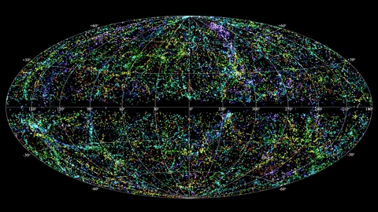
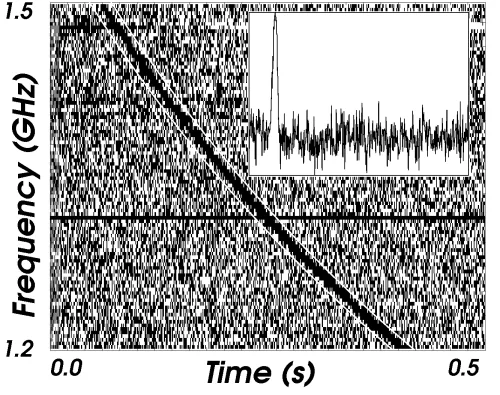
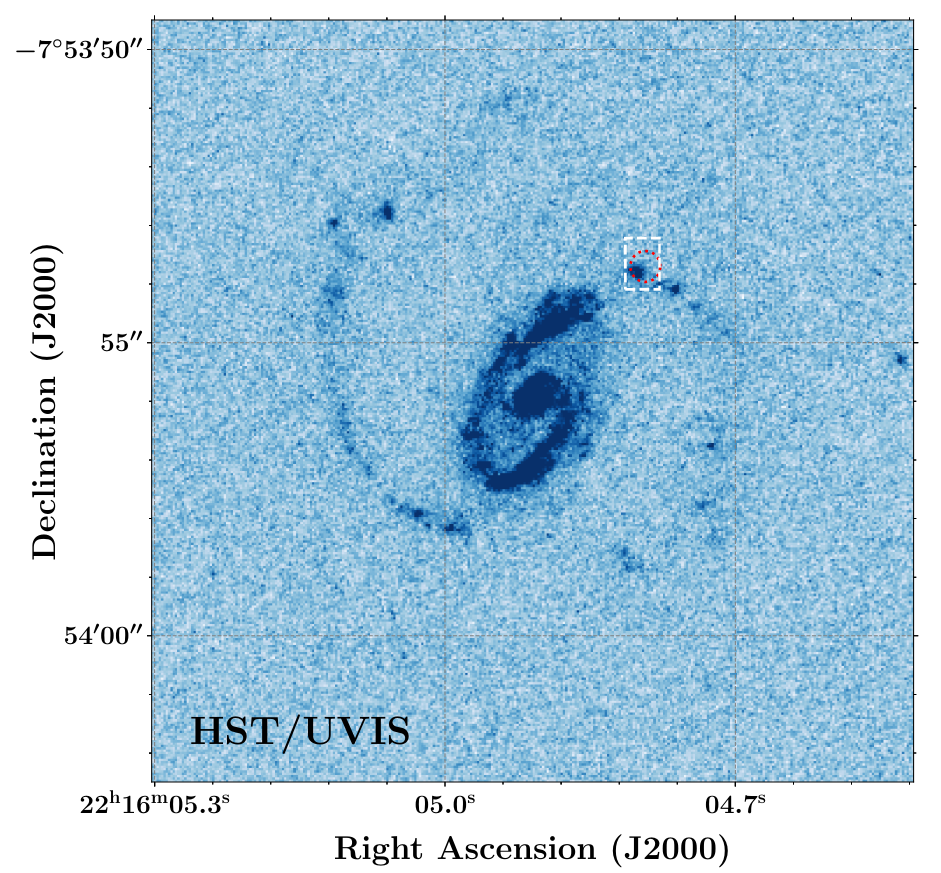
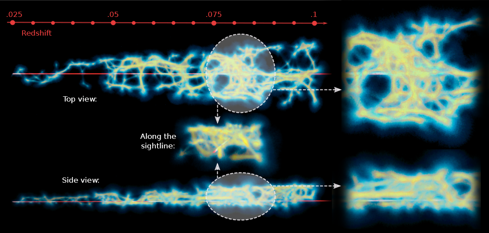

>Fast Radio Bursts are millisecond-duration radio transients of extragalactic origin. Their dispersion measures are sensitive to the presence of ionized matter along their lines of sight. This unique measurable makes FRBs a promising cosmological probe that can shed light on a hitherto invisible matter reservoir that constitutes the universe.
>
---

The study of Fast Radio Bursts (FRBs) is one of the fastest developing fields of astronomical research.1 Discovered serendipitously only in 2007 by <a href="https://ui.adsabs.harvard.edu/abs/2007Sci...318..777L/abstract">Lorimer et al</a>, FRBs are bright, millisecond-duration transient radio events. According to some <a href="https://ui.adsabs.harvard.edu/abs/2013Sci...341...53T/abstract">estimates</a>, thousands of FRBs occur in the sky daily. If one could see the sky in the radio frequencies, they would look like Fig.1.

  

Figure 1: An artist’s rendition of what FRBs look like in the radio wavelengths. <a href="https://vimeo.com/146295242">Credit: NRAO outreach</a>

Most FRBs detected have extragalactic origins with the only exception being two <a href="https://ui.adsabs.harvard.edu/abs/2020PASP..132c4202B/abstract">recently discovered</a> radio pulse emissions from a Milky Way <a href="https://en.wikipedia.org/wiki/Magnetar">magnetar</a>, a compact remnant of a supernova that sports extremely strong magnetic fields, SGR 1935+2154. As the FRB pulses travel through space, they are dispersed by plasma (ionized matter) that permeates the universe, just like sunlight disperses in a prism into a rainbow. This means the higher frequency components of the pulse travel faster than the lower frequency waves. Fig. 2 shows the dispersed pulse reported by Lorimer et al. The amount of dispersion is quantified by the Dispersion Measure (DM). DM is defined as the line-of-sight integral of electron density, weighted by the cosmological scale factor. In Fig. 2, the DM essentially tells you how far apart the 1.5 GHz and 1.2 GHz components are. Measuring DM therefore relies on accurately estimating the arrival delay between the high and low frequencies constituting the light and since the delay is of the order of a few seconds. Lorimer et al could not account for the burst’s large DM using estimates of matter density within our galaxy alone.

It was very much this dispersion that led Lorimer et al to postulate they are extragalactic in origin. In fact, it was several times larger and the burst was estimated to have originated at a distance of <1 Gigaparsec (Gpc). The sharp FRB pulse is therefore quite a unique and powerful probe of ionized matter on cosmological scales. Previously available cosmological probes of matter like quasar absorption lines are largely “blind” to ionized matter as fully ionized hydrogen and helium (which makes up most of the universe) do not produce any line features.

  

Figure 2: The dispersed pulse of the Lorimer Burst. The dark curve is the FRB event. The horizontal axis shows the time relative to a reference. The higher frequency components of the pulse come before the low frequency components and thus the curve goes from the top-left to bottom-right. The shape of the curve is governed by plasma physics. The inset image shows the pulse when all the frequencies are aligned (i.e. the curve is straightened) and summed over. Note how sharp the pulse is compared to the total time of the FRB event (~0.4 s).

Emission or absorption line features are manifestations of the quantum nature of an atom. In the ionized state, i.e. when  atoms are stripped of their electrons, there is no quantum system to produce said features. Furthermore, continuum (i.e. non line-like) emission from electrons/ions in the intergalactic medium is extremely hard to detect due to its sparsity. FRB dispersions on the other hand provide a direct measure of the line-of-sight integrated ionized matter density.

Due to their transient nature, it is only recently that FRBs have been localized in the sky with a precision better than an arcsecond thanks to advances in radio interferometry. The first FRB to be precisely localized was FRB 20121102 (by <a href="https://ui.adsabs.harvard.edu/abs/2017ApJ...834L...7T/abstract">Tendulkar et al</a> in 2017), which using the American Very Large Array (VLA), was pinpointed to a small, highly star-forming galaxy at a redshift of 0.19. This FRB was first detected by the Arecibo telescope in 2012 and then since the source burst repeatedly albeit sporadically over the years, it was finally captured with the radio interferometer that is the VLA in 2017. In 2018, <a href="https://ui.adsabs.harvard.edu/abs/2019Sci...365..565B/abstract">Bannister et al</a> detected and simultaneously localized the FRB 20180924 thanks to the Australian Square-Kilometer-Array Pathfinder (ASKAP) and a new technique of performing radio interferometry. ASKAP consists of several large radio antenna pointing in the same direction in the sky. The telescope essentially looks for a transient in the non-interferometric mode2, i.e. without correlating the signal from its individual antennae, to maximize the area of the sky scanned. The moment it detects a transient, the data in its buffer gets dumped to an external storage space for post-detection correlation and subsequently localization. Since the first detection, ASKAP has localized several FRBs and will continue doing so. Precise localization is crucial in pegging the FRB’s distance as the pulse itself does not carry precise information about the redshift3. Localization is crucial to identify the host galaxy and spectroscopic follow-up observations of the host yield the redshift or distance estimate4.

  

Figure 3: UV image of the FRB 20190608 host galaxy showing the active starforming regions (<a href="https://ui.adsabs.harvard.edu/abs/2021ApJ...922..173C/abstract">Chittidi et al 2020</a>). The red circle/white rectangle shows the radio-derived location of the FRB which is coincident with one of the starforming clumps.

Given the dispersion and the distance to the FRBs, one can start constraining the matter distribution in the foreground universe. One FRB sightline that we studied in detail was that of FRB 20190608 (see <a href="https://ui.adsabs.harvard.edu/abs/2020ApJ...901..134S/abstract">Simha et al 2020</a>). This FRB was localized to a spiral galaxy at redshift 0.3215 in the Sloan Digital Sky Survey (SDSS) footprint. A UV Hubble image of the galaxy showed that the FRB originated from one of the star-forming clumps within a spiral arm (Fig. 3). Due to its fortunate location within the SDSS database, we had extensive spectroscopic information of the field galaxies. This informed us about the location of foreground galaxies relative to the sightline and thus, with some modeling, the contribution of different foreground electron reservoirs to the FRB DM. Being an integrated quantity, the DM can be split into multiple parts corresponding to the source of electrons. That is,

DMFRB = DMMW + DMhalos + DMIGM + DMhost

Here DMMW is the contribution from the Milky Way interstellar medium (ISM) and halo, DMhost is a similar term but for the host galaxy, DMhalos is from the gas present in intervening galactic halos and DMIGM is from the diffuse filamentary gas that permeates the <a href="https://en.wikipedia.org/wiki/Observable_universe#Large-scale_structure">cosmic web</a>5. In our work, we aimed to estimate each of these individual subcomponents from optical observations. For the Milky Way, we used models of the ISM electron distribution constructed using galactic pulsars (NE2001; <a href="https://ui.adsabs.harvard.edu/abs/2003astro.ph..1598C/abstract">Cordes and Lazio 2003</a>). We modeled the gas distribution of the halo as a modified NFW profile (see <a href="https://ui.adsabs.harvard.edu/abs/2019MNRAS.485..648P/abstract">Prochaska and Zheng 2019</a> for details). In total, of the 340 pc cm-3of the FRB DM, we estimated roughly 80 pc cm-3 arising from the Milky Way. <a href="https://ui.adsabs.harvard.edu/abs/2021ApJ...922..173C/abstract">Chittidi et al 2020</a> estimated the DMhost~100 pc cm-3 using <a href="https://en.wikipedia.org/wiki/Integral_field_spectrograph">integral field unit</a> (IFU)6 observations with the Keck Cosmic Web Imager (KCWI) and the same halo model as the one used for the Milky Way.

Using the SDSS and WISE photometry available for the field galaxies in tandem with the spectroscopic redshifts, we estimated the stellar masses of foreground galaxies. Then, using the stellar-to-halo-mass ratio from <a href="https://ui.adsabs.harvard.edu/abs/2013MNRAS.428.3121M/abstract">Moster et al 2013</a>, we estimated their halo masses. Assuming that the halo gas typically extends up to one virial radius7, we determined which halos intersect the FRB sightline and then using our modified NFW halo gas model, determined their DM contributions. We estimated DMhalos ~ 20 pc cm-3.

Estimating DMIGM was perhaps the most challenging as one cannot directly observe diffuse filamentary gas, its presence is generally inferred indirectly. However, since we had access to the SDSS galaxy redshifts, we could, in theory, reconstruct the cosmic web density using them as tracers. Thus, we leveraged the Monte-Carlo <i>Physarum Machine</i> (MCPM) model introduced by <a href="https://ui.adsabs.harvard.edu/abs/2020ApJ...891L..35B/abstract">Burchett et al</a> in 2020 to do exactly this. The algorithm is inspired by the motion of Physarum polycephalum or <a href="https://www.youtube.com/watch?v=3rWk6h0Syog">slime mold</a>. The mold efficiently searches for food particles and produces a filamentary network connecting them in its wake. Modeling the galaxies as “food”, one can produce a steady-state slime mold particle density with MCPM and translate this to physical matter density by calibrating against dark matter density in cosmological simulations. The result (see Fig. 4) is an estimate of gas density along the sightline.

  

Figure 4: Cosmic web density “reconstruction” using the MCPM algorithm for the FRB 20190608 sightline. Though galaxies were cone-searched around the FRB, as it is located in one of the narrow strips of SDSS, there were more spectra available in one direction (top) than the other (side) and thus our model doesn’t appear conical.

Using this model, we estimated DMIGM ~ 110 pc cm-3. Thus just using optical data, we were able to estimate DMFRB and closely match the radio measurement. Our model uncertainties are fairly large (~30%) but nevertheless, this work was a proof of concept that FRB DMs can inform us about the matter distribution in the universe. Furthermore, if this analysis is performed on multiple sightlines, we can start laying statistical constraints on some of the key model parameters that were only assumed in this work e.g. the fraction of the universe’s baryons in the filamentary gas and the fraction of halo gas present in the hot (>106 K) ionized phase. In fact, our future work on the <a href="https://ui.adsabs.harvard.edu/abs/2021arXiv210900386L/abstract">FLIMFLAM</a> (FRB Line-of-sight Ionization Measurement with Lightcone AAOmega Mapping) survey intends to achieve ~ 10% constraints on these parameters using ~25 sightlines. We are currently collecting spectroscopic redshifts of field galaxies along multiple sightlines and hope to start producing preliminary results within the next year. FRB-aided cosmology promises exciting research in the near future.

[1] See <a href="https://ui.adsabs.harvard.edu/abs/2019A%26ARv..27....4P/abstract">Petroff et al</a> 2019 for an excellent review.
[2] See the <a href="https://astronomy.curtin.edu.au/research/craft/">CRAFT webpage</a> and <a href="https://www.nature.com/articles/s41550-018-0597-7">this article</a> for more details on the survey and the telescope.
[3] Though the dispersion is correlated to the distance, there are many sources of uncertainty in the DM-redshift relation.
[4] Astronomers use redshift as a proxy for distance when it comes to cosmological scales. This is thanks to the <a href="https://en.wikipedia.org/wiki/Hubble%27s_law">Hubble relation</a>.
[5] This is the large-scale structure of matter in the universe. As dark matter (and regular matter) condensed gravitationally after the Big Bang, it created halos and filamentary structures connecting halos, giving it a web-like appearance.
[6] IFUs are specialized instruments that can take images as well as spectra of the field-of-view simultaneously.
[7] A virial radius of a halo is the radius from its center within which the halo dark matter density is roughly 200 times larger than the background value. Think of it as the radial extent of the halo matter.

**Original paper:**
<a href="https://ui.adsabs.harvard.edu/abs/2021ApJ...921..134S/abstract" target="_blank">Estimating the Contribution of Foreground Halos to the FRB 180924 Dispersion Measure</a>

**First Author:** Sunil Simha

**Co-authors:** Nicolas Tejos, J. Xavier Prochaska, Khee-Gan Lee, Stuart D. Ryder, Sebastiano Cantalupo, Keith W. Bannister, Shivani Bhandari and Ryan M. Shannon

**First author’s Institution:** University of California, Santa Cruz, CA 95064, United States

<noscript>Please enable JavaScript to view the <a href="https://disqus.com/?ref_noscript">comments powered by Disqus.</a></noscript>
