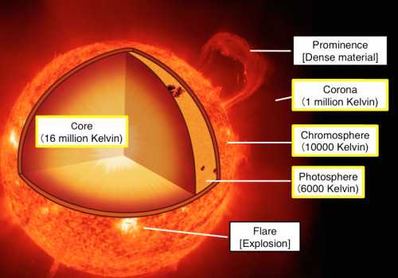
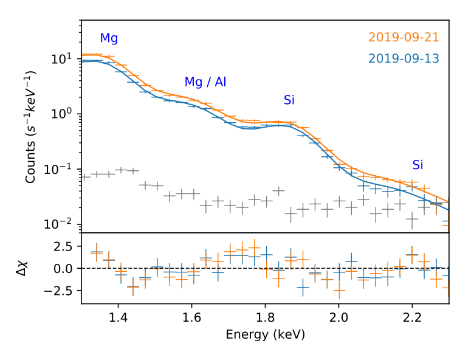
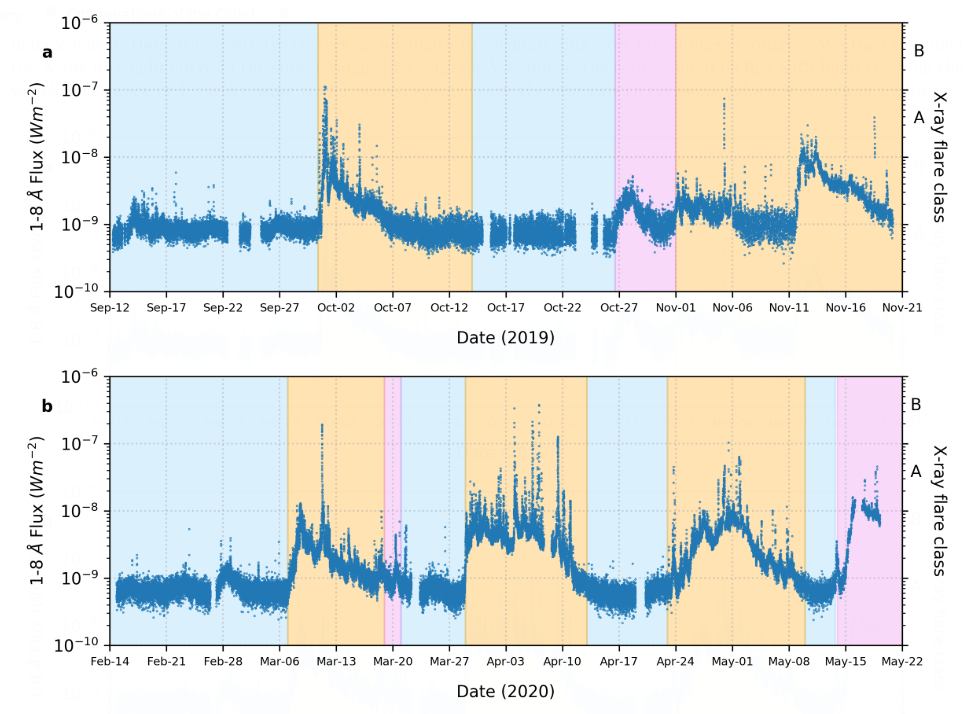

> 
XSM onboard Chandrayaan-2 observed the Sun during the deepest solar minimum of the past century from in 2019-2020. By studying the XSM spectra for the days when the Sun was very quiet, researchers have found that the abundances of all Mg, Al, Si is around two times higher than its abundances in the photosphere! They also calculated the temperature of the quiet Sun corona to be around 2 MK. This article explains how these measurements were made.
>
---

The visible orange-yellow surface of the Sun that we can see even with the naked eye is called the Photosphere. It extends up to a height of 400 km. The temperature here decreases from 6000K, at the bottom of the layer, to 4500K at the top of the layer. This is expected because as we move away from a source of energy and heat, the temperature drops. The next layer is the Chromosphere, that is in between a height of about 400 - 2100 km. The temperature in the Chromosphere varies between about 4000 K at the bottom and 8000 K at the top. As the numbers show, in the Chromosphere, as we move upwards it gets hotter and not cooler as common sense suggests!

More mystifyingly, things get extremely hot (literally) as we move into the next layer, the transition region, which is just a 100 km in height but the temperature drastically increases from a few thousand kelvin to a few million kelvin! Temperature stays at a million degree kelvin in the Corona (which extends throughout the solar system) as well, which is the uppermost atmospheric layer of the Sun. The reason for this temperature increase in the solar atmosphere is one of the long standing problems of solar physics referred to as the *Coronal Heating Problem*. You can read more about this in the article: [Using machine learning to infer Solar Coronal heating](https://cosmicvarta.in/vishal_machine_learning_corona_article)

Figure 1: The Sun and its layers.
Credit: <a href="https://hinode.nao.ac.jp/en/news/results/formation-mechanisms-of-the-solar-chromosphere-revealed-by-hinode-and-iris/">Hinode</a>.

The Corona is mainly visible in UV and X rays. This is because the hotter a material is, the light coming from it will be of higher energy. You can see this in daily life in the flames of a stove. The innermost regions of the fire will be bluish compared to the outer parts, which will be red, orange and yellow. As we have seen, since the Corona is at a million degree kelvin temperature, it emits mainly in the high energy part of the spectrum, that is, in UV and X-rays, while the Photosphere emits mainly in optical wavelengths that we can perceive with our naked eyes. This means that telescopes on the Earth are enough to observe and study the Photosphere. But since the ozone layer blocks UV and X rays (thankfully, otherwise we would not exist as we do now!), Coronal studies began only with advent of the space age and satellites in the 1960s. 

Another phenomenon that is related and similarly astonishing to the 'Coronal Heating Problem' that occurs in the transition region and the Corona is called as the First Ionization Potential (FIP) Effect. This effect deals with the abundances of elements in the Corona. 

Soon after the launch of the first satellites with instruments to study the Sun in UV and X rays, [Stuart R. Pottasch](http://articles.adsabs.harvard.edu/pdf/1963ApJ...137..945P) in 1963 found something very weird concerning the elements present in the Corona. Using spectroscopy, that is, by studying light from the Corona, he discovered that the absolute abundances (i.e., the abundances with respect hydrogen) of certain elements [the low FIP elements](https://en.wikipedia.org/wiki/Ionization_energy) like magnesium (Mg), silicon (Si) and iron (Fe) were mode abundant (3-4 times higher!) in the Corona than in the Photosphere. Now you might ask why is this surprising? After all, Corona is a different layer with a very different temperature. So, why can't it have different abundances of elements than the Photosphere, right? This is because all the material that is present in the Corona comes from the lower atmospheric layers through flares and Coronal mass ejections (CMEs). [Flares](https://spaceplace.nasa.gov/solar-activity/en/) and [CMEs](https://www.swpc.noaa.gov/phenomena/Coronal-mass-ejections) are huge explosions that supply material and energy from the Photosphere to the Corona. So it was expected that the elemental abundances in the Corona will reflect that of the Photosphere.

The theories that are trying to explain the FIP effect predict that the FIP effect and the Coronal Heating Problem are intimately connected with each other. Thus studying one problem might give insights about the other and vice versa!

Over the years, many studies of the FIP effect have shown that the amount of FIP effect, which basically tells by how much the (low FIP) elements in the Corona are more compared to the Photosphere, is different in different structures of the Corona. Sun's activity changes with an approximate period of 11 years called as the solar cycle. At the start of a cycle, large flares and CMEs on the sun are usually non-existent. With the progress of the cycle, activity increases, reaches a maximum and starts coming down again before the start of the next cycle. Studies have also shown that the elemental abundance in the Corona changes in accordance with the solar cycle.

It is relatively easier to study the Corona when explosions (flares and CMEs) happen. This is because the Sun is very active and outputs a large amount of UV and X rays which the instruments can receive. But studying the Sun when it is quiet requires extremely sensitive instruments to be present and observing the Sun. Here comes in Chandrayaan-2 live a saviour! The Chandrayaan-2 mission was launched in July 2019 and the orbiter carried an instrument called Solar X-ray Monitor (XSM), which is till date the most sensitive instrument to measure the sun's spectra (light). For more information on XSM, refer to the article:[Deciphering The Mysteries of The Quiet Sun Explosions](https://cosmicvarta.in/lakshitha_solar_article_corona). 2019 also marked the end of solar cycle 24 during which the sun was extremely quiet. This was the quietest the sun has been in the past 100 years! Thus with the Sun in its deep minimum and the XSM observing its inactivity, Santosh Vadawale and team have managed to decode the abundances of three (low FIP) elements - Mg, Al and Si  - in the quiescent Corona using spectroscopy. 

Spectroscopy is the study of light of different energies that is emitted by a source. The instrument that is used for spectroscopy is called as a spectroscope/spectrometer. And the output of a spectroscope is a spectrum (plural - spectra). A spectrum is basically a graph of intensity (or count rate which gives the number of photons) versus the wavelength (or energy) of light. It is possible to derive the temperature and other physical parameters by studying the shape of the spectrum (known as the continuum), and by studying the bumps (called as 'emission lines or emission complexes'), it is possible to derive the abundances of various elements present in the source (see figure 2). Each emission line is a 'signature' of a different element. By modelling (i.e., comparing the strength of the observed line and shape of the continuum with that predicted by theory) the spectra, we can find the abundances and other physical parameters. For more in-depth information about spectroscopy, please refer to: [Understanding the solar chromosphere through spectral lines.](https://cosmicvarta.in/solar-chromosphere-spectral-lines-vishal)

Figure 2: Soft X-ray spectra measured by the XSM for two representative days of quiet Sun observations are shown. Solid lines represent the best fit isothermal model and the residuals are shown in the bottom panel. Gray points correspond to non-solar background spectrum.
Credit: <a href="https://arxiv.org/pdf/2103.16643.pdf">S.Vadawale et al., 2021</a>.

By studying the XSM spectra for 73 days when the Sun was very quiet, they found that the abundances of all three elements (Mg, Al, Si) were around two times higher than the corresponding photospheric abundances. They also calculated the temperature of the quiet Sun to be around 2 MK.

Figure 3: Light curve for the duration of the XSM observations used in this study. Orange shaded regions are duration when active regions were present on the Sun, pink shaded regions are duration when the Sun showed enhanced X-ray activity, and blue shaded regions are duration of quiet Sun observations.
Credit: <a href="https://arxiv.org/pdf/2103.16643.pdf">S.Vadawale et al., 2021</a>.

As no activity was happening on the Sun, XSM was even able to measure the absolute lowest X-ray energy emitted by the Sun, which is about 6 x 10-10 Wm-2. For comparison, the highest soft X-ray energy emitted by the Sun is of the order of 10-4   Wm-2, which is 6 orders of magnitude higher!

**Original paper:**
<a href="https://iopscience.iop.org/article/10.3847/2041-8213/abf35d" target="_blank"> Observations Of The Quiet Sun During The Deepest Solar Minimum Of The PastCentury With Chandrayaan-2 XSM: Elemental Abundances in the Quiescent Corona</a>

**First Author:** Santosh Vadawale

**Co-authors:** Biswajit Mondal, N. P. S. Mithun, Aveek Sarkar, P. Janardhan, Bhuwan Joshi, Anil Bhardwaj, M. Shanmugam, Arpit R. Patel, Hitesh Kumar L. Adalja

**First author’s Institution:** Physical Research Laboratory, Ahmedabad, Gujarat-380 009, India

<noscript>Please enable JavaScript to view the <a href="https://disqus.com/?ref_noscript">comments powered by Disqus.</a></noscript>
