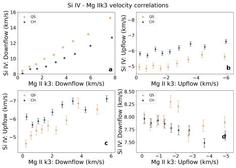
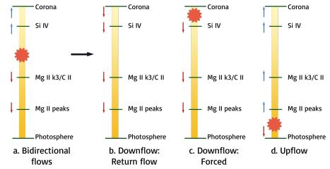
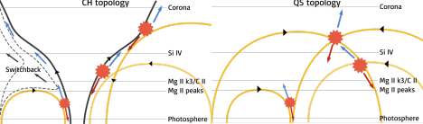

>
Light when seen correctly provides rich information on what happens in the cosmos. In this article, we showcase our work on identifying signatures of the solar wind in the solar chromosphere -- far lower in the solar atmosphere than what has been expected. We take the reader through our analysis, interpretations and speculations on our observations, and present a unified model of solar wind emergence and the heating of quiet corona.
>
---

NOTE: This article is a follow-up to [“Understanding the solar chromosphere through spectral lines”](https://cosmicvarta.in/solar-chromosphere-spectral-lines-vishal) (which I shall henceforth call #A1) written by yours truly. While I have presented a summary of the previous article here too, possibly you would enjoy reading them together better! 

Light, as we have seen in #A1, encodes in it information regarding the world. It is especially of great help to astronomers in figuring out what-where-why something happens. For those of us folks who study the Sun, we are bathed – or rather, burnt crisp with light. And so, light or photons carry with them information regarding various aspects of different regions on the Sun. 

Now, we have seen in #A1 that each element, or ion has a characteristic fingerprint in the form of “spectral lines”. The properties of these spectral lines depend on the plasma properties where the particular ion is present. Critically, it depends on the local temperature, density, velocity, and any other turbulent flows present in the plasma. These show up as effects on the line intensity, the line “shift” and the line width. And so by “reading out” these spectral lines, we can get an estimate of how much plasma is present, how fast it is moving, and in what direction it is moving – at the very least!. 

The solar atmosphere is composed of the photosphere (at ~5500 K), the chromosphere (at ~10,000 to 80,000 K), Transition region (TR; ~1,00,000 K) and the corona (>10,00,000 K). The rise in temperature with height of the atmosphere is the rather much debated “Coronal heating problem”, which presents more questions than answers[^1]. The corona then extends outwards as the streaming solar wind, with plasma moving at great speeds outwards from the Sun[^2]. The exact reason(s) behind the large temperature of the corona, and the height (or the layer of the atmosphere) from where the solar wind starts are not known well, and are an unsolved problem in solar physics. 

In #A1, we attempted to understand the underlying cause of these two problems in tandem by studying two regions called the Coronal Holes (CHs) and Quiet Sun (QS). The CHs are regions seen as dark in the corona against the background QS - see Fig. 1, first panel. However, if we go down to the TR (see Si IV in the same figure), or chromosphere (CII or Mg II k3), these differences vanish! Since the CHs are well known sources of the solar wind, studying these two regions together, and investigating where (and how) this differentiation starts can give us hints on resolving the coronal heating and solar wind emergence problems. 

Fig. 1: Fig. 1: CHs (dark) and QS (bright) in the corona (AIA 193 Å), TR (Si IV) and the chromosphere (C II, Mg II k3) with the two regions demarcated by light green contours. 
Image source: <a href="https://arxiv.org/abs/2111.11668 ">Vishal.U et al., 2022 </a>.

In #A1, we had studied the C II 1334 Å line - which forms in the upper chromosphere - in CHs and QS as a function of the underlying magnetic field. The general idea was to check if and how these two regions are differentiated depending on the underlying magnetic field. Our results in #A1 told us that QS is brighter than CHs only if we account for the underlying magnetic field. Similarly, we also found that plasma is both preferentially moving towards, and moving away from us (of course at different places!) in CHs, when compared to QS. This motion (and so the velocity) was found to be larger for regions with stronger magnetic fields! Such a result is counterintuitive – the CHs are known to be the source of the wind which travels towards us. Then why do we see the plasma strongly moving away from us? With this backdrop, let us dive into what other ions in the solar atmosphere tell us! 

Let us proceed systematically here - we are seeing some “anomalous” results in the C II 1334 Å line: a line that forms in the upper chromosphere. A simple way forward would hence be to check the properties of other lines which form in the same region of the chromosphere. And so, we performed the same analysis on what are called Mg II h and Mg II k lines. 

Mg II - Magnesium - is an awesome atom from which one electron has been removed. The transitions of this atom give rise to what are commonly called the h and k lines. Why do I call it awesome? Because the Mg II h & k lines are very complex – so complex that in fact they can give us the velocity of almost the whole of the chromosphere! If our results in the C II 1334 Å line were correct, they must be seen in what is called the ‘k3’ part of the Mg II line3. However, we also need to have a comparison against some “expected” results. For this, we performed the same analysis on the Si IV 1393 Å line – this line forms in the TR, and so will give very different dynamics when compared to C II or Mg II. Let us look at the results below! 

Fig. 2: QS-CH differences as a function of magnetic field (|B|) in the TR and chromosphere. The intensity ratio is depicted in panel a and velocity differences in other panels. Panel b depicts the difference in average velocity, while panels c & d show for the blue- and red shifted pixels alone. 
Image source: <a href="https://arxiv.org/abs/2111.11668 ">Vishal.U et al., 2022 </a>.

 

In Fig 2, I present all the results we find for Mg II k3 and contrast them with Si IV. The way I present it is as follows: for the intensity, we are only interested in the “factor” by which the intensities are different, while for the velocities we are interested in the differences. The dashed lines depict the intensity ratio of 1/ velocity difference of 0 – i.e, case where no differences are seen. 
From Fig. 2a, the QS shows more intensity than CH - the factor is more than 1. This ratio is larger in Si IV (TR) than in Mg II k3 (chromosphere). This result is consistent with what we expect from physics – as we keep moving above in height, we will keep seeing QS becoming brighter than CH. 

In Fig. 2b, we check what the average velocity looks like. In the chromosphere the average CH-QS velocities are similar, while in TR the CH is less redshifted. Hence, we clearly see that the solar wind signature is starting to be seen in TR, but apparently not in the chromosphere. 

In Fig. 2c, we consider only those regions where plasma is moving towards us. Clearly, we see that the CHs have plasma moving much faster towards us than QS. The difference in velocities is also larger in the TR. This is in-line with our expectation of plasma moving towards us in CHs. 

And finally in Fig. 2d, we consider only those regions where the plasma is moving away from us. Here we see that while the QS plasma is falling down faster in the TR, the case is reversed in CHs! In-line with what we found from C II in #A1, Mg II k3 also tells us that the plasma is preferentially going away from us in CH at the chromosphere[^4]! So this analysis tells us that the result we are seeing is something truly physical 

But why could this be happening? Is there an “extra” push for the plasma to flow away from us in the CH, or is the plasma being stopped for some reason in the QS? And where are these flows coming from/going to? A clear dichotomy seems to occur between the chromosphere and TR – something is clearly happening at the interface of these two regions. And so to understand further, we study how the TR velocities change with chromospheric velocities. For instance, if a pixel shows upflow in Mg II k[^3], what kind of flows does it show in Si IV? And how do these vary between CH and QS? This is a question we ask for multiple spectral lines, but I will just present the results for the Mg II k3 and Si IV below. 

Fig. 3: TR and chromospheric flow correlations in CHs (black) and QS (orange). Note that up-flows are blueshifts, and downflows are redshifts. 
Taken from <a href="https://arxiv.org/abs/2111.11668">Vishal.U et al., 2022</a>.

 

In Fig. 3a, we show downflows (=plasma moving away from us) in TR are related to downflows in the chromosphere. Turns out, the plasma that is moving away from us in TR is also seen moving away from us in the chromosphere, except that in QS the speed drastically reduces. 

Similarly, we can look at how the upflows (=plasma moving towards us) in TR relate to the upflows in the chromosphere in Fig. 3b. Again, it turns out that the plasma that we see coming towards us in the chromosphere is getting accelerated towards us in TR. However, this time the CH plasma is accelerated more than QS! Next, we can also check if the plasma that is coming towards us the TR has any relation to the plasma that is moving away from us in the chromosphere. In Fig. 3c, interestingly, we find that faster the plasma in TR is coming towards us, faster is it also moving away from us in the chromosphere –with the upflows larger in CH. And finally, in Fig. 3d, it turns out that the plasma moving towards us in the chromosphere has not relation whatsoever with the plasma moving away from us in the TR. This is all very interesting, but what does it mean? 
It means that: (i). If a plasma parcel is moving towards us in the chromosphere, it would be accelerated even more in the TR. This seems like a signature of the solar wind coming towards us, but starting from the chromosphere – or maybe even lower! (ii). Plasma that is flowing down from the TR is decelerated as it falls down into the chromosphere, and this deceleration is much more in QS, and (iii). There seem to be flows coming out like “jets” both towards, and away from us – faster one end comes towards us, faster is the other end moving away from us! What is going on here? 

Let us handle each observation one by one, and then try to piece them together.First, why would plasma move? Plasma motion takes place if it is either forced to move due to pressure, or if the plasma is freely falling like a ball falls down once it's thrown up. The freely falling case applies only to plasma that is falling down – for a plasma that is rising, we need something to pump pressure, like a piston. What could this mechanism be? A graphic summary is given in Fig. 4. 

In the solar atmosphere, it turns out there are complex mechanisms which can heat a small part of the plasma very quickly. Hot air rises, and similarly the plasma will be forced to rise. These complex mechanisms are generally “impulsive events”, for simplicity. These impulsive events are well known in the corona, and have been hypothesized to maintain the coronal temperature at a million degree Kelvin[^5]! Hence, we may invoke a similar impulsive heat dumping mechanism throughout the solar atmosphere to get plasma moving! 

Now, the density in the solar atmosphere reduces drastically with height. If the amount of mass crossing a surface at a given time is kept constant, it can be shown that the velocity should increase with height (Fig. 4d). Thus, any upflows starting from the lower chromosphere due to these impulsive events will naturally accelerate, and can persist to great heights. 

Now, these impulsive events basically just dump some energy very quickly in the plasma. Since the plasma just needs to expand (and not only rise), the expansion can occur both ways – upwards and downwards! And if the energy were dumped between the chromosphere and TR, we will see plasma moving towards us in TR, and moving away from us in the chromosphere (Fig. 4a). These are called “bidirectional flows”. Thus, if more energy is dumped by the impulsive event, faster the plasma will move in both directions! 

Finally, let this event occur at a very great height – in the corona, for example. In such a case, we would only see the downward flowing plasma, since the upward flowing plasma would be seen in lines which form at much higher temperature. Hence this would be seen as persistent downflows (Fig. 4c)! However, note that the “freely-falling” plasma can also simply fall down,  and can give a similar signature (Fig. 4b). 

Fig. 4: A schematic showing the response of plasma due to an impulsive heating event (red asterisk). The blue arrows correspond to blueshifts (motion towards us), while red arrows show redshifts (motion away from us). The vertical colour is density – going from high density at bottom to low on top. Different scenarios are depicted across the figure.
Image source: <a href="https://arxiv.org/abs/2111.11668">Vishal.U et al., 2022 </a>.

But how does this explain the difference between CH and QS? For this, we invoke something we kind of know from observations: How does the magnetic field approximately look like in CH and QS. 

In Fig. 5, open magnetic field lines (in black) are drawn near closed loops (in yellow) in CH, while closed loops alone are drawn in QS. When you have magnetic field lines close by, a phenomenon called magnetic reconnection can occur, which causes field lines to snap and rejoin. This will release a large amount of energy contained in the magnetic field in a very short period of time – these would be our impulsive events!

Fig. 5: A schematic depicting the proposed picture of impulsive heating occurring across different magnetic field topologies. In the left panel, we show a CH topology, including open funnel-like structure (black), closed loops of varying sizes (yellow), and impulsive events (red asterisks) due to interchange reconnection between the open and closed field lines, giving rise to bidirectional flows (blue and red arrows). The kinked field line propagating outward as a switchback is depicted as a dashed line, with the approximate propagation direction by black arrows. Right panel: QS topology shown with the same terminology as the left panel.
Image source: <a href="https://arxiv.org/abs/2111.11668">Vishal.U et al., 2022</a>.

The reconnection process itself just needs two magnetic field lines, preferably pointing in opposite directions. However, what happens to the plasma after reconnection depends on the overall shape of the field lines, which guide the motion of plasma. Hence, the resultant of reconnection will be different in CH and QS! 

In the CHs we have “interchange reconnection” between the open field lines and closed loops. While this gives rise to the correlated motion, the plasma is preferentially guided away from the surface (and hence towards us as blueshifts) along the open field line. The open field eventually takes the plasma away, and puts it out into the solar wind. Since plasma is being taken away along the magnetic field, it doesn't stay and emit enough light for us to see. However, depending on how predominant loops of different heights are, the signatures would be different. Hence, the solar wind may start from a range of heights, with something specific going on in the interface of chromosphere and TR. 

In the QS, however, the reconnection is only between closed loops. In this case, while the correlated motion is present, the plasma is not allowed to escape into the solar wind, and is kept trapped inside the loop – this and the CH effect above give rise to the intensity ratio of Fig. 2a.! However, due to the presence of excess plasma at the bottom (remember, cool plasma can just gravitationally fall down towards the photosphere!) in QS, any downflows will be decelerated in QS. Thus, all our observations are naturally explained by invoking magnetic reconnection in what are called different magnetic topologies! 

But what about the coronal heating problem? We have actually already described it – the reconnection mechanism! Energy dumping by reconnection is precisely the needed means to maintain the solar corona – however, this occurs across various heights in the atmosphere, but predominantly starting from the TR. 

Finally, one unexpected result from this scheme of things is the generation of what are known as switchbacks. In Fig. 5, the dashed field lines in the CH are how the magnetic field evolves after reconnection. Over the past couple of years, similar structures have been found in the solar wind, and called switchbacks. If the switchbacks form in the chromosphere/ TR, then the velocities that we provide will serve as constraints on the different models to test out the theory! Thus, in one neat sweep, we can potentially unify solar wind emergence, coronal heating, and switchback generation in a single mechanism! 

Does this mean we have now solved all of these problems? No! On the contrary, we actually need to perform realistic (a subjective word!) simulations of the Sun to check the viability of various aspects of this model. For instance, we still need to understand some of the following questions: how much energy does a typical reconnection event release? How much of this energy is transformed to velocities of different ions? How much of this energy gets radiated away by the plasma? How many reconnection events typically occur in CHs and QS in the first place? Does all of the plasma eventually escape out into the solar wind? If so, do we find similar results while probing hotter (and cooler) spectral lines? These are some typical questions we are trying to answer in a future work! 

Further reading: 
1. There are three papers which form a series of analyses on this subject. The first is [Tripathi et al 2021](https://iopscience.iop.org/article/10.3847/1538-4357/abcc6b?fbclid=IwAR2Tv6sS9eLY2uFCb3N73Acx_VpZQX1KhS5Iy51uE39JZ-t-KUyIXHGXrsU), which analyzes Si IV 1393 line. The second is [Upendran & Tripathi 2021a](https://ui.adsabs.harvard.edu/abs/2021ApJ...922..112U/abstract?fbclid=IwAR2fhB9PFj2lDG89mqlm3c3E0REEZdcb4KbgUxLrskZTYYa4ymgWr-e7tco), which analyzes the C II 1334 line. And the third paper is [Upendran & Tripathi 2021b](https://ui.adsabs.harvard.edu/abs/2022ApJ...926..138U/abstract), which jointly analyzes multiple lines. 

2. [On switchbacks](https://www.nasa.gov/feature/goddard/2021/switchbacks-science-explaining-parker-solar-probe-s-magnetic-puzzle).

**Original paper:**
<a href="https://arxiv.org/abs/2111.11668"  target="_blank"> On the formation of solar wind & switchbacks, and quiet Sun heating</a>

**First Author:** Vishal Upendran

**Co-authors:** Durgesh Tripathi

**First author’s Institution:** Inter University Centre for Astronomy and Astrophysics, Pune, 411007, India

[^1]: I have written on it at length in this article: [Using machine learning to infer Solar coronal heating](https://cosmicvarta.in/vishal_machine_learning_corona_article).

[^2]: Again I have written on this at length, in this article: [From Sun to Earth using Artificial Intelligence](https://cosmicvarta.in/sun-to-earth-using-ai-vishal). 

[^3]: I realize it is too hard wavy, but the physics behind how this line forms, what this ‘k3’ is, etc. is quite complicated. It is best if you take my word for it!

[^4]: I have shown here the figure only for Mg II k3, but we see this trend for both Mg II h & k lines. On an average, the entire chromosphere is going down faster in CH over QS!

[^5]: I have talked in great detail about this impulsive release of energy in my article on coronal heating: https://cosmicvarta.in/vishal_machine_learning_corona_article

<noscript>Please enable JavaScript to view the <a href="https://disqus.com/?ref_noscript">comments powered by Disqus.</a></noscript>
