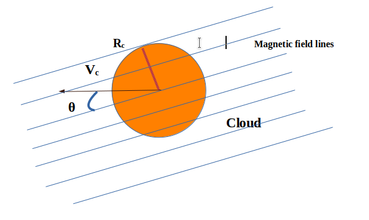
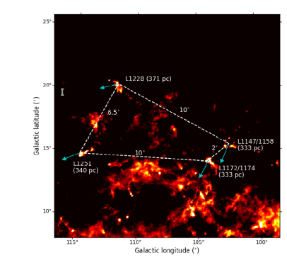
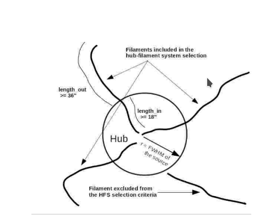
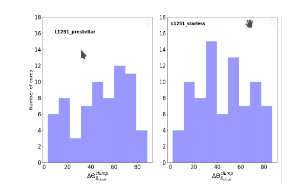

>
Stars take birth in molecular clouds. The presence of magnetic fields everywhere in the universe naturally creates a curiosity to investigate their role at all the stages of star fomation. The motion of clouds through the interstellar medium in the presence of magnetic fields may get effected and can shed light on the structure/orientation of stellar nurseries.  This short article will explain these possible effects in an interesting region of our Universe, Cepheus Flare. 
>
---

Understanding how stars are formed is one of the crucial questions in astronomy. Molecular clouds are the blank spaces or voids in between stars in our galaxy, the Milky Way and they consist of predominantly hydrogen or helium molecules. They are stellar nurseries in our local galaxy and the universe. The prestellar/protostellar cores are the high density nested quantities in large molecular clouds with a typical temperatures of 10 K and density of ~ 103 cm-3. They are considered as the fundamental units for the formation of stars.

Figure 1: Schematic of cloud of radius Rc moving in a uniformly magnetized background medium with a velocity, Vc making an angle θ with the field lines
Credit: <a href="https://iopscience.iop.org/article/10.1086/307162/pdf">Miniati et al. 1999</a>.

Magnetic fields, which are ubiquitous to the universe, is a very interesting property. Due to their interaction with the ionized material, they can play an important role in the dynamics of the clouds. The angular offsets between the direction of the cloud motion and the magnetic fields, θ is shown in Fig. 1. These offsets can help in preventing the disruption of the cloud (radius Rc moving with velocity Vc) against the Kelvin-Helmholtz instability in the interstellar medium as suggested by simulations.

Figure 1: Schematic of cloud of radius Rc moving in a uniformly magnetized background medium with a velocity, Vc making an angle θ with the field lines
Credit: <a href="https://iopscience.iop.org/article/10.1086/307162/pdf">Miniati et al. 1999</a>.

Stars which are young are still associated/embedded in the high-density clouds because the surrounding molecular material has not completely collapsed towards the centre. Their motion in the projected plane of the galaxy is defined as proper motion. Stars move in the interstellar medium (ISM) and their proper motion is a critical factor in determining their overall motion in the galaxy.  Proper motion can serve as a proxy of the motion of the clouds in the ISM. A team of researchers led by Dr. Ekta Sharma and Dr. Maheswar Gopinathan from the Indian Institute of Astrophysics, an autonomous institute of the Department of Science & Technology, Govt. of India and Dr. Sami Dib from Niels Bohr Institute, University of Copenhagen, Denmark carried out an observational test on a sample of clouds (L1228, L1251, L1172/1174 and L1147/1158) located at a nearby distance of ~330 pc in Cepheus Flare region identified in Fig. 2. The Gaia (Global Astrometric Interferometer for Astrophysics) and Planck, both are space based observatories to study the motion of stars and the emission in far-infrared wavelengths, respectively. The authors used proper motion data from Gaia Data Release 3 to study the motion of the clouds in sky plane (shown by arrows in Fig. 2) and Planck polarization data to construct magnetic field maps.

Figure 2: Background image in color scale is cloud emission in far-infrared wavelengths obtained by Planck satellite. Blue arrows show the direction of proper motion.
Credit: <a href="https://arxiv.org/pdf/2109.07510.pdf">Sharma et al., 2021</a>.

They estimated various offsets between the direction of magnetic field and the motion of the clouds in the sky. The results show that the magnetic fields are ordered in all the clouds except one cloud, L1172/1174 which shows an offset (angle, θ in Fig. 1) higher than 30°. The authors suggest that the higher offset could be responsible for converting the cloud material in the form of hub-filament structure (see Fig. 3). These structures consist of a hub having less aspect ratio with high column density and a number of filaments with high aspect ratio with less column density.  

Figure 3: Schematics of Hub-filament systems.
Credit: <a href="https://arxiv.org/pdf/2008.00295.pdf">Kumar et al., 2020</a>.

Starless cores are the earlier stages in the process of star formation which have not formed stars and the pretsellar cores are the ones which are on the verge of making stars. We made a quantitative analysis of the core orientations (direction of major axes) (in Fig. 4) with respect to the magnetic field in case of starless as well as the prestellar cores. The distribution for all the clouds is found to be random. The study concluded that the core dynamics could be affected more by the local variations in the magnetic field in the cloud’s environment. The results of this study have been published in the journal “Astronomy & Astrophysics”.

Figure 4: Distribution of offset between magnetic field direction and clump orientation. 
Credit: <a href="https://arxiv.org/pdf/2109.07510.pdf">Sharma et al., 2021</a>.

**Original paper:**
<a href="https://www.aanda.org/articles/aa/abs/2022/02/aa40495-21/aa40495-21.html" target="_blank"> Cloud motion and magnetic fields: Four clouds in the Cepheus Flare region</a>

**First Author:** Ekta Sharma

**Co-authors:** G. Maheswar and S. Dib

**First author’s Institution:** Indian Institute of Astrophysics (IIA), Sarjapur Road, Koramangala, Bangalore 560034, India

<noscript>Please enable JavaScript to view the <a href="https://disqus.com/?ref_noscript">comments powered by Disqus.</a></noscript>

