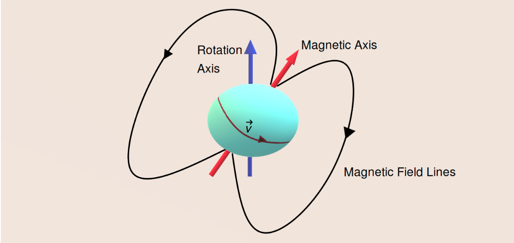
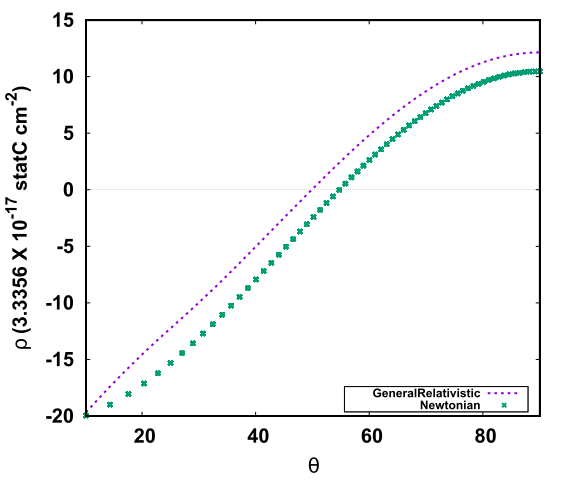
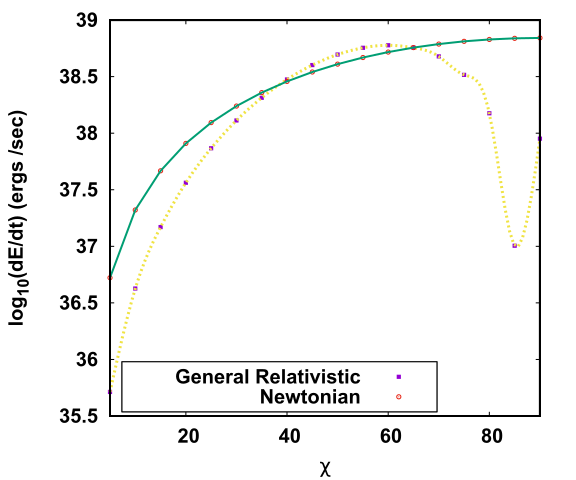

> Observed pulsars are misaligned in nature. The misalignment scenario occurs when the rotation axis and the magnetic axis of the star forms a finite non-zero angle between them. This scenario gives rise to very interesting phenomenons. This article explores such a misaligned star which is oblate in nature due to the deformations of rotation would vary considering general relativistic corrections. Our calculations show some interesting features regarding the magnetic field, power loss and also the charge separation on the surface of such a star. 
>

## Introduction

Neutron Stars (NSs) are very dense objects found in the universe, having masses ranging from about 1.4  MΘ ( MΘ  is the Solar mass) to about 2.2 MΘ . NS are the highly dense collapsed core of a a star of mass 8 MΘ  to 20 MΘ formed after a supernova explosion. The central density at the core of the NS is about few times that of the nuclear saturation density. The predictions of Quantum Chromodynamics (QCD) state that at such high densities, nuclear matter won't be the stable state and the quarks present inside the nucleons will get deconfined resulting in a stable quark matter. Until now, there are no earth-based experiments that can probe such densities nor any reliable theoretical calculation. Therefore the only laboratory to test the theory of deconfinement at high density is at the core of the NS.

Very fast spinning NSs are also known as pulsars. Observed pulsars have a dipolar magnetic field with its magnetic moment directed along an axis known as the magnetic axis. The pulsars rotate about an axis called the rotation axis. These two axes are not directed in the same direction (they have some finite angle between them), and such pulsars are known as misaligned pulsars. 

A schematic diagram of a misaligned pulsar. The cyan-coloured spherical object is the pulsar which rotates about the rotation axis (blue axis), and the magnetic moment is pointed along the magnetic axis (red axis). The charged particles move with a velocity (v) as shown in the figure. The black lines show the closed magnetic field lines of the star. Image courtesy: author. 

In our recent publication, we have tried to provide a realistic model for such a pulsar. For simplicity of calculations, people tend to assume the star is aligned (the magnetic axis and the rotation axis coincide). Still, in reality, the pulsars found in the universe are misaligned. We have also considered the deformation due to the star's rotation about its axis to provide a more accurate model. Thus our star tends to form an oblate shape, which adds an extra challenge to our calculations since we cannot assume the star to be spherically symmetric, which would have simplified our calculations. The general theory of relativity, given by Einstein in 1915, shows that heavy objects tend to curve the space-time. Since NSs are more massive than our sun, we need to consider these general relativistic effects to have the most accurate model possible. 

## Results

This work done by me, along with my supervisor Dr.Ritam Mallick, and my collaborator Dr.Debojoti Kuzur, shows some interesting results. 

Our calculations show that along the star's equator, the strength of the magnetic field reduces with an increase in the misalignment of the star. As there are no direct means to measure the misalignment angle, our calculations conclude that a pulsar which has lesser magnetic field near the equatorial plane compared to another pulsar having a higher magnetic field near the equator can be said to be more misaligned than the later. The pulsar will also lose its energy due to its rotation. We also studied how the general relativistic calculations differ from the known Newtonian approach of finding the power loss of the star. We see that with an increase in the misalignment angle of the star, the power loss increases, to a certain angle, after which it takes a sharp dip and rises again. As the star rotates about its axis with extremely high angular velocity, the charges near the star's surface would separate as a result. This would result in the accumulation of the negatively charged particles called electrons near the poles of the star-forming dome kind of shape, and the positrons will accumulate near the equator of the star, forming a torus. The charge density near the star's surface for such a scenario is called the  <a href="https://ui.adsabs.harvard.edu/abs/1969ApJ...157..869G/abstract"> Goldreich-Julian </a> charge density of the star. We also calculated the Goldreich-Julian charged density for our model and compared it with the known model for the Newtonian case. Our results report changes from the known nature of the charge density distribution from the previous values.

 <b> Top: </b> Figure shows the comparison of the Goldreich-Julian density for the Newtonian and the general relativistic case, the x-axis denotes the polar angle &theta; and the y-axis denotes the charge density in cm-2. As we increase the angle &theta;, i.e. we move from the star's pole towards the star's equator, we see a change in the sign of the charge densities. At the pole of the star, we see more electrons (negative charges), and as we move towards the equator, we see more positrons (positive charges).	<b> Bottom:</b> The plot shows the comparison of the power loss for the deformed pulsar for different values of misalignment angle &chi;. The yellow line shows the results obtained from the general relativistic plot. The green coloured line shows the power loss for known Newtonian methods.

You can find a complete description of our calculations and explanations in the original paper linked below.

**Original paper:**
<a href="https://doi.org/10.1016/j.jheap.2022.03.002" target="_blank"> General relativistic calculation of magnetic field and power loss for a misaligned pulsar.</a>

**First Author:** Sagnik Chatterjee 

**Co-authors:** Ritam Mallick and DebojotiKuzur

**First author’s Institution:** Indian Institute of Science Education and Research Bhopal, Bhopal, Bhopal, Madhya Pradesh, India

<noscript>Please enable JavaScript to view the <a href="https://disqus.com/?ref_noscript">comments powered by Disqus.</a></noscript>

