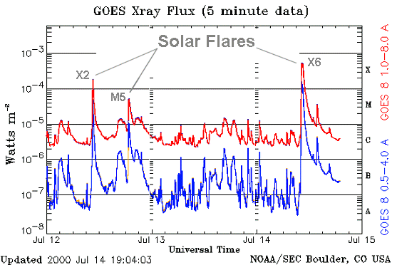
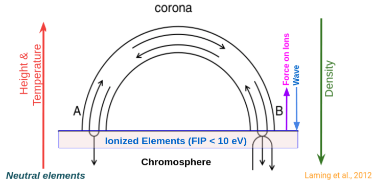
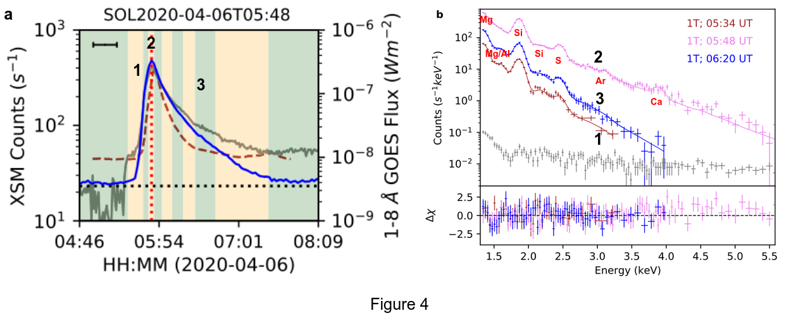
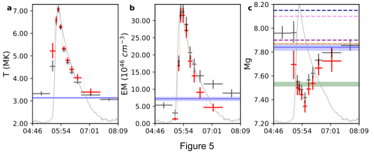

> In this article, we presented the temporal evolution of elemental abundances during solar flares of GOES B1−B4 class, the weakest events for which such studies have been possible so far, using observations with XSM on board Chandrayaan-2. This study was possible due to the extremely quiet solar conditions currently prevailing along with the availability of appropriate instrumentation. By modeling the soft X-ray spectra obtained with the XSM during different phases of these flares, measurements of temperature, emission measure, and abundances of Mg, Al, Si, and S were obtained. We have shown that the abundances of these elements are nearly photospheric during the peak phase, compared to their 3–4 times higher preflare values. Beyond the flare peak, the abundances are seen to get enriched again and they recover back to the coronal values at the end of the flare. This suggests that during the flares, the coronal loops are quickly filled with plasma originating from the lower parts of the solar atmosphere without having sufficient time for the usually observed fractionation in nonflaring loops to take place. Our observation of the quick recovery to the coronal values shows that any process giving rise to such fraction must be occurring on a timescale of a few tens of minutes.
>
---

The Sun’s atmosphere is made up of several layers, primarily the photosphere, the chromosphere, and the corona. The lowest layer is the Photosphere. The temperature of the photosphere is around 5500 degrees, whereas the temperature increases towards the outer layer of the atmosphere and exceed a million degrees at the outermost layer, the corona. The physical mechanism of heating the solar corona to such a high temperature has been a mystery for the last several decades. The current understanding suggests that the magnetic field associated with the Sun is responsible for such high temperatures at corona. The Sun’s magnetic fields are highly dynamic in space and time. Many regions on the Sun are found to have enhanced and concentrated magnetic fields, which are generally known as Active Regions (AR) at the corona. Occasionally sudden bursts of energy are found to release from the AR, known as solar flares. Though solar flares are very commonly seen within the AR, they are also found to occur outside the AR with a small amount of energy release. The modern [classification](https://www.spaceweather.com/glossary/flareclasses.html) system for solar flares uses the letters A, B, C, M, or X, according to the peak flux in watts per square meter (W/m2) of soft X-rays with wavelengths 1 to 8 Angstrom, as measured at the Earth. The figure below shows the different types of solar flares observed by the geosynchronous equatorial satellites ([GOES](https://www.swpc.noaa.gov/products/goes-x-ray-flux)). X-class flares are the biggest flares seen in the solar atmosphere with a peak flux of > 10-4 W/m2, whereas the M, C, B, and, A-class flares are smaller and smaller flares having peak fluxes 10-5-10-4  W/m2, 10-6-10-5  W/m2, 10-7-10-6  W/m2, and < 10-7 W/m2 respectively (Figure 1).

Figure 1: Soft X-ray flux from GOES satellites.
Credit: <a href="https://www.swpc.noaa.gov/products/goes-x-ray-flux">NOAA GOES X-ray flux</a>.

Due to the high temperature, the elements (H, He, Fe, O, Ni, Mg, Si, etc) present in the solar atmosphere are found to be ionized to their different ionization levels at different atmospheric layers depending on the temperature. As the origin of the plasma remains the same throughout the solar atmosphere, it is expected that the relative composition or so-called abundances of these elements remains the same throughout the solar atmosphere. However, the observational studies showed that the abundances of certain elements whose ‘First Ionization Potential’ (FIP; which is the minimum energy required to remove the most loosely bound electron from a neutral atom) is lower than 10eV are 2-4 times more abundant in the AR than their photospheric values. This phenomenon is known as the FIP effect. Figure 2 represents a pictorial view of the FIP effect. The x-axis represents the first ionization potential of the elements, whereas the y-axis represents the elements' abundance ratio (called FIP bias) at the corona and photosphere. All the elements (e.g., Na, Fe, Ni, etc.) with a first ionization potential less than 10 eV have FIP-bias of 2-4, representing they are 2-4 times more in the amount present in the corona than in the photosphere. The FIP bias for the elements having first-ionization-potential more than 10 eV (e.g., Ar, Ne, etc.)  are close to one representing their composition in both photosphere and corona remain the same.

Figure 2: Plot of FIP bias versus FIP 
Credit: <a href="https://ui.adsabs.harvard.edu/abs/1992PhyS...46..202F/abstract">U. Feldman et al. 1992</a>.

Though the true origin of the FIP effect is not well known, the present understanding of the FIP effect is based on the upward reflection of the magnetic waves, known as the [Alfvén wave](https://en.wikipedia.org/wiki/Alfvén_wave), at the top of the chromospheric layer.
The cartoon below (Figure 3) represents the process briefly. Here we considered a magnetic-field loop rooted in the lower atmosphere and expanded to the corona. The red arrow represents the increase of temperature with a height from the lower atmosphere. Due to the perturbation of the magnetic fields, Alfvén waves will be present inside the loop and can travel throughout it (as shown by the black arrows inside the loop). As the waves travel from upward to downward, they can reflect from the top of the chromosphere (as shown by the black arrows).  Due to the reflection of the waves, an upward force known as “Ponderomotive force” is experienced by the ions (as indicated by the magenta arrow) present in that layer (see Laming (2015)  for details). The ions influenced by the Ponderomotive force travel to the corona and increase their concentration to the corona. The temperature and pressure at the top of the chromosphere are such that only the elements having FIP less than 10 eV can ionize, whereas the high FIP elements remain neutrals, resulting in only the ions of low FIP elements present at the top of the chromosphere to be influenced by the Ponderomotive force, thereby increasing their concentration in the corona. 

Figure 3: Schematical diagram of the Ponderomotive force model.
Credit: <a href="https://arxiv.org/pdf/1110.4357.pdf">Laming et al. 2012</a>.

Thus the present understanding of the FIP effect is based on the reflection of the  Alfven waves generated due to the perturbation of the magnetic field lines. These Alfven waves are related to the mechanism that heats the solar corona. Recently, it has been believed that the FIP effect is the bi-product of the coronal heating mechanism. Thus measuring the abundances and hence the FIP bias can be a tracer to understanding the origin of the FIP effect as well as the coronal heating mechanism.  

The FIP effect has been studied extensively in quiescent AR closed-loops and during the peak of big solar flares. During the peak of the big flares, a low FIP bias has been found compared with the closed-loop ARs.  However, the detailed picture of the FIP effect during the flare is not clear as the time evolution study of elemental abundances during the solar flare was limited due to technical limitations of the present generation instrument (e.g., sensitivity: lowest flux that an instrument can detect, instrument’s energy resolution: the capability of an instrument to distinguish the emission lines present at nearby energies, cadence: time gap between two successive observations, etc.). 

Generally, the elements' absolute (i.e.,  relative to the H) abundances are measured using the spectroscopic technique. A recent instrument, Solar X-ray Monitor (XSM) onboard the Chandrayaan-2 spacecraft, provides the spectrum of the Sun every second in the broad energy range of 1-15 keV. Its good spectral resolution and sensitivity have been useful for time-resolved spectroscopy. In time-resolved spectroscopy, the instrument provides the spectrum of the detected photons at each time step, and then analyzing each spectrum corresponding to a time step, we extract the characteristics of the incident photons on the detector. One can study the abundance evolution during solar flares using such a technique.

During the period from 2019 September to 2020 May, covering the minimum of [Solar Cycle](https://en.wikipedia.org/wiki/Solar_cycle) 24, XSM observed nine B-class flares ranging from B1.3 to B4.5. The observed XSM light curve (blue color) for one of the flares is shown in Figure 4a. Light curves of the same flare as observed by the other instruments (non-spectroscopic) are also shown by gray and brown colors. For the time-resolved spectroscopy, we used the XSM observed spectra at different time intervals throughout the flares, as shown by the green and orange shaded background colors. Representative XSM spectra for three different durations as marked by the “1”, “2”, and “3” are shown in Figure 4b. All the line complexes observed in the XSM spectra are annotated in the plot.

Figure 4: Spectroscopic analysis from Chandrayaan-2 XSM.
Credit: <a href="https://arxiv.org/abs/2107.07825">B.Mondal et al. 2021</a>.

Analyzing the spectrum of each of the shaded duration as marked by green and orange color in Figure 4a, we estimate the temperature, emission measure (EM; which is a quantity to quantify how much emission is coming from the source at a particular temperature), and absolute elemental abundances of four elements–Mg, Al, Si, and S throughout the flares. These are the first measurements of abundances during such small flares, and this study offers a unique insight into the evolution of abundances as the flares evolve. The results are shown in Figure 5. The flare light curve is plotted in a grey curve. Panels ‘a’ and ‘b’ (black and red color represent the results obtained from two different methods of spectral analysis; for detail, see the reference paper) show the evolution of the temperature and EM during the flare. In the impulsive phase of the flares, due to the sudden release of the energy, both temperature and EM increase as flares evolve. After the peak of the flare, the flaring plasma starts to cool down and reach the background plasma temperature at the end of the flare, as shown by the blue horizontal line.  The abundances of the Magnesium (black and red points in panels c) decrease toward their photospheric values (shown by the green horizontal band) during the impulsive phase of the flares. During the decay phase, the abundances are observed to quickly return to their pre-flare coronal values (shown by colored horizontal dashed lines as reported by several authors). A similar evolution of the abundances of other elements (Al, Si, and S) are also observed.

Figure 5: Representative results of temperature, emission measure and Mg abundance for one B-class flare.
Credit: <a href="https://arxiv.org/abs/2107.07825">B.Mondal et al. 2021</a>.

The decay of the abundances (or FIP bias) during the impulsive phase of the flares can be explained by invoking the process of chromospheric evaporation, the process in which the photospheric materials come up to the corona. However, the quick recovery (in a few minutes time scale)  of the abundances from near photospheric to coronal values in the decay phase of the flare can not be explained by the present theory of the FIP effect alone, where to develop the FIP bias a time scale of 1-2 days is required. There are two possible scenarios that can explain our observation, as described in Figure 6.

Figure 6: Models to explain the observed FIP bias and its evolution.
Credit: <a href="https://arxiv.org/abs/2107.07825">B.Mondal et al. 2021</a>.

In the first scenario, Figure-6; (1a) Impulsive phase–After the flare onset (at time t0), heat energy travels down to the chromosphere and evaporates the plasma there. The process of evaporating the plasma from the chromosphere is called chromospheric evaporation. The temperature peak is identified at the start (time t1) of the chromospheric evaporation. During the initial phase, plasma evaporates with high velocity and quickly passes through the fractionation layer (top of the chromosphere, where the reflection of the downward propagating Alfvén waves occurs and the ions are separated due to the Ponderomotive force) without getting fractionated, resulting in depletion of the coronal FIP bias. The EM peak is achieved (time t2 ) once the loop gets filled with the chromospheric plasma. At around the same time, the abundances of the low-FIP elements also attain their minima. (1b) Decay phase–The speed of the evaporative up-flow slows down significantly, allowing plasma enough time in the fractionation layer to get fractionated. The fractionated plasma eventually fills the coronal part of the loop, thereby demonstrating the recovery of the coronal FIP bias. (1c) Representative temperature, EM, and elemental abundance evolution curves. Time t4 marks the time of complete recovery of the coronal FIP bias.

In the second scenario, Figure-6; (2a), At the time of the flare onset (time t0 ), high amplitude Alfvén waves are initiated. The released heat energy gets transported to the chromosphere by suprathermal electrons (high energetic electrons), at speeds faster than those of the Alfvén waves. Evaporation starts at time t1 and reduces the coronal FIP bias. The temperature peak is observed around this time. (2b) The EM peak and abundance minima are achieved when the loop is filled with the evaporated plasma (t2). Once the flare-driven Alfvén waves arrive at the chromosphere (time t3 ), they rapidly fractionate the plasma. These Alfvén waves also carry significant heat from the flaring site to assist the evaporation. The fractionated plasma is then transported to the coronal part of the loop through evaporative upflows, which help in rapidly recovering the coronal FIP bias. (2c) Representative curves of temperature, EM, and elemental abundances for the second scenario.

Earlier studies during the peak of the big flares (X or M) found photospheric abundances, but how the abundances became photospheric was not very clear. A time-resolved spectroscopic observation with a good resolution was essential to study the problem in detail. Here using the recent X-ray spectrometer, XSM onboard Chandrayaan 2 orbiter, we did time-resolved spectroscopy during the B-class flares and showed the complete evolution of the abundances during the flares.  The results suggest that the coronal loops are quickly filled with plasma originating from the lower parts of the solar atmosphere during the flares. During the decay phase of the flares, the abundances reach their 3-4 times higher pre-flare values within a few tens of minutes. These results will help us to understand the origin of FIP bias during flares and provide constraints to develop the model of the FIP theory. This study suggests that measuring the abundances during the flares is an important tool to get insight into the flaring process. The B-class flares are much smaller than the large X or M-class flares. Thus it is expected that even smaller class flares could show a similar variation of the abundances during the flares. Studying smaller flares is of great interest in the entire solar physics community as it is believed that the smaller flares occur very frequently and heat the solar corona to million degrees. In follow-up work, we will study several much smaller A-class flares and compare the results with the present study. 

**Original paper:**
<a href="https://iopscience.iop.org/article/10.3847/1538-4357/ac14c1 target=_blank"> Evolution of Elemental Abundances during B-Class Solar Flares: Soft X-Ray Spectral Measurements with Chandrayaan-2 XSM</a>

**First Author:** Biswajit Mondal

**Co-authors:** Aveek Sarkar, Santosh V. Vadawale, N. P. S. Mithun, P. Janardhan, Giulio Del Zanna, Helen E. Mason, Urmila Mitra-Kraev, S. Narendranath

**First author’s Institution:** Physical Research Laboratory, Navrangpura, Ahmedabad, Gujarat-380 009, India

<noscript>Please enable JavaScript to view the <a href="https://disqus.com/?ref_noscript">comments powered by Disqus.</a></noscript>
202
