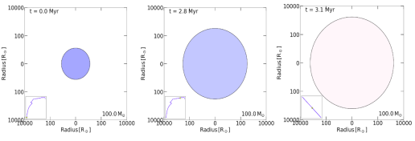

>
Supernovae are extreme astrophysical transient phenomena marking the death of stars. In this article, I take you to the journey of the life of a star as massive as 100 times our sun. Through the state-of-the-art simulation tool **MESA**, we have studied the overall life of a 100 solar mass star and the implications of the resulting supernova. At the time of its birth, the 100 solar mass star is around 10 times bigger than the current size of our sun, while in the last stages of its life, it has evolved to around 1700 times the current size of our sun. The energy released from the resulting supernova from such a massive star would be so powerful that it would take around 100 million Suns shining together for a period of at least a few hundred days.
>
---

Looking up into the sky on a clear and dark night, we can see thousands of stars twinkling. While sleeping on the rooftop of my home in our village during summer days, I used to wonder why the night sky looked similar every night. The stars present in the sky last night used to appear in the sky every other night. Similarly, seeing the constellation Ursa Major (popularly known as *Saptarishi Taramandal in Hindi*) shining brightly with its seven visible stars every summer night, I used to scratch my tiny mind about the unchanging nature of the heavens. But, do the heavens remain unchanged? No, not at all! Similar to the lifespan of a human being, every star that we see in the sky has a finite lifetime. Accumulation of cosmic clouds gives birth to stars in the form of spherical blobs by burning hydrogen as fuel in their core. These stars grow older while spreading a tremendous amount of energy in the form of light/radiation and finally die with no active fuel burning left in their core. 

The death of each star (for less massive stars having masses < 8 M⊙ subjected to mass accretion from a companion) is marked by one final, massive detonation or explosion, and the phenomenon is known as a supernova (SN), an event so bright that even if it occurred in another, very far galaxy, it could be seen from the telescopes available on earth and in space. The only difference between the lifetime of humans and stars is that humans can have a lifespan of around a hundred years or so only, but the stars live for a few million to a few billion years of age! This is the reason why the heavens in the night appear unchanged every night when seen through the naked eyes. However, as I mentioned above, the heavens change, with supernovae (SNe) being one of the means. So, has there been any bright supernova event in human civilizations that could have been seen through the naked eyes? Yes, nine such events have been identified and recorded by human civilizations in the past 2000 years! The first SN event was recorded in 185 A.D. by the ancient Chinese, as referenced in the work of two Roman chroniclers. Around 200 years later, two bright SNe in 386 A.D. and 393 A.D. were also recorded. The fourth one is the most bright SN in human history, which occurred in the year 1006 A.D., an event so bright that it could cast shadows on the ground. The fifth and sixth SNe seen through the naked eyes occurred in 1054 A.D. and 1181 A.D., respectively. The remnant of the SN that occurred in 1054 A.D. is known as the very famous *crab nebula*. The seventh and eighth SNe seen through the naked eyes occurred in 1572 A.D. (known as Tycho's supernova) and 1604 A.D. (known as Kepler's supernova). The ninth SN seen through the naked eyes occurred just a few decades earlier, in 1987, named SN 1987A. 

Our sun is a star in our galaxy *Milky Way* which hosts about a billion other stars, many of them having masses greater or lesser than our sun. Further, in the known universe, there are billions of other galaxies, each of them hosting billions of stars. However, the SNe can be so bright that they can outshine their entire host galaxy and can be seen through the telescopes on earth even if they are occurring in other galaxies (or, in other words, being extra-galactic). Once such SNe is detected through space-based or ground-based telescopes, they are followed up, and their brightness is recorded until they become fainter beyond the detection limits of telescopes. For SN, the variation in brightness (or intrinsic luminosity) over a period of time is called its *light curve*. 

>
With the state of the art software and simulation techniques, we are now capable of studying the lifespan of a star. We can numerically evolve a certain mass star from birth to death and study its implications. A review of one such work is presented in this article. Here, we have studied the life span of a star as massive as 100 M⊙. Figure 1 shows the change in the size of 100 M⊙ star as it evolves through various phases of its life. This star starts as a relatively smaller blob of gas, evolves to grow bigger, and during its last evolutionary stages, it has grown in size, having a radius of a few 1000 times bigger than our sun. 
>

  

Figure 1 : The evolution of the size (measured by its radius) of a 100 solar mass star as it gets birth (left panel), becomes an adult (mid panel), and finally reaches the stage where it is about to die (rightmost panel). The subplot in the left-bottom corner marks the star's position on HR diagram (which is the variation of luminosity with effective surface temperature). The figures are also color-coded with blue meaning hot and red meaning less hot. These figures have made use of the results from Aryan et al. 2022. (Credits: Author)

During the last evolutionary stages (approaching its death), the star is mainly composed of inert Iron in its core, and the burning of fuel in the core has almost stopped. Due to this, the core of the star is vacated of any radiation. The role of the presence of radiation in the core of a star is vital as it is the source of radiation pressure responsible for balancing the self-gravity of the core. But, when the core is vacated of almost all the radiations, there is no support to the self-gravity of the core, and it *starts to collapse* under its own gravity resulting in a core-collapse supernova. 

   

Figure 2 : (Left )The variation of the core temperature (Tcore)  and core density (&rho;core) as the 100 M⊙ star is born and evolves older to reach the last evolutionary stage reaching on the verge of core collapse. The blue triangle marks the core temperature and density at the birth of the star, while the red solid circle marks the same when the star is on the verge of death. This panel makes use of the results from Aryan et. al 2022. (Right) The light curves of supernovae resulting from the death of a 100 M⊙ star by keeping total explosion energy constant and varying the amount of total nickel mass. For comparison purposes, the light curves of three similar type supernovae are also shown but these three supernovae result from much lower mass (10 - 20 M⊙) stars. This figure has been adapted from Aryan et al. 2022.

The left panel of Figure 2 shows the variation of core temperature (Tcore) with core density (&rho;core) as the 100 M⊙ star evolves from its birth (marked by a blue triangle) to the stage where it is about to die (marked by red solid-circle). We could see that near the last evolutionary stages, the core temperature and core density have reached in excess of 1010 K and 1010 g cm-3, respectively. Keeping such high density in a normal human life perspective, a matchbox full of such core material would weigh around 200 million Kg!

The right panel of Figure 2 shows the light curves when a 100 M &odot; star explodes as a core-collapse supernova. The resulting SNe are Type IIP-like that are identified by a phase of nearly constant luminosity (also called *plateau* phase) in their light curves. The length of the plateau is dependent on the size of the Hydrogen envelope retained by the star. So, we can see that SN 1999em, SN 2005cs, and SN2009N have shorter plateau duration, as they arrive from much lower stars having masses in the range of 10 to 20 M⊙. Further, in the right panel of Figure 2, on increasing the Nickel mass while keeping the explosion energy constant, the duration of the plateau in the light curve is increased. This behavior due to the increase in Nickel mass is attributed to the increase in energy deposition in the expanding ejecta by the &gamma; rays that are produced by the radioactive decay of Nickel (56Ni) and Cobalt (56Co). 
One can also notice that the explosions from such a massive star would be so humongous that they would radiate at a rate of 1040 ergs/s or more for at least a period of 350 days. Again putting it in an observational perspective, it would be equal to around 100 million Suns shining together for a period of at least 350 days! Thus, the core-collapse supernovae are extreme catastrophic phenomena and are among one of the major events marking the alterable heavens. Keeping these aspects of supernovae in mind, we conclude that the heavens do change. It only requires an eye of a keen observer to see the change! 

---

**Symbols used** : 
M⊙= Mass of the Sun 

**Note** : *This article has been submitted for the DST-AWSAR award.* 

**Additional read**: 
- A) Aryan et al. 2022, JApA, 43, 2, and, 
- B) *Supernovae* by Paul & Lesley Murdin

**Original paper:**
<a href="https://link.springer.com/article/10.1007/s12036-021-09784-6" target="_blank">Core-collapse supernova from a possible progenitor star of 100 M⊙</a>

**First Author:** Amar Aryan

**Co-authors:** Shashi Bhushan Pandey, Abhay Pratap Yadav, Amit Kumar, Rahul Gupta, and Sugriva Nath Tiwari 

**First author’s Institution:** Aryabhatta Research Institute of Observational Sciences (ARIES), Manora Peak, Nainital-263002, India and Department of Physics, Deen Dayal Upadhyaya Gorakhpur University, Gorakhpur-273009, India

<noscript>Please enable JavaScript to view the <a href="https://disqus.com/?ref_noscript">comments powered by Disqus.</a></noscript>