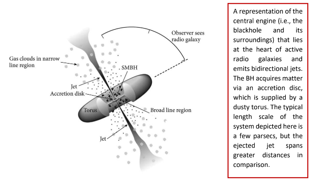
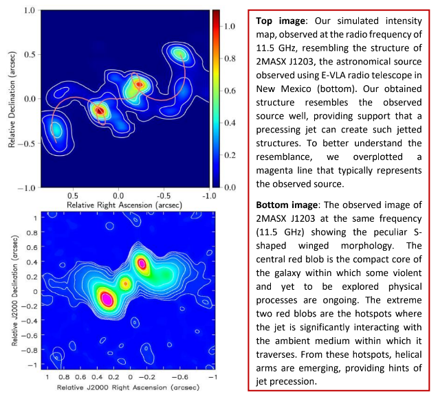
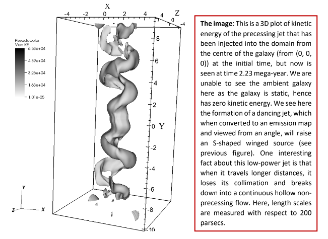

>
A small percentage of the ejected hot plasma flows (the jets) from supermassive blackholes are observed to deviate from their intended path, resulting in unusual jetted morphologies. One of these peculiarities appears when the jet starts to dance /precess around an axis, forming curved jets with **S-shaped** morphology. When we observe such sources through radio telescopes, we see a massive S-like structure floating in the vast cosmos. Due to their peculiar morphology, the formation mechanism of such sources is still debated. Simultaneously, an increasing number of such sources are being discovered with even more complex S-shaped structures, making the unravelling of the underlying physics more difficult than earlier.
>
---

A blackhole is a voracious cosmic giant that feeds on surrounding matter to grow. Its gravitational pull  is so strong that anything that enters inside a certain radius (known as event horizon), finds no way  out, not even the fastest thing in this universe; the light photons. There is no limit to how large a  blackhole can grow in size. The largest of them are supermassive blackholes (nearly a billion times  more massive than the sun; SMBH), which are found at the centres of galaxies. Some of these SMBH  enter into an active phase (not yet fully understood how), during which they accrete matter  (surrounding hot ionised gas/plasma) at an accelerated rate, with some of this material being violently  ejected down the SMBH's spin axis due to a complex process caused by a powerful magnetic  disturbance. The super-heated plasma material that is thrown out traverses a distance ranging from  sub-parsec to a few megaparsec in space with a velocity nearing the speed of light. Just to compare with our usable scales, one parsec is 3.26 light-years (a distance that light travels in a year). These  ejected streams of matter are called jets, which are destined to propagate along a straight path while  carrying the magnetic field from their origin. As a result, they mostly emit radiation at radio  frequencies due to the synchrotron process (a process where charged particles radiate when they  move in curved paths in magnetic fields), and hence we need radio telescopes to observe and study  them. 

  

(<em>Credit: https://fermi.gsfc.nasa.gov/science/eteu/agn/</em>)

A small percentage of these ejected hot plasma flows (the jets) are observed to deviate from their  intended path, resulting in unusual jetted morphologies. One of these peculiarities appears when the  jet starts to dance /precess around an axis, forming curved jets with **S-shaped** morphology. When  we observe such sources through radio telescopes, we see a massive S-like structure floating in the  vast cosmos. Due to their peculiar morphology, the formation mechanism of such sources is still  debated. Simultaneously, an increasing number of such sources are being discovered with even more complex S-shaped structures, making the unravelling of the underlying physics more difficult than  earlier. Some examples of these radio sources are highlighted below. 

  

<strong>Top image</strong>: Image of SS 433 (obtained from VLA radio telescope), a micro-quasar in our galaxy  (similar system to what we are discussing here, but with a smaller length scale) showing the  presence of bidirectional precessing jets. [Credit: NRAO]. <strong>Bottom image</strong>: Another example of  precessing jets of a powerful radio galaxy 4C +12.50, studied by Lister et al. 2003.
(<em>Credit: <a href="https://www.nrao.edu/pr/2004/ss433corkscrew/">SS 433</a>, 
<a href="http://www.astroexplorer.org/details/10_1086_345666_fg6">4C +12.50</a>
</em>)

To uncover the underlying mechanism that produces these sources, I, along with a team of Indian  scientists, have conducted a study where we tried to numerically (using computer simulation) reproduce an observed peculiar S-shaped source that has recently been observed using  <a href="https://www.aoc.nrao.edu/evla/">the Expanded Very Large Array Telescope</a> in New Mexico. The source has a  technical name *2MASX J1203*. At first appearance, the jets seem to propagate along a straight line from the compact core of the galaxy (centre of mystery!) and end in hotspots (places where jets  terminate or encounter a major collision with the ambient medium). But afterwards, the jets suddenly  bend in opposite directions, making a structure that looks like a wing. This is why it is called an *S shaped winged source*. Our novel simulations have modelled this peculiar galaxy using a precessing  jet and have shown that it is not only the jet precession that causes such ambiguities in morphology  but also the galactic medium through which the jet is travelling shape the structure. The heavy galactic  medium (mostly gas) exerts additional force on opposing jet’s free propagation leading to slowing  down the jet significantly, as well as causing it to be unstable as it propagates to longer distances. The resultant structure, when observed from a fortuitous viewing angle (the orientation angle an object  makes with respect to the observer here on Earth), we see the formation of such peculiar *S-shaped  winged* sources on the sky plane; what we see in the sky is just a two-dimensional representation of  three-dimensional objects. 
 

  

<em>Credit: <a href="https://arxiv.org/abs/2206.04705">arXiv:2206.04705</a></em>

To elaborate our work a bit more, we have carried out computer simulations by adopting a novel  approach where we modelled not only the observed morphology but also the underlying micro physical processes of this radio structure. To answer the morphological peculiarity of the source, we first built a setup where a precessing jet is being injected from the centre of a realistic galactic medium whose time evolution we have further followed. As time progresses, the precessing jet grows in size, and at time 2.23 mega-year, a fully grown dancing jet is formed. When you see this structure from a  particular angle (the line-of-sight), the structure will appear as an S-shaped source with extended wing-like substructures.  

  

<em>Credit: <a href="https://arxiv.org/abs/2206.04705">arXiv:2206.04705</a></em>

I must mention that finding this fortuitous line-of-sight angle, as well as the jet parameters that  perfectly mimic the observed source (2MASX J1203) was quite a challenging task. This is because the  existing models that tend to predict these parameters of dancing jets have seemed to ignore the jet  deceleration effects imparted by the ambient medium, which have been self-consistently adopted in  our simulations. As a result, our study pointed out that for a better determination of precessing jet’s parameters, numerical simulations are a better choice. Furthermore, when we started to model the  synchrotron emission part of this structure, we found out that the galaxy is radiating at a higher level  that contradicts the theories if we consider that the hot plasma of the jet is radiating away its energies  via radiation as well as via adiabatic expansion of the whole system with time. This further hint that  the radiating non-thermal particles are somehow getting re-energized, which is keeping the structure  alive for a longer time than what has been anticipated from theories. Using our simulations, we explicitly demonstrated that diffusive shock acceleration is the physical factor that assists the particle  in regaining energy supplied by the generated shocks in the medium. These shocks were formed by  the jet's supersonic flows (flows that move faster than the sound speed in that medium), which caused  the source to be more active than it should have been. 

A significant question now arises: why did the jet begin to precess in the first place? 

Let’s say we have a water fountain that sprays water to a certain height. Now, if we want to make the  ejected stream of water precess around an axis, one has to externally precess the nozzle from where  water is ejected. Similarly, in our astrophysical scenario, the blackhole that is responsible for jet  ejection has to be precessed by an external force. It has been theorized that a secondary supermassive  blackhole possibly orbits close to the primary one, causing the spin axis of the primary SMBH to  precess. The secondary SMBH came from another galaxy that has recently collided with the existing  one, resulting in two SMBHs in a single galaxy. It has been observed that galaxies do collide with each  other, and in the local Universe, the rate of it is significant too. Hence the systematic dance of the  binary blackholes most possibly have made the jet to precess. In this regard, our numerical simulations have successfully constrained the precession period of the jet, using which one can calculate the  separation of the binary BHs.  

In general, only a handful of dual AGNs have been discovered yet, maybe because we are looking at  the wrong sources. Nonetheless, these sources with curved/bent jets can now be the ideal candidates  to look for dual SMBH pairs at their centres, detection of which can further help us better understand  the evolution of supermassive blackholes throughout the Universe. 

---

**Original paper:**
<a href="https://academic.oup.com/mnras/article/514/4/5625/6608271" target="_blank">Dynamical modelling and emission signatures of a candidate dual AGN with precessing radio jets</a>

**First Author:**  Gourab Giri

**Co-authors:** Ravi Pratap Dubey, K Rubinur, Bhargav Vaidya, Preeti Kharb 

**First author’s Institution:** Indian Institute of Technology Indore, India

<noscript>Please enable JavaScript to view the <a href="https://disqus.com/?ref_noscript">comments powered by Disqus.</a></noscript>