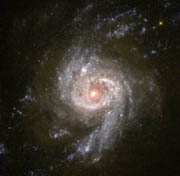
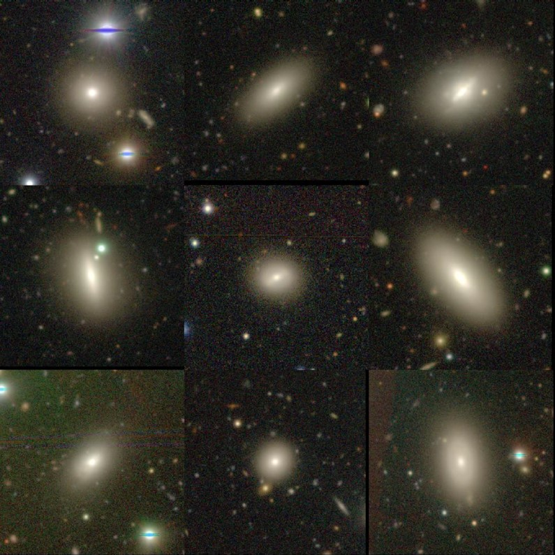
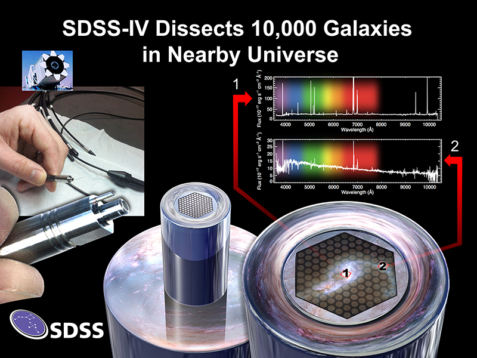
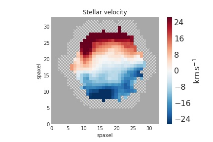
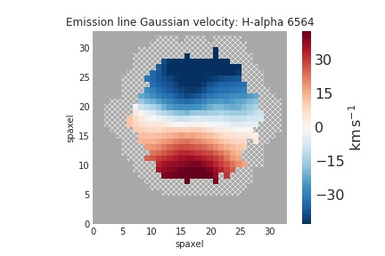

>
Galaxies are the building blocks of our universe. A comprehensive theory of how galaxies evolve with cosmic time is key to understanding how the universe turns out the way it is today. Decades of observational, theoretical and computational efforts have been devoted to this purpose. Despite this, observations continue throwing challenges that theories of galaxy evolution cannot explain. In this work, we try to address one such challenge.
>
---

On the basis of their morphology, i.e. appearance, galaxies can be divided into three classes:

●	The Spirals: Spiral galaxies possess a flat rotating disc with spiral arms. 
●	The <a style="font-family:Courier New">S0</a>s: <a style="font-family:Courier New">S0</a> galaxies possess a flat rotating disc, but lack spiral arms. Quite often, the side-view of <a style="font-family:Courier New">S0</a>s takes the shape of a convex lens, thus in the old days <a style="font-family:Courier New">S0</a>s were called Lenticulars. 
●	The Ellipticals: Elliptical galaxies, on the other hand, are 3-D ellipsoidal distribution of stars, and do not have any disc-like structure. 

Typical examples of the three classes are illustrated in Fig. 1 below.

  

  

  

Figure 1: Typical example of a Spiral (top), an <a style="font-family:Courier New">S0</a> (middle) and an Elliptical (bottom) galaxy. (Credits: <a href="http://skyserver.sdss.org/dr17/">SDSS, HSC-SSP sky-server</a>
)

Through galaxy formation theories, we know that Spiral galaxies continuously form new stars. Spiral galaxies contain beautiful spiral arms - the places where new stars are born. On the other hand, <a style="font-family:Courier New">S0</a> and elliptical galaxies are found to have stopped any kind of active star formation. But, it turns out that there exist some <a style="font-family:Courier New">S0</a> galaxies in the nearby universe, which are actively star-forming. In our work, we identify a sample of 120 star-forming <a style="font-family:Courier New">S0</a> galaxies in a large galaxy survey known as the SDSS-MaNGA survey. The images of some of these galaxies is shown in Fig. 2 below.

  

Figure 2: Very deep HSC-SSP telescope images of some of our star-forming <a style="font-family:Courier New">S0</a> galaxies. (Credits: <a href="http://skyserver.sdss.org/dr17/">SDSS, HSC-SSP sky-server</a>
)

The peculiar nature of these star-forming <a style="font-family:Courier New">S0</a>s leads us to quite a few questions. First of all, where does the star-formation happen in these galaxies? The spirals have well defined regions where new stars are born - the spiral arms. No such structure is present in the <a style="font-family:Courier New">S0</a>s.

In order to answer this question, we will have to probe within these galaxies and find out where new stars are being born. We cannot do this with the conventional spectroscopic and photometric methods, since they give us the light of the entire galaxy as a whole. This does not allow us to resolve the details inside the galaxy. This is where the revolutionary MaNGA survey comes to the rescue!

**What is so special about the MaNGA survey?**

One of the most important observables of a galaxy is its spectrum. Spectrum is awesome compared to photometry. Photometry just gives you the total light emitted by the galaxy over a broad range of wavelengths. Whereas, with a spectrum you get the light of the galaxy at every wavelength! That is a lot more information! The spectrum can be used to derive various physical properties of the galaxy, like the Star-Formation Rate (SFR), stellar mass, chemical composition etc.

In the past decade, most galaxy surveys were equipped with single-aperture spectroscopy. This means you got the spectrum of the entire galaxy as a whole. However, in recent times, advancement in technology has led to the development of Integral Field Spectrographs (IFS). IFS provides us with the spectrum of various spatial regions of a galaxy in a single observation. Let's understand this in more detail.

The image of a galaxy is divided into numerous spatial regions (similar to pixels in a photographic image). Each such region is called a spaxel (short for spatial-pixel), and we can obtain the spectrum of each spaxel.

Because of these spaxels, we get excellent resolution over the 2D image of the galaxy.  With the spectrum of each spaxel, we get the 2D resolved image in each wavelength! Thus, in some sense, IFS provides us with 3D information about the galaxy. The first two axes are the spatial X and Y coordinates, and the third axis is the wavelength. This is illustrated in Fig. 3 below:

  

  

Figure 3: Top - MaNGA obtains spatially resolved spectra of a galaxy. The galaxy image is divided into various spatial regions, called spaxels. Each spaxel has a spectrum. This leads to what is called a 3D galaxy data-cube (bottom). The first two axes are the spatial X and Y axis of the galaxy image. We obtain the galaxy image at each wavelength (which is the third axis). (Credits: Dana Berry / SkyWorks Digital Inc., David Law, and the SDSS collaboration; <a href="https://www.sdss.org/surveys/manga/">https://www.sdss.org/surveys/manga/</a>; <a href="https://www.eso.org/public/">ESO</a>
)

The SDSS-MaNGA is one such IFS survey. It enables us to study properties of a galaxy in a spatially resolved manner. Thus, we shall be able to understand the physical processes going on in our star-forming <a style="font-family:Courier New">S0</a> galaxies in great detail. In particular, this will help us probe the interiors of these galaxies and find out where the new stars are being born!

We start by studying how the Star-Formation Rate (SFR) of the star-forming <a style="font-family:Courier New">S0</a>s varies with the distance from the center of the galaxy. This will give us insights about the site and spatial extent of star-formation in these peculiar galaxies.

When we studied the star formation as a function of distance from the galaxy center for the star-forming <a style="font-family:Courier New">S0</a>s, we found that they are forming new stars close to their center. This is opposite to what happens in Spiral galaxies, since most of their star-formation happens in the spiral arms present in the disc - i.e. away from the center. This is a very interesting result about the star-forming <a style="font-family:Courier New">S0</a>s, which was not known before!
Having answered where the star-formation is happening in these star-forming <a style="font-family:Courier New">S0</a>s, now we get to the even bigger question - why are they forming new stars (being <a style="font-family:Courier New">S0</a>s, they are not supposed to do that!) ? In order to answer this question, we would want to go deeper into the past of these galaxies.

A lot of research suggests that <a style="font-family:Courier New">S0</a> galaxies form from Spiral galaxies. When new stars are no longer being born in a Spiral galaxy, the spiral arms slowly start to fade - and eventually disappear. This leads to a galaxy which has a disc, but no spiral arms - i.e. an <a style="font-family:Courier New">S0</a>. So, the star-forming <a style="font-family:Courier New">S0</a>s could be a population of Spiral galaxies whose spiral arms have faded, but some star-formation activity is still going on in the center - i.e. a last burst of star-formation. This is just one hypothesis with regards to the formation of star-forming <a style="font-family:Courier New">S0</a>s.

Alternatively, the star-forming <a style="font-family:Courier New">S0</a>s could be a population of the usual <a style="font-family:Courier New">S0</a>s (with no star-formation), whose star-formation has been somehow revived. They could also be something totally out of the box - a galaxy population with a distinct past of its own!

The above hypotheses suggest that there can be various possible connections and comparison points between the star-forming <a style="font-family:Courier New">S0</a>s, star-forming Spirals and the usual <a style="font-family:Courier New">S0</a>s with no star-formation (also known as quenched <a style="font-family:Courier New">S0</a>s). To probe these connections, we construct control samples of star-forming spirals and quenched <a style="font-family:Courier New">S0</a>s, in addition to our main sample of star-forming <a style="font-family:Courier New">S0</a>s.

Now, a main property that distinguishes different classes of galaxies is how compact the spatial distribution of their stars is. An excellent way to probe this compactness is through the galaxy size - mass relation. The galaxy size is to be plotted on the Y-axis, and its stellar mass on the X-axis. It is well known that different classes of galaxies nicely separate out in this plot. We construct the size - mass relation for our star-forming <a style="font-family:Courier New">S0</a>s, star-forming Spirals and the usual quenched <a style="font-family:Courier New">S0</a>s in Fig. 4. This will help us to compare and contrast the three galaxy populations, in lieu of the hypotheses presented before regarding the star-forming <a style="font-family:Courier New">S0</a>s.

  

Figure 4: Galaxy size (Y-axis) v/s galaxy stellar mass (X-axis) for star-forming <a style="font-family:Courier New">S0</a>s (<a style="font-family:Courier New">SF-S0</a>s), star-forming Spirals (<a style="font-family:Courier New">SF-Sp</a>s) and quenched <a style="font-family:Courier New">S0</a>s (<a style="font-family:Courier New">Q-S0</a>s). Solid line denotes the median trend. (Credits: Authors)

In the size - mass plane, the star-forming <a style="font-family:Courier New">S0</a>s are quite similar to the quenched <a style="font-family:Courier New">S0</a>s, and are different from star-forming Spirals. This suggests that the star-forming <a style="font-family:Courier New">S0</a>s are not fading spirals, and are likely to be the usual <a style="font-family:Courier New">S0</a>s whose star-formation has been somehow revived! This is another very interesting result which was not confirmed before!

Now the next natural question is, what caused the revival of star-formation in our star-forming <a style="font-family:Courier New">S0</a>s? One way in which this can happen is if another gas-rich galaxy merged with our <a style="font-family:Courier New">S0</a>, and brought in the necessary Hydrogen gas required for forming new stars. This other galaxy must be significantly less massive than our <a style="font-family:Courier New">S0</a>, so that the merger does not end up completely deforming our <a style="font-family:Courier New">S0</a>. Such mergers are called minor mergers.

One key signature of whether a galaxy has undergone a recent minor merger is in the motion of its stars and gas. The minor merger will cause some perturbations to the main galaxy, causing the velocity of stars and gas to get disturbed, as opposed to a coherent rotation around the galaxy center. But how do we study the velocities of stars and gas within these galaxies? Again, MaNGA Integral Field Spectroscopy comes to the rescue!

Another very useful quantity that can be derived from a spectrum is the velocity of the object along the line of sight, using the principle of Doppler effect (see <a href="http://spiff.rit.edu/classes/phys301/lectures/doppler/doppler.html">this link</a> for more details). Using the MaNGA IFS, we obtain the velocities of stars and gas in various regions of our star-forming <a style="font-family:Courier New">S0</a>s.

We find that more than 50% of our star-forming <a style="font-family:Courier New">S0</a>s have disturbed stellar and gas velocities. In a few cases, we even find the stars and gas rotating in opposite directions about the galaxy center (Fig. 6) !

  

  

Figure 5: Example of a counter-rotating star-forming <a style="font-family:Courier New">S0</a>. Stars (left) and gas (right) rotate in the opposite sense. The gas has likely come from a smaller galaxy that has merged with the main galaxy! (Credits: Authors)

Such disturbed and incoherent stellar and gas velocities indicate instabilities triggered by a recent minor merger. This merger could have brought in the necessary gas for reviving the star-formation in the star-forming <a style="font-family:Courier New">S0</a>s. Thus, we infer that minor mergers are the most likely cause for the revival of star-formation in our star-forming <a style="font-family:Courier New">S0</a>s!

To summarize, in this work, we have been able to answer many questions about these mysterious objects called star-forming <a style="font-family:Courier New">S0</a>s. We found that the star-forming <a style="font-family:Courier New">S0</a>s form new stars primarily in their central regions, which is opposite to what happens in Spiral galaxies. We also inferred that the star-forming <a style="font-family:Courier New">S0</a>s are likely the usual <a style="font-family:Courier New">S0</a>s (which do not form new stars), in which star-formation activity has been somehow revived. We conclude that minor merger with a gas-rich galaxy has likely caused this revival. Thus, we have made good progress in solving the mystery behind the existence of star-forming <a style="font-family:Courier New">S0</a>s! Moreover, in the bigger picture, our work highlights the importance of minor-mergers as a complex ingredient that shapes how galaxies evolve with time!

Still, quite a few concerns remain. We have 120 galaxies in this work, and ideally, we would like to have a larger sample to constrain our findings better. Many large IFS surveys are coming up in the future, and we look forward to them. Moreover, the star-forming gas of these star-forming <a style="font-family:Courier New">S0</a>s needs to be analyzed in more detail to fully confirm whether it has come from another galaxy. Molecular gas observations from radio telescopes and better resolution IFS observations will be very helpful in this pursuit!

**Acknowledgements**

Himansh and Kavin would like to thank Prof. Yogesh Wadadekar for helpful feedback on this article. Also, a sincere thanks to the Cosmicvaarta editor Kshitija Kelkar, whose constructive suggestions significantly improved the quality of this article.

**Original paper:**
<a href="https://academic.oup.com/mnras/article/513/1/389/6561635" target="_blank">Star-forming S0 Galaxies in SDSS-MaNGA: fading spirals or rejuvenated S0s?</a>

**First Author:** Himansh Rathore

**Co-authors:** Kavin Kumar, Preetish K Mishra, Yogesh Wadadekar, Omkar Bait

**First author’s Institution:** Department of Physics, Indian Institute of Technology Bombay, Powai, Mumbai, Maharashtra 400076, India

<noscript>Please enable JavaScript to view the <a href="https://disqus.com/?ref_noscript">comments powered by Disqus.</a></noscript>
