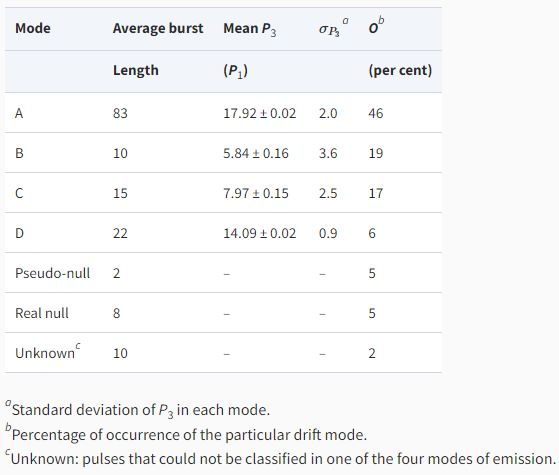

>
Long after humans figured out that the small bright dots in the night sky were just another sun-like object, and not very long after the discovery of the neutron, in the year 1933, Baade and Zwicky theorized the existence of a star made entirely of neutrons. It was called a neutron star and was thought to be leftover after the death of a rather massive star. The theory was, however, left alone due to the lack of proof.
>
---

In 1967, a graduate student found something strange in her data. She saw a signal coming from the sky at equal intervals in time with impeccable accuracy, unknown, until then, to any known astrophysical source. Naturally, this sparked an interest in not just the entire scientific community but also among the non-scientific folks. The phenomenon was initially ascribed to alien civilizations due to the lack of scientific reason. Within a year, the era's greatest minds figured that the 1967 discovery was, in fact, related to the theory conjectured in 1933. 

The neutron star spins at incredibly high rotational velocity owing to the conservation of angular momentum. They also emit radiation from their magnetic poles, observed at a wide range of wavelengths from Gamma-ray to Radio. This combination of emission from poles and rotation caused the apparent pulsating nature of the signal as seen by a steady observer on Earth. These 'pulsating' objects are now commonly known as pulsars. 

  

Figure 1: 2D pulse stacks displaying the subpulse drifting modes of emission observed for J1822−2256. The modes A, B, C, and D are arranged anticlockwise. Here, the x-axis shows the pulse phase, whereas the y-axis is the pulse number. The figure clearly shows drift patterns and their distinct behaviour representing the four different drift modes. (Credits: Author)

In a recent publication, our team tried to understand some long-standing questions related to pulsar emission, in light of new high-quality data from the upgraded Giant Meterwave Radio Telescope (uGMRT), on the pulsar J1822-2256. This work revolves around a periodic pattern found in some pulsars, different from their rotational periodicity. It has been found that the pulse observed from pulsars is not uniform and often shows sub-structures called subpulses. These subpulses are conjectured to come from small pockets of 'sparks'. The exact working of these sparks is still unclear. But the idea is that as the pulsar rotates around its rotational axis, these sparks also rotate with a period different from the pulsar's rotational period. Therefore, after each pulsar rotation, the spark arrangement seen by the observer is different from before. Interestingly, a diagonal pattern can be seen when the pulses are stacked in a 2D pulse stack, as shown in figure 1. This phenomenon is called subpulse drifting and gives a unique insight directly into the pulsar emission process. It is to be noted that pulsars show different kinds of drifting, and the parameters are rarely similar for any two pulsars. The number of pulsar rotations it takes for a subpulse to reappear at any given phase is denoted by the value P3.

  

Table 1: Drift mode measurements of J1822−2256. (Credits: Author)

  

Figure 2: Average profiles of different modes of emission of J1822−2256 at band 3 (300–500 MHz) and band 4 (550–750 MHz). The black dashed lines show the average profile, and the rest show the colour-coded average profile for each mode. The profiles are given arbitrary constant shifts along the y-axis for display purposes. Apart from the variation of the profiles across the different modes, the frequency-dependent behaviour of the profiles in each mode can also be observed here. (Credits: Author)

  

Figure 3: Plot of emission heights for different modes with frequency. The different colours represent the different subpulse drifting modes. (Credits: Author)

Our study found that the pulsar J1822-2256 shows at least four types of subpulse drifting modes, listed in table 1. The pulsar also seems to significantly lower or stop its emission aperiodically. The average pulsar emission (seen in an average profile, figure 2) also changes as the pulsar switches from one mode to the other. A direct implication of this finding is that the spark configuration changes as the pulsar changes its drifting modes. Through a robust calculation, we also calculated the possible number of sparks in each subpulse drifting mode. How and why the spark configuration changes are the questions that need to be answered. We further tried to explore the emission region for this pulsar. We estimated the emission heights for each subpulse drifting mode using the radius to frequency mapping model, suggesting that high-frequency emission dominantly comes from lower emission heights and low-frequency emission comes from higher altitudes. According to this new-found-knowledge, we claim that the emission we observe from the pulsar is inversely related to the number of sparks in each drifting mode. Figure 3 shows this inverse relationship between the emission height of different modes and the quantity P3, which is used to characterize the subpulse drifting modes. Therefore, each subpulse mode of emission comes from a different height in the pulsar’s magnetosphere and each mode contains a different number of sparks. 

Since the discovery of the first pulsar CP1919 by Jocelyn Bell, thousands of pulsars have been observed. Emission from pulsars has been seen at multiple wavelengths; however, not all pulsars emit at all wavelengths. Some pulsars only emit at radio frequencies, while some others only at Gamma-ray frequencies, and a small fraction also emit at multiple wavelengths. However, a majority of the pulsar population shows emission at radio frequencies, sometimes in conjunction with emission at other frequencies as well. These compact objects have been subjects of curiosity for a long time and continue to do so. Neutron stars are highly gravitating objects, only second to black holes. They have magnetic fields over a trillion times stronger than the Earth's magnetic field. Thus, neutron stars, aka pulsars, are laboratories to study physics in extreme environments, which are otherwise impossible to attain in labs. Despite the pulsars being known for decades, they continue to be mysterious and something that will always gravitate the astronomers.

<i>
If you like this sneak peek into the world of astronomical research, do visit my <a href="https://www.youtube.com/channel/UCtyBYX722FICBnH-sodTBsQ">YouTube channel!</a> I aperiodically (unlike pulsars) post about my life as a PhD scholar, tips for the ones who want to do research, and discuss far more interesting topics related to astrophysics. Psst! I also went to the All India Radio station to record an astronomy podcast. Check out the vlog <a href="https://www.youtube.com/watch?v=0BaTg1UC5Z0">here</a>. Like! Share! Subscribe!
</i>

**Original paper:**
<a href="https://academic.oup.com/mnras/article/509/3/4573/6429311" target="_blank">Revisiting the subpulse drifting phenomenon in PSR J1822−2256: drift modes, sparks, and emission heights</a>

**First Author:** Parul Janagal

**Co-authors:** Manoneeta Chakraborty, N D Ramesh Bhat, Bhaswati Bhattacharyya, Samuel J McSweeney

**First author’s Institution:** Department of Astronomy, Astrophysics, and Space Engineering, Indian Institute of Technology Indore, Indore 453552, India

<noscript>Please enable JavaScript to view the <a href="https://disqus.com/?ref_noscript">comments powered by Disqus.</a></noscript>
