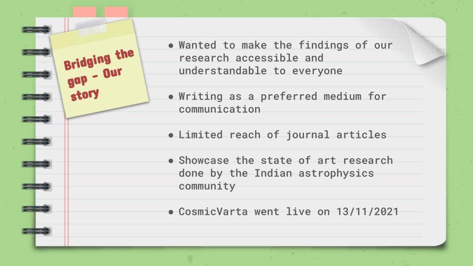
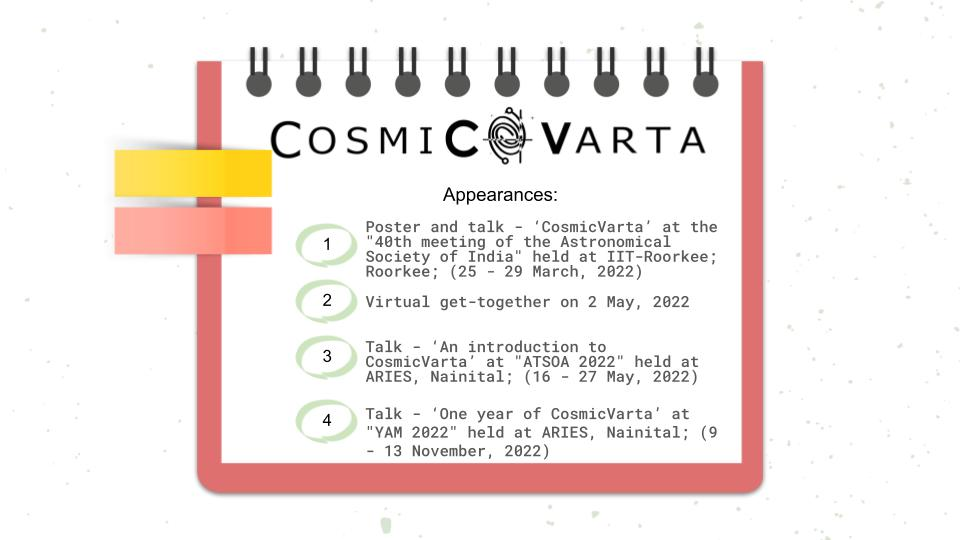
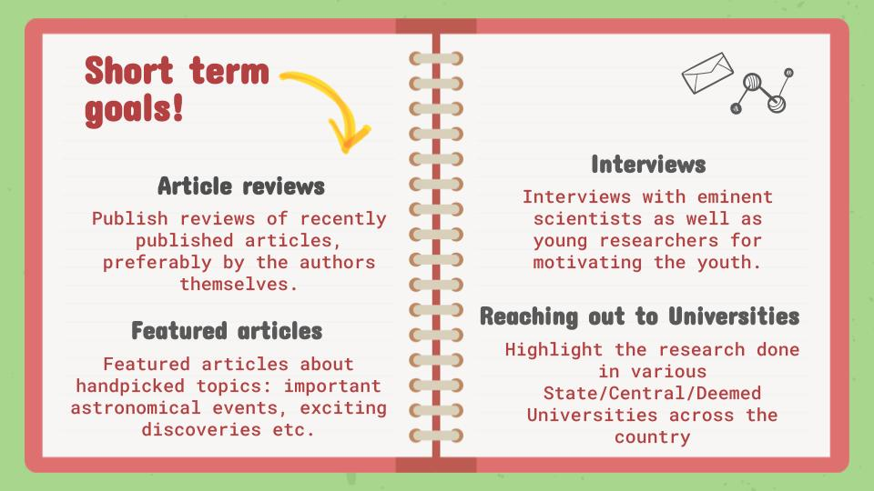
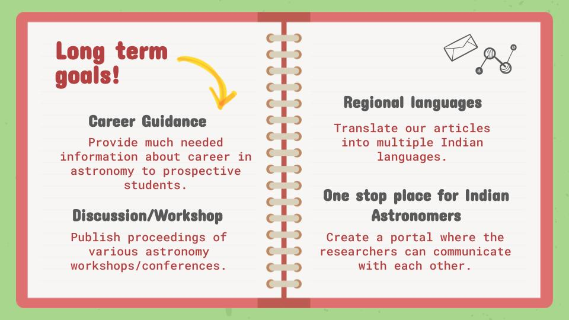
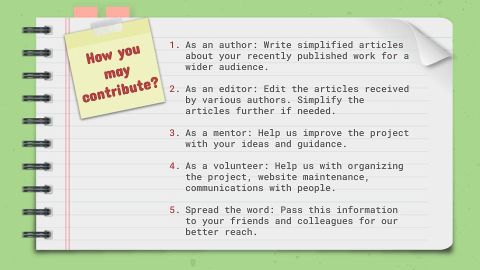

>
**CosmicVarta** celebrates its **first birthday** today! Hurray!
It was a wonderful year indeed.
Today, we take a look back at our journey and briefly talk about our future plans.
>
---

## Our Story

**Astronomy and Astrophysics** as a subject has the potential to remove the barriers between people and unite them in a hope of understanding the cosmos. However, even though cutting-edge research is being carried out across India, a communication gap exists between the researchers and the younger students as well as the general public who may not be familiar with the technical details.

In the hope of bridging this gap, came together a group of enthusiastic PhD students from various research institutes across India and **CosmicVarta** was born.

  

Here is an article describing <a href="https://cosmicvarta.in/welcome-to-cosmicvarta-team/" target="_blank">"What is CosmicVarta?"</a>

## CosmicVarta in numbers...

1. Total number of articles: 46 
2. Total number of featured articles: 5
3. Number of articles under progress: 10+
4. Contributions from: Masters’ students, PhD scholars, post docs and scientists
5. Number of authors: 34 
6. Number of editors: 10+
7. Contribution from University students: 32.35%
8. Contribution from Institute students: 67.65%
9. Readers from **76** countries with maximum users from India followed by US

## Showcasing CosmicVarta

This year, we had an opportunity to showcase CosmicVarta at several conferences and events. Here is the list of those events.

  

## Future Goals

  

  

## Contribute to CosmicVarta

We are always looking for contributors.
**Here is how you may contribute to our efforts and help us take the research done by the Indian Astronomy and Astrophysics community to wider audiences.**

  

**In the end thank everyone who has been part of our journey. We look forward much more eventful and exciting year ahead!**

## Thank you!

<noscript>Please enable JavaScript to view the <a href="https://disqus.com/?ref_noscript">comments powered by Disqus.</a></noscript>
