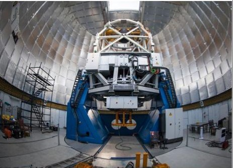

>
Gamma-ray bursts (GRBs) are flashes of high-energy radiation arising from energetic cosmic explosions. Bursts of long (greater than two seconds) duration are produced by the core-collapse of massive stars, and those of short (less than two seconds) duration by the merger of compact objects, such as two neutron stars. A third class of events with hybrid high-energy properties was identified, but never conclusively linked to a stellar progenitor. The lack of bright supernovae rules out typical core-collapse explosions, but their distance scales prevent sensitive searches for direct signatures of a progenitor system. Only tentative evidence for a kilonova has been presented. Here we report observations of the exceptionally bright GRB 211211A, which classify it as a hybrid event and constrain its distance scale to only 346 megaparsecs. Our measurements indicate that its lower-energy (from ultraviolet to near-infrared) counterpart is powered by a luminous kilonova possibly formed in the ejecta of a compact object merger. To study the aftermath of this long GRB, we used several telescopes in space and on Earth, in which the 3.6 m Devasthal Optical Telescope of the Aryabhatta Research Institute of Observational Sciences (ARIES) played a significant role.
>
---

Some massive stars die as the brightest and most explosive astrophysical sources in the universe, known as gamma-ray bursts (GRBs). GRBs are powerful astronomical bursts of high-energy gamma-ray radiation and are one of the most interesting and scientifically fulfilling phenomena studied in modern astronomy. GRB events have two distinct emission phases: one is the short-lived prompt emission (the initial burst phase, that emits gamma-rays), followed by a long-lived multiwavelength afterglow phase. 

For the past few decades, based on the observed time scale of prompt emission, astronomers have generally divided GRBs into two categories: long and short-duration GRBs, respectively. Long GRBs typically emit gamma rays for two seconds or more. They are associated with the death of very massive stars and are sometimes associated with supernovae. On the other hand, Short GRBs emit gamma rays for short periods of less than two seconds. This class of GRBs is formed when pairs of very dense celestial bodies (compact) - such as neutron stars or black holes - merge with each other, rotating in a spiral form over a period of billions of years. They also generate gravitational waves. In recent years, scientists have discovered a special phenomenon called a kilonova of visible and infrared light with short-period GRBs. According to a possible scientific hypothesis, the heat produced by the radioactive decay of heavier elements may emit kilonova. This process, known in physics as the r and s process, also produces heavier elements such as gold and platinum. However, observing kilonovas at near-infrared wavelengths is technically challenging, and only a few telescopes on Earth have been useful. The 3.6-meter Devasthal Optical Telescope (see Figure 1) of the Aryabhatta Research Institute of Observational Sciences (ARIES), is one such telescope that is  sensitive enough to detect kilonova and optical/near-IR counterparts of gravitational wave objects at these wavelengths up to faint limits.

On December 11, 2021, NASA's Neil Gehrels Swift Observatory and the Fermi Gamma-ray Space Telescope detected a burst of high-energy light (GRB 211211A) from the outskirts of the Milky Way located approximately 1 billion light-years away. To study the aftermath of this long GRB, astronomers used several telescopes in space and on Earth, in which the 3.6 m Devasthal Optical Telescope of the Aryabhatta Research Institute of Observational Sciences (ARIES) played a very important role (see Figure 2). The spectral energy distribution of GRB afterglow is usually explained in terms of non-thermal emission (due to synchrotron radiation). However, in this event, both thermal and non-thermal emissions are included in the spectral energy distribution of the afterglow, modeled using the magnificent and dim observations of the 3.6 m Devasthal Optical Telescope. After subtracting the afterglow contribution from the collected data taken using the 3.6 m telescope and 4Kx4K CCD IMAGER, the scientists found that the multiwavelength data could be well explained by additional thermal spectra and that this thermal emission could be explained in terms of kilonova emission. **This is the first astronomical event in which a long GRB has been accompanied by the unexpected discovery of a kilonova emission**, and  has shaken the understanding of scientists. In this event, the high-energy outburst lasted about a minute, and follow-up observations taken from the 3.6-meter Devasthal Optical Telescope identified a kilonova. Observations by the 3.6 m Devasthal Optical Telescope have provided information on the earliest phase of a kilonova ever detected. In addition to the first data taken by the 3.6-meter telescope, this scientific discovery, published in the journal **Nature**, also used Hubble Space Telescope, Multicolor Imaging Telescopes for Survey and Monstrous Explosions, Calar Alto Observatory, Devasthal Fast Optical Telescope, and many other space and ground-based telescopes. This discovery will help in understanding the process of the formation of heavy elements in the universe.

  

Figure 1: 3.6m Devasthal Optical Telescope installed at Devasthal Observatory of  Aryabhatta Research Institute of Observational Sciences (ARIES), Nainital. 

"Several years ago, Neil Gehrels, an astrophysicist, and namesake of Swift suggested that some long-duration GRBs may be produced by merging neutron stars," said Eleonora Troja, an astrophysicist at the University of Rome who led the team on the study. By GRB standards, this event was relatively nearby, allowing space and ground-based telescopes to capture the dim light of the kilonova. Kilonovae may also arise from more distant long GRBs, but we have not yet been able to see them through observations. PI of the 4Kx4K CCD IMAGER mounted on ARIES' 3.6-meter telescope, senior Scientist Dr. Shashi Bhushan Pandey, along with research students Rahul Gupta, Amar Aryan, Amit Kumar, and Senior Scientist Kuntal Mishra, contributed significantly to the discovery of this milestone event published in the journal Nature on 07-12-2022 at 16:00 (London time). Dr. Shashi Bhushan Pandey and the team of Indian scientists involved in this work said that this discovery challenges our current understanding of the origin of GRBs and gives rise to new possibilities in this thrust area of research. Professor Dipankar Banerjee, director of ARIES, pointed out that future time-domain astronomy has a unique potential to make a lot of such discoveries using the 3.6m Devasthal optical telescope.

  

Figure 2: The temporal evolution of optical emission (in R band) from GRB 211211A based on DOT data. The scientists from the ARIES, an autonomous institute of DST, used data from 3.6m DOT, in studying the aftermath of the long GRB (GRB 211211A), detected by NASA's Neil Gehrels Swift Observatory and the Fermi Gamma-ray Space Telescope on December 11, 2021. The high-energy outburst lasted about a minute, and follow-up observations taken from the 3.6-meter Devasthal Optical Telescope identified a kilonova. 

This discovery opens new questions regarding the origin and classification of GRBs. These sources' unique gravitational wave signatures could be the key to unraveling the mystery. The gravitational wave detectors such as LIGO, Virgo, and KAGRA did not detect GRB 211211A, as these detectors were offline for advancements. Suppose  gravitational wave detectors can see a long-duration GRB after they begin operating again in 2023. In that case, the combination of gravitational wave and electromagnetic data may solve the mystery of this newly discovered event.

---

**Original paper:**
<a href="https://www.nature.com/articles/s41586-022-05327-3" target="_blank">A nearby long gamma-ray burst from a merger of compact objects</a>

**First Author:** E. Troja

**Co-authors:** C. L. Fryer, B. O'Connor, G. Ryan, S. Dichiara, A. Kumar, N. Ito, R. Gupta, R. Wollaeger, J. P. Norris, N. Kawai, N. Butler, A. Aryan, K. Misra, R. Hosokawa, K. L. Murata, M. Niwano, S. B. Pandey, A. Kutyrev, H. J. van Eerten, E. A. Chase, Y.-D. Hu, M. D. Caballero-Garcia, A. J. Castro-Tirado

**First author’s Institution:** 
- Department of Physics, University of Rome “Tor Vergata”, Rome, Italy
- School of Earth and Space Exploration, Arizona State University, Tempe, AZ, USA

<noscript>Please enable JavaScript to view the <a href="https://disqus.com/?ref_noscript">comments powered by Disqus.</a></noscript>
