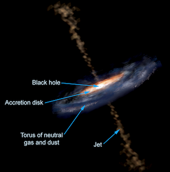
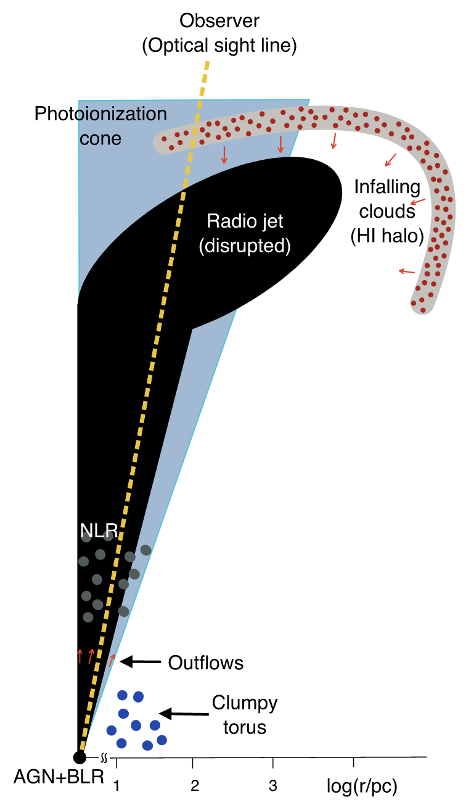

>
The interaction of radio jets with gas associated with the host galaxy could play an important role in determining their morphology.  Such interactions may be more prevalent at high redshifts, when these powerful AGN are still the assembly sites of giant galaxies.
>
---

  

Fig. 1 The canonical model of AGN (<a href="https://imagine.gsfc.nasa.gov/science/objects/active_galaxies1.html" target="_blank">Credit: Aurore Simonnet, Sonoma State University</a>)

The active galactic nuclei (AGN) are among the most luminous sources in the Universe. Their energy output is fuelled by the supply of gas to the central engine, i.e., a supermassive black hole (SMBH) through an accretion disk (see Fig. 1).  The detection of Lyman-alpha emission from neutral hydrogen (HI) has established that the powerful AGN at high redshift are embedded in huge (10 - 100 kpc) gaseous halos of diffuse atomic gas.  The observations of absorption lines detected in the spectra of AGN can provide crucial insights into the processes through which gas at large scales can be transported to the circumnuclear disk to fuel the central engine.

<a href="https://ui.adsabs.harvard.edu/link_gateway/2022ApJ...927L..24G/doi:10.3847/2041-8213/ac589f" target="_blank">Gupta et al.(2022, ApJL, 927, L24)</a> recently used the Robert Stobie Spectrograph (RSS) on <a href="https://www.salt.ac.za/" target="_blank">the Southern African Large Telescope (SALT)</a> in South Africa and <a href="https://science.nrao.edu/facilities/vlba/introduction-to-vlba" target="_blank">the Very Long Baseline Array (VLBA)</a>  in the USA to discover a curious case of high HI column density absorber that exhibits strong HI 21-cm absorption at radio wavelengths but is absent at optical wavelength! SALT is the largest single optical telescope in the southern hemisphere whereas VLBA is a radio interferometer  consisting of 10 identical antennas, separated by distances from 200 km to transcontinental 8600 km. 

  

Fig. 2 HI 21-cm absorption line associated with the powerful AGN M1540-1453.  Note that the HI 21-cm line (rest frequency of 1420.405752 MHz) is redshifted to ~456.2 MHz.

The large reservoir of cold HI gas associated with the quasar M1540-1453 at the redshift of z = 2.104 was discovered using <a href="http://www.gmrt.ncra.tifr.res.in/" target="_blank">the upgraded Giant Metrewave Radio Telescope (uGMRT)</a>  in India.  The corresponding HI 21-cm absorption profile is shown in Fig. 2.  It doesn’t exhibit any unusual features except that such absorbers have been difficult to find at high redshifts and only four are known at z > 2.  To understand the origin of detected cold gas, Gupta et al. observed M1540-1453 with SALT to detect the strong Lyman-alpha (Lyα) absorption corresponding to the gas detected with uGMRT.  But to their surprise, no such absorption was detected in the optical spectrum (see Fig. 3).   Also, in comparison to typical quasars, the Lyα emission line associated with the AGN is much narrower.

  

Fig. 3 SALT spectrum of M1540-1453.  Note the absence of strong HI Lyman alpha absorption.  The blue curve represents the absorption profile expected on the basis of absorption detected in the uGMRT spectrum at radio wavelengths.

  

Fig. 4 VLBA image revealing the diffuse radio morphology of M1540-1453.

In comparison to optical, in general the radio emission associated with AGN is much more spatially extended. This difference can be used to explain such ambiguities in the radio and optical spectra. To dissect this further and understand the *ghostly* nature of this HI absorber, Gupta et al. observed M1540-1453 with VLBA.  Usually, one expects radio emission associated with such powerful AGN to exhibit well collimated radio jets and lobes (see Fig. 1). However, the milliarcsecond-scale resolution observation of M1540-1453 shows a diffuse morphology (Fig. 4), which implies that the gas in front of it, which is producing absorption, is also not a few localized gas clumps, but rather forms a clumpy shell or halo which could be as large as 10 kpc (see Fig. 5). It is conjectured that this HI shell represents infalling gas clouds that may have been blown by the interaction between radio jets and the host galaxy medium.

  

Fig. 5: Cartoon depicting a quadrant of M1540–1453 embedded in a clumpy ISM. The quasar’s optical sight line (dashed line) may not intercept infalling HI clouds. In comparison, extended radio emission (> 425 pc) from the lobes will be intercepted by several such clouds, producing the broad redshifted HI 21 cm absorption line. The extent of the HI halo and radio emission could be as large as 10 kpc.  

The quasar M1540-1453 was discovered through an ambitious spectroscopic survey using SALT (180 hrs) and the Nordic Optical Telescopes (6 nights) to build a purely infrared-selected sample of radio-loud quasars (RLQs) at z > 1.5 and define the footprint of <a href="https://mals.iucaa.in/" target="_blank">the MeerKAT Absorption Line Survey</a>  (MALS; PI: N. Gupta).  MALS is one of <a href="https://www.ska.ac.za/science-engineering/meerkat/observers/observing-programme/large-survey-projects/" target="_blank">the ten large surveys</a> being carried out with <a href="https://www.ska.ac.za/science-engineering/meerkat/" target="_blank"> the MeerKAT radio telescope</a> in South Africa. In the coming years, MALS is expected to detect several such absorbers that may have escaped detection at other wavelengths, and address various fundamental issues related to AGN.

---

**Original paper:**
<a href="https://doi.org/10.3847/2041-8213/ac589f" target="_blank"> H I Gas Playing Hide-and-seek around a Powerful FRI-type Quasar at z ∼ 2.1</a>

**First Author:** Neeraj Gupta

**Co-authors:** R. Srianand, E. Momjian, G. Shukla, F. Combes, J.-K. Krogager, P. Noterdaeme, and P. Petitjean

**First author’s Institution:** Inter-University Centre for Astronomy and Astrophysics (IUCAA), Pune, India.

<noscript>Please enable JavaScript to view the <a href="https://disqus.com/?ref_noscript">comments powered by Disqus.</a></noscript>
