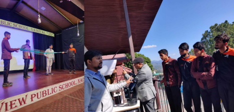

>
A summary of science outreach performed during the Young Astronomer's Meeting, 2022.
>
---

The human mind is always curious and questioning. It has a very compulsive behavior of asking “why,” “how,” and sometimes “what if?”. As Farhan Akhtar sings in the movie Rock On!! (2008), *“Why is the sky blue, why is the water wet, and why is the Earth round? Socha hai? Ye tumne kya kabhi?”*, meaning *“Have you ever thought of this?”*. Curiosity is one of the most fundamental qualities of humans and is unbridled in children. Children ask questions that are sometimes startlingly profound - “Why is the North of a magnet attracted to the South?”. Such questions are crucial to understanding the world around us and the very nature of our existence!

Science is generally approached in schools as a collection of facts about the world, with a smattering of numerical problems. However, this is hardly the case. Science is a method or a prescription for understanding the world. Typically, we perceive (see or hear or taste, for example) the world and are driven by an innate curiosity as to how the world functions. To answer this curiosity, we come up with reasons – some may be correct, but others may be utterly wrong. How do we decide this? Through the scientific method! Each reason may give rise to multiple testable results, which we then compare against the things we see or infer. We keep updating our different “reasons” if they fail and try to come up with a general picture of the world. If any person tests out these different “reasons,” they should also come up with the same answer – and then we would know if our understanding of the world is correct! 

The Young Astronomers Meet (YAM) is a meeting of **only research scholars** in astronomy and astrophysics in India. This meeting is of the scholars, for the scholars, and by the scholars. After a “coronal hiatus,” the meeting was held this year at the Aryabhatta Research Institute of observational sciencES (ARIES) in Nainital between 9th-13th November. As research scholars aiming to be professional scientists in the future, we ought to share our understanding, enthusiasm, and excitement about the scientific analysis of the world with everyone. With this in mind, the YAM committee organized a series of outreach activities aimed mainly at school children. The unbridled enthusiasm and curiosity of school children are an excellent motivator for the research scholars who were on the other side just a decade ago. The outreach activities were initiated by Dr. Virendra Yadav of ARIES/ASI-POEC and brought into shape by Mr. Atharva Pathak of Pune Knowledge Cluster, who was earlier with the IUCAA Science Popularization team. Along with the two experts were the YAM chair Vivek Jha, YAM coordinator Dimple, and YAM SOC member/ CosmicVarta editorial team member Vishal[^1], who edited and finalized the outreach program. This complete team had almost more than 15 research scholars who volunteered from purchasing materials to conducting outreach! 

# The initial outreach session 

In general, the schools had requested outreach sessions for a specific range of classes. For example, students between classes 6th to 8th formed one batch, and those from 9th to 12th included another. On the first day of YAM, we were yet to receive a full confirmation from various schools which had been approached. One school – Dikshant International, Haldwani – had confirmed the outreach session for both batches on the 10th of November, 2022. So on the 9th, Atharva, Virendra, Dimple, Vivek, and I sat down with the set of experiments and demonstrations of IUCAA Scip-pop brought by Atharva. Every region, every school, and every batch is unique. Hence, we selected an initial set of demonstrations suitable for the two batches of students. The initial preparation was extremely important – the demonstrations had traveled all the way from Pune to Nainital and had to be in perfect condition to work. Thus, we narrowed down a couple of demonstrations and presentations to be showcased to the students. 

The team on the first day was led by both Atharva and Virendra. It consisted of Sreetama Das Choudhury and Samik Mitra from IIT Guwahati, Priyesh Tripathi from ARIES, Ajay Kumar from NCRA, Pune, and myself. The outreach started with the senior batch students, to whom Virendra introduced astronomy and ARIES. This was followed by a set of demonstrations led by Atharva and the volunteers, involving participation from the crowd as “student volunteers.” A part of the team then led these students for sunspot observations through the 5” Cassegrain telescope. The junior batch students were presented with most of the demonstrations – however, this crowd was more challenging to control, with the time running short. Thus, while the volunteers conducted the demonstrations, each step and reasoning was interactively performed, with the students sometimes shouting an answer in unison! Finally, these students were shown sunspots through the telescope, and the sessions concluded with an informal interaction with the outreach team and teachers.

  

Outreach sessions at Dikshant International. Top: The research scholar volunteers with the school students. Bottom: A talk by Dr. Virendra Yadav is underway.

 

# Learning from feedback 
The sessions at Dikshant International were a big hit and taught us many things. First, the younger students were typically chaotic and easily fascinated by science experiments – especially those making a lot of noise or being disruptive. These kids were not very interested in any presentation unless it was highly captivating. Second, the older students showed a greater inclination toward the presentations. Furthermore, the presentations were effective if they were relevant to the experiment being performed. 

We had confirmed attendance at four schools the next day (11th November). Since the demos were limited in number, we had to select demos that may be showcased at these different schools and make multiple copies of each demo for each school. 

Taking all this data, we formulated a plan of action. The subsequent sessions would have the sunspot observation as the epicenter, and from thereon, we would diversify to different topics. Each session would first start with sunspot observations, giving an observational treat. Next, we would have a presentation on sunspots with lots of visuals. Then, we change tracks to the experiments: (i). Demonstration of magnetic levitation – an extension of the magnetic nature of sunspots, (ii). Mixing of different colours of light, and the meaning of “electromagnetic spectrum” (iii). The demonstration of transverse and longitudinal waves and energy transfer using a slinky-like construction (iv). The dependence of pitch of the sound on the length of the air/water column, using two demonstrations, (v). Concave and convex mirror and lens demonstration, and (vi). The application of an astrolabe to find the coordinates of objects in the sky. The session would then end with slides on ARIES and YAM. 

With our demos confirmed, we needed to replicate them. Volunteers from ARIES stepped up to perform the purchase. The demonstrations are constructed with simple, day-to-day objects: colored papers, pencils, plastic straws, sponges, and protractors, for example!

  

Session planning, demonstration construction, and presentation curation by the YAM attendees. 

Since there were four schools with four volunteers per team, we needed around 16 volunteers for our team. The YAM attendees enthusiastically turned up to volunteer for the outreach and were split into different teams. Each team had a lead and a set of volunteers trained and readied for the outreach.

# Large-scale outreach session

Two large cars containing two teams each left ARIES early in the morning after breakfast on the 11th. The schools gave timings for conducting the sessions, so we had to ensure there was correct coordination, for we only had two telescopes for four schools. The outreach plan was to go to the first school, perform sunspot observations, and let the second team take the telescope to the next school. 

The four schools that had requested outreach were Shemford, Sacred Heart, Aurum Global, and Aryaman Vikram Birla Institute of Learning. Atharva, Virendra, Gourav, and I led the teams at different schools. In Atharva’s team were Eshita Banerjee (IUCAA) and Kiran Wani (ARIES), while in Virendra's team were Sayak Dutta, Suraj Dhiwar (IUCAA), and Vikas Rawat (ARIES). Gourav Banerjee of CHRIST (Deemed to be University), Bangalore led Anju Panthi (BITS Pilani), Mizna Ashraf (IISER Tirupati), and Arpit Kumar Shrivastav (ARIES), while I led Pranshu Kumar, Bhavya Ailawadhi and Prajjwal Rawat from ARIES. 

  

Outreach at Aryaman school, with the sunspot observations (top) and demonstrations (bottom). 

  

Outreach session and demonstrations at Aurum school 

  

Outreach session and demonstrations at Sacred heart school 

  

Outreach session and demonstrations at Shemford school  

The outreach events went almost perfectly according to our plans. Since each team had a leader with prior experience performing science outreach, the teams adapted to the student's responses. We aimed not just to showcase experiments but to inculcate excitement and develop an innate curiosity about the world. Thus, depending on which demos were well received, the teams tinkered with the order and the set of demos to be presented. 

The junior batch students were extremely chaotic. Navigating the chaotic energy is a major task in itself, but in general, all the volunteers were amazed by the observation skills and thought processes of these kids. The students were attentive to what we spoke about and asked some questions which, at a scientific level, were quite profound! Also, we noticed that the little things we do significantly impact kids with confidence issues. A little encouragement to such kids to come onto the stage and perform the demos has quite an impact on these kids. In fact, some of these kids stayed much later to chat with us and thanked us for giving them an opportunity on stage! 

On the 12th of November, a final outreach session was planned for senior batch students at Longview Public school with the same demos. This school was not in the plains of Haldwani but rather in the mountains of Nainital. This session was undertaken by Virendra, Kiran, and Pranshu and joined by Srashti Goyal of ICTS. 

  

Outreach session and demonstrations at Longview school 

# Wrapping up and next steps

The science demos we created for individual schools were given away to these schools to let the teachers perform such demonstrations. In most schools, the teachers showed as much enthusiasm as the students while the demos were underway. This is critically important in inculcating love, excitement for the scientific process, and a general curiosity about the world. Dr. Virendra Yadav, the co-chair of the Outreach team of the Astronomical Society of India, presented a summary report to ASI on the conducted outreach sessions. The team of volunteers hopes that the YAM outreach becomes a standard template of outreach to be followed as a part of any conference/meeting occurring within India; looking forward to increased participation and sharing our scientific enthusiasm!

[^1]: Yeah me - Nice to meet you :P

---

<noscript>Please enable JavaScript to view the <a href="https://disqus.com/?ref_noscript">comments powered by Disqus.</a></noscript>
