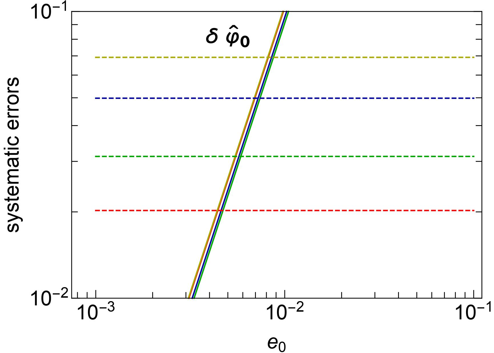

>
General theory of relativity proposed by Albert Einstein in 1915 has passed all the experimental and observational tests with flying colors. Gravitational waves from the merger of compact binaries such as black holes and neutron stars provide a unique opportunity to test general relativity in the strong-field regime of gravity. Missing physics in the modeling of gravitational waves can appear as a false violation of general relativity.
>
---

General theory of relativity predicts that if two black holes are orbiting around each other, the orbit of the binary will shrink due to the emission of gravitational waves. As black holes come closer and closer, their orbital speed increases. The black holes move close to the speed of light in their final orbits, dragging spacetime around them. Finally, two black holes collide and merge, releasing an enormous amount of energy in the form of gravitational waves and leaving behind a more massive spinning black hole. The emitted gravitational waves from these mergers carry information about the nature of gravity in these extreme regions of spacetime.

In 1974, Hulse and Taylor discovered a pulsar orbiting around a neutron star. According to general relativity, the binary system must be losing energy due to the emission of gravitational waves. By observing the orbital period of the binary, they found that the orbit of the binary was shrinking and the rate of shrinking was in excellent agreement with the predictions of general relativity. This observation proved the existence of gravitational waves and tested general relativity in strong gravitational fields where the theory had never been tested before. This discovery of gravitational waves earned the Nobel Prize in physics in 1993.

On September 14, 2015, gravitational waves from the merger of two black holes were detected by Laser Interferometer Gravitational-wave Observatory (LIGO), nearly 100 years after Einstein's discovery of general relativity. This first direct observation of gravitational waves opened a new window to the unexplored dark universe. The observation won the Nobel Prize in 2017. Till now, nearly 90 gravitational wave signals from merging black holes have been detected. Each new gravitational wave observation helps physicists test general relativity. No evidence of physics beyond general relativity has been found in any of these observations. However, it is possible that beyond general relativity effects are minuscule and not visible in current-generation gravitational wave detectors.

General relativity is currently our best understanding of gravity. However, there are unsolved problems in cosmology such as the nature of dark matter and dark energy, that cannot be explained by general relativity alone. Many {*modified theories of gravity*} have been proposed as an alternative to general relativity to address these unsolved problems. The ideal way to test the true theory of gravity would be to match the observed gravitational wave signals against the predictions of various theories of gravity and see which theory is best supported by the data. However, waveform modeling in modified theories of gravity is still in the infant stage. Hence we use our best understanding of general relativity and look for deviations away from general relativity.

  

    (a) LIGO

  

    (b) Cosmic Explorer

    Figure 1: Systematic and statistical errors on the leading order deviation parameter as a function of orbital eccentricity e0. Systematic errors are represented by solid lines and statistical errors are denoted by dashed lines. These errors are shown for four representative binaries with different total masses. The orbital eccentricity e0 on the x-axis is defined at a gravitational wave frequency of 10 Hz.

    If a black hole binary with total mass 15M&#9737 (solar mass) and orbital eccentricity 0.04 is observed by LIGO, the eccentricity-induced systematic bias on the leading-order deviation parameter becomes comparable to the statistical errors as illustrated in the adjacent figure (taken from Saini et al. (2022)). These biases will shift the deformation parameters away from their true value, which is zero in general relativity, indicating a false deviation from general relativity. This value of eccentricity is even lower (0.005) for the more sensitive future third-generation gravitational wave detector (Cosmic Explorer).

It is very likely that in the near future, we detect gravitational waves from the mergers of black holes in eccentric orbits. There are already signatures of a few eccentric mergers in the detected gravitational wave signals. To avoid the risk of falsely claiming a breakdown of general relativity, controlling waveform systematics is of immediate need for the gravitational wave community.

# References:

* [Saini et al.(2022) Saini, Favata, and Arun] P. Saini, M. Favata, and K. G. Arun, Phys. Rev. D 106, 084031 (2022), arXiv:2203.04634[gr-qc].

---

**Original paper:**
<a href="https://ui.adsabs.harvard.edu/link_gateway/2022PhRvD.106h4031S/arxiv:2203.04634" target="_blank">Testing general relativity using gravitational waves</a>

**First Author:** Pankaj Saini

**Co-authors:** Marc Favata, K. G. Arun

**First author’s Institution:** Chennai Mathematical Institute, Chennai, 603103; India

<noscript>Please enable JavaScript to view the <a href="https://disqus.com/?ref_noscript">comments powered by Disqus.</a></noscript>
