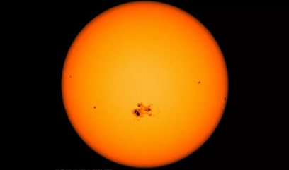
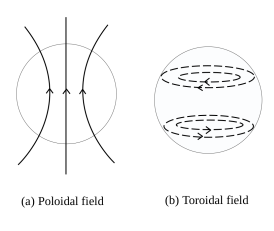
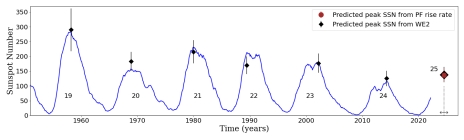
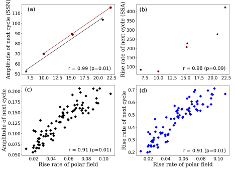

>
Forecasting the strength of the solar cycle is of the utmost importance because it affects space weather and our technology-based society. By a riveting feature of the solar cycles, i.e. Waldmeier effect (WE2), we find a linear relationship between the solar cycle rise rate and cycle amplitude. Also, the previous cycle's poloidal field (PF) rise rate is physically related to the next cycle's rise rate and amplitude. Using this physical connection, we predicted the strength of Solar Cycle 25 to be 137+/-23, which extends the temporal range of the solar cycle prediction to much earlier than what previous studies were able to do. Also, this prediction is very close to what we got by direct application of the Waldmeier effect (WE2). Currently, solar cycle 25 is in progress, which is following our forecast quite well. 
>
---

# Introduction

The Sun is our nearest star, which generates an incredible amount of energy in different forms like light and heat, charged particles, magnetic fields, gamma, and X- rays. The Sun's dynamic magnetic field is responsible for energetic events like solar flares and coronal mass ejections (CMEs). The sunspots (Fig. 1), regions of strong magnetic fields on the solar surface, are also the result of the Sun's dynamic magnetic field. The number of sunspots varies periodically in about a 11-year cycle. This cycle is popularly known as the solar cycle or the sunspot cycle. The strength of the solar magnetic field is strongly coupled with the activity level of the solar cycle. These events concertedly create weather in space (“space weather”), which affects the interplanetary medium and planetary atmosphere. Sometimes this space weather has hazardous impacts on our technology-dependent society. In a strong solar cycle, many more such energetic events are observed and thus have huge effects on the space weather. Space weather interferes with the Earth's atmosphere and disrupts radio communications, power grids, and satellites. Thus, space weather is currently a vital issue and a novel field of exploration. The scientific community is actively trying to understand space weather phenomena and its impact on us. Therefore, the prediction of the dynamic solar cycle strength is of the utmost importance. 

Most of us have seen the bulb turning on in the headlight of the bicycle at night. This bulb used to give more light when the paddles of the bicycle went fast and when the paddles stopped the bulb was extinguished, right? There was a small dynamo in the bicycle which used to produce current when the bicycle was moving. Inside the dynamo, a permanent magnet is rotated in the middle of some coils of wire. The rotating magnet produces a changing magnetic field and thus magnetic flux. By Faraday’s law, it gives an e.m.f. and generates current in the coils of wire. The top of the dynamo is touched against the rim of the bicycle which rotates when the bicycle is moving. Similarly, the solar dynamo is the action of different flows inside the sun and produces currents, and these currents give the dynamic magnetic field. The Sun has two types of magnetic fields, one is a toroidal field, and the other is a poloidal field (see Fig. 2). In 1955, Parker suggested that the sunspot cycle is produced by an oscillation between the poloidal and the toroidal magnetic fields, resulting in a 11-year periodic magnetic cycle. In this theory, the poloidal field gives a toroidal field and vice versa by the dynamo process. 

Interestingly, this magnetic cycle follows a specific property i.e. the Waldmeier effect (WE). In 1935, Waldmeier showed that the rise time of the solar cycles is inversely proportional to the cycle's amplitudes.

This effect is known as the Waldmeier effect (WE1). Also, a strong correlation was found between the rise rate and the amplitude of the cycle, and this is known as the Waldmeier effect (WE2). Further, the feature of the Waldmeier effect (WE2) enables us to establish a linear relationship between the rise rate of the cycle and the amplitude of the cycle. Motivated by this relationship, we analyzed the observational data of Sunspot number (SSN) and sunspot area (SSA) for the solar cycles. 

  

Figure 1. Sunspots ( black dots ) on the surface of the sun. (Image credit: NASA/SDO) 

Using the data from the past 13 solar cycles, we found a strong linear correlation between the rise rate and the strength of the solar cycles. Thus, we can predict the solar Cycle 25's amplitude by applying the linear fit between these two parameters. Using this method, we predicted the solar Cycle 25's peak amplitude to be 138 +/- 26, even though it started just two years ago. We also expect this cycle to attain its peak around mid-2024. For checking the robustness and reliability of this method, we also predicted the amplitudes of a few past cycles, which agree quite well with the corresponding observations, as shown in Fig. 3.

  

Figure 2. Sketches of the poloidal and toroidal field of the sun

  

Figure 3. The plot shows the comparison of predicted amplitudes (using WE2) with observed solar cycle amplitudes. The blue curve shows the temporal variation of the observed sunspot number (SSN). Squares show the predicted amplitudes based on the WE2, and vertical lines their errors. The vertical dotted line and the horizontal arrow show the time of the predicted peak of Cycle 25 and the error in that time’s prediction respectively. Prediction of Cycle 25's amplitude using the rise rate of the previous cycle's poloidal field is shown by a <i>dark red-filled circle</i>. 

Generally, the scientific community uses a highly robust physics-based method to predict the upcoming solar cycle strength at solar cycle minimum, called the polar precursor method. In this method, the amplitude of the poloidal field at the solar cycle minimum is taken as the seed to predict the amplitude of the next solar cycle. Motivated by this, we analyzed the poloidal field at cycle minima and the rise rate of the next cycle, and obtained a high linear correlation between them for both observational and model data. This strong correlation indicates that a strong poloidal field at cycle minima certainly makes the following cycle rise faster and it also becomes stronger complying with the Waldmeier effect (WE2).

Now, since we found that the polar field at cycle minima is strongly correlated with the rise rate of the cycle, therefore going one step backward in their evolution, we find a fascinating feature. This feature reveals that the rise rate of the poloidal field after polarity reversal (north pole to south pole or vice versa) is strongly correlated to the rise rate and amplitude of the next cycle (see Fig. 4). Moreover, we also found a strong correlation between the poloidal field build-up rate and the peak poloidal field. These features can be explained with the help of the solar dynamo process. Thus, these results suggest a physical link between the poloidal field build-up rate and the rise rate of the next cycle. Therefore, WE2 enables us to predict the amplitude of the next cycle from the rise rate of the poloidal field calculated from the data a few years after the polarity reversal of the previous cycle. By applying a linear fit between the poloidal field rise rate and amplitude of the next cycle for the data of previous cycles, we predicted the peak of cycle 25 will be around 137 +/- 23 This value is very close to the value we got directly from WE2. 

Our work shows a strong physical connection between the polar field build-up rate and the amplitude of the next solar cycle. Further, it also shows the crucial physical link between the polar field rise rate and the Waldmeier effect (WE2), since our prediction of the peak amplitude of the current solar cycle based on WE2 (138 +/- 26) is very close to that based on the polar field rise rate (137 +/- 23). Thus, using our novel method allows us to make a reliable prediction of the amplitude of a solar cycle as early as about 9 years before it actually reaches its peak !

  

Figure 4. Scatter plots between the rise rate of the polar field with the rise rate of the next cycle and cycle amplitude. (a) and (b) are obtained from observational data (black and red colors are for the northern and southern hemispheres of the sun respectively), while (c) and (d) are for the dynamo model. ‘r’ denotes the extent of correlation between the values on the y-axis and values on the x-axis. 

Recently, solar Cycle 25 activity was in the news, and it has been observed that its activity has quickly ramped up. Even though the sun has not yet reached its peak activity level, it has already exceeded many predictions. Until now, the sun is following the same pattern we predicted based on the polar field rise rate. Thus, our technique will further increase the temporal range of prediction of the solar cycle strength and will also help to understand the dynamo process more physically.

---

**Original paper:**
<a href="https://doi.org/10.1093/mnrasl/slac043" target="_blank"> Physical link of the polar field buildup with the Waldmeier effect broadens the scope of early solar cycle prediction: Cycle 25 is likely to be slightly stronger than Cycle 24</a>

**First Author:** Pawan Kumar

**Co-authors:** Akash Biswas, Bidya Binay Karak

**First author’s Institution:** Department of Physics, Indian Institute of Technology (Banaras Hindu University), Varanasi 221005, India

<noscript>Please enable JavaScript to view the <a href="https://disqus.com/?ref_noscript">comments powered by Disqus.</a></noscript>

