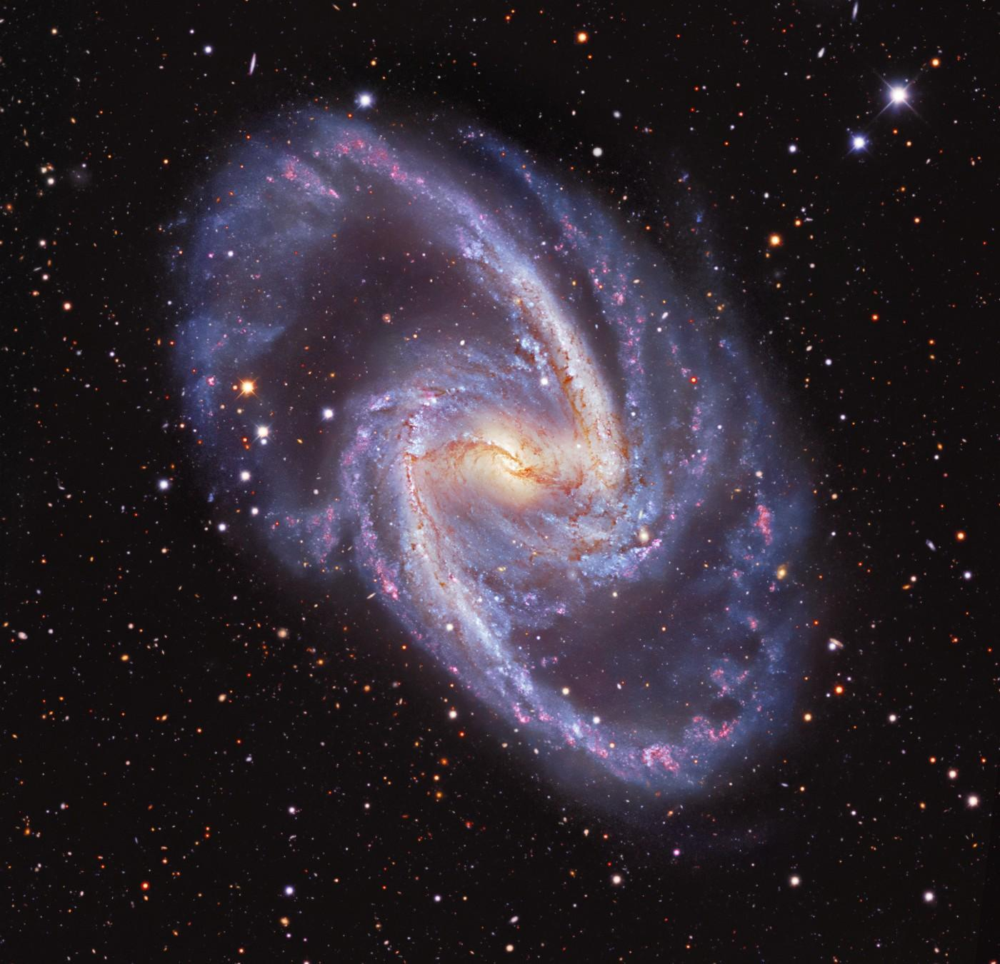

>
An active galactic nucleus (AGN) is powered by the matter accreting onto the central supermassive black hole (SMBH) at the centre of a galaxy. Changing look (CL) AGNs are those sources that show rapid change in the column density of the X-ray absorber. CLAGNs show a complex shape in their X-ray spectra. The physical mechanisms responsible for these variations are unclear to date. In this article, we took an attempt to explain the CL phenomena on AGN and their possible origin. For that, we studied the spectral properties of NGC 1365 using joint XMM-Newton and NuSTAR observations. We used JeTCAF model to fit the X-ray spectra of the source. We found that the variable absorption column density correlates with the mass accretion rate and the geometry of the corona. The derived wind velocity was sufficiently low compared to the escape velocity to drive the wind away from the disk for the epochs during which column densities were high. This suggests that the high and variable absorption can be due to failed winds from the disk. Our study construed that the changing accretion rate, which is a fundamental physical quantity and the geometry of the corona are driving the CL phenomena in NGC 1365. The physical picture of this work connects both variable continuum and variable absorbing medium scenarios. Moreover, from the spectral fitting of the joint data, we found the mass of the central black hole to be constant 4.38 ± 0.34−4.51 ± 0.29 × 106 Msun , in accord with the optical observations. 
>
---

Beyond the visible stars that we see in the night sky, there is a hidden zoo of strange astronomical objects that are only visible as signals through high-tech telescopes in multiwavelengths from radio to gamma rays. Some are even Black Holes They are extremely dense, with such a strong gravitational attraction that not even light can escape their grasp. Therefore, black holes seem black! But the light which is coming from the accretion disk  makes them visible through different telescopes. Small black holes populate the universe, but their cousins, supermassive black holes, dominate. These enormous black holes are millions or maybe even billions of times as massive as the sun. Scientists aren't certain how such large black holes spawn. Once these giants have formed, they gather mass from the dust and gas around them, material that is plentiful in the center of galaxies, allowing them to grow to even more enormous sizes. When such an active supermassive black hole is sitting at the center of a galaxy and illuminating the whole galaxy is called an active galactic nucleus or an AGN. They can launch energetic jets and winds and emit radiation in different wavelengths.  AGNs have an endless supply of fuel, allowing them to power the jets. The accretion of hot gas and dust from the host galaxy is one of the sources of such a seemingly unlimited fuel supply. 

Not all AGNs appear similar to each other. They are classified depending on the presence or absence of jets, jet morphology, width of emission lines, luminosity, and the orientation in which these AGNs are viewed from the Earth. Depending on either the viewing angle or some intrinsic difference in structure, they can be classified into different spectral types. AGNs not only differ from one another but also change their flux and spectral type drastically in a timescale of hours to decades in both X-ray and optical/UV energy bands, which is why they are often called Changing Look AGNs. What makes them change their appearance has been the subject of much debate recently; however, two main processes are hypothesized to bring about this change: Changing Look due to obscuration and Changing Look due to change in state.

We often see stars twinkling on a moderately cloudy night. This twinkling behavior is observed due to the irregular movements of clouds in the atmosphere, which changes the amount of brightness seen in stars from time to time through time-dependent obscuration along the line of human sight. Changing obscuration AGNs also have a similar reason for changing their appearance. They show intense time-dependent variability of the line-of-sight intervening gas density/column density, primarily associated with clouds or outflows eclipsing the AGN. Change in the appearance of AGNs due to obscuration is observed mainly in the X-ray wavelength regime. Obscuration by neutral intervening gas can leave a clear imprint on the X-ray emission observed in AGN. At a high column density, obscuration becomes significant enough to suppress the primary continuum of X-rays and produce a secondary continuum through reflections within the gas. Such variations are typically observed in X-Rays as the region which makes these X-rays are small enough to be concealed by the neighboring gases.  Changes in gas densities that cause obscuration are driven by intrinsic AGN luminosity variations, which have an impact on the chemical state of the material. A higher AGN luminosity chemically modifies the obscuring material to become more transparent to X-rays and thereby allows a decrease in line-of-sight column density. Apart from neutral gas obscuration, absorbing gas usually associated with outflows can also strongly affect the X-ray spectrum and is routinely recorded by the detector.

  
  

    Figure 1: (upper panel) <em>Credit:</em> Robert Gendler and The Hubble Legacy Archive, KPNO/NOIRLab/NSF/AURA-Total view of NGC 1365, (lower panel) Cartoon diagram of the model (JeTCAF; jet in two component advective flow model) used to fit the X-ray data. <em>Credit:</em> arXiv:2107.13808. 

Changing look due to change in state in AGN may arise due to several processes. They are usually observed in the UV/Optical regime due to variability in the accretion phenomenon. In many cases, they can be separated from Changing Obscuration AGN, when a Change in the look of AGN happens in close succession to a change in some intrinsic property of black hole accretion. One such case is a failed wind scenario. Instabilities like thermal or magnetic instabilities can heat up the disk and cause variations in the disk surface temperature and density and thereby making chemical changes in the disk, which directly affects the X-ray radiation. Other events include tidal disruption events, where a star gets close to a black hole and gets torn apart by it. In the process, the debris of the dead star disrupts the gas in the accretion disk of the black hole, which in turn changes the accretion rate and significantly affects the disk along with the X-ray corona, which disappears after a point. Observations do see such effects in different wavebands. 

In our study, we attempted to make a bridge between two main mechanisms, the intrinsic variability in the spectrum and the obscuration along the line of sight. For that purpose, we have analyzed a joint XMM-Newton and NuSTAR satellites’ data of the source NGC 1365 (shown in the left panel of Fig. 1). Here, we briefly explain the data analysis procedures and spectral fitting techniques. 

# Data Analysis

We used joint *XMM-Newton* and *NuSTAR* observations of NGC 1365 during 2012 and 2013.  To analyze the XMM-Newton data, we used the Science Analysis System (SAS) version 19.1.0 and followed the standard procedures given in the SAS data analysis threads. We first reprocessed the Observation Data Files (ODF) using the epproc routine to generate the calibrated and concatenated event lists. We filtered the concatenated event lists to remove the periods of high background activity. Furthermore, we extracted the source and background spectra using the evselect routine. We used a circular region with a radius of 32′′ for both the source and the background. We used rmfgen and arfgen tasks to generate the redistribution matrices (.rmf) and the ancillary (.arf) files. Finally, we rebinned the spectra using the task specgroup in order to have at least 25 counts in each bin.

 The NuSTAR data were extracted using the standard NUSTARDAS version 1.3.12 software. We ran a nupipeline  task to produce cleaned event lists and nuproducts to generate the spectra. We used a region of 80′′ for the source and 100′′ for the background using ds9. The data were grouped by *grppha* command, with a minimum of 30 counts in each bin. For the analysis of each epoch of observation, we used the data of both XMM-Newton and NuSTAR in the energy range of 0.5−75 keV. We used XSPEC version 12.11.0 for spectral analysis.

# Model Fitting

Each epoch of observation was fitted using an accretion-ejection-based JeTCAF model (see Right panel of Fig. 1). This model requires six parameters (if the mass is considered as a free parameter), which are (i) the mass of the BH, (ii) the disc accretion rate, (iii) the halo accretion rate, (iv) the size of the dynamic corona or the location of the shock, (v) the shock compression ratio, and (vi) the ratio of the solid angle subtended by the outflow to the inflow. We directly run this model in NASA’s XSPEC software using *initpackage* command. Initially, we need to give some guess values of the parameters, then the fitting using the iterative method tries to find the best-fit values by minimizing the chi-square. Along with JeTCAF, we used the two-component absorption model (z)TBABS (Wilms et al. 2000) for both host galaxy and our Galaxy contributions, keeping the Galactic hydrogen column density (NH) fixed to 1.3 × 1022 cm-2 . We used chi-square statistics for the goodness of the fitting. A representative fit using JeTCAF is shown in Figure 2. The model-fitted parameters show that NH along the line of sight decreases with mass accretion rate. Using this dependence and considering that the central radiation is illuminating the disk, therefore, the outflow is launching, we have estimated the mass outflow velocity, which is less than the escape velocity of the outflows. This suggests that the winds or outflows that cannot go away from the gravitational well of the BH are blocking the central radiation and may cause the changing look phenomena.

  

Figure 2: A representative best fit JeTCAF model spectrum of NGC 1365 in the 0.5-75 keV energy band. Different emission and absorption lines are clearly visible. A strong excess below 2 keV energy is also evidenced.

As an additional test, we used photoionization simulation using CLOUDY to predict absorption and emission line spectra for the modeled intrinsic spectral energy distribution in JeTCAF. The gas properties used in CLOUDY are taken from JeTCAF model fitting. The simulated spectra for all epochs are shown in Figure 3. The red and blue lines correspond to the ionization parameter (ξ) = 100 and 1000 erg cms-1, respectively. The micro-turbulence of vturb= 1000 km s-1 is used in the simulations for all epochs. The CLOUDY simulations show that absorption features are stronger for the low mass accretion state, where NH is high.

  

Figure 3: CLOUDY simulation of all epochs depicting the emission and absorption features. For the simulation, we used an ionization parameter of 100 (red) and 1000 (blue) erg cm s-1, motivated by the observational results. 

# Our key findings are as follows:

-  The accretion rates and the geometry of the dynamic corona changed significantly during the observation period.
-  The maximum outflow rate estimated is ~12% of the inflow rate and confirmed the previous findings that the outflows are present in the system.
- The accretion-ejection model-fitted mass is placed within a range between 4.38 ± 0.34−4.51 ± 0.29 × 106 Msun and, remarkably, matches the optical observation.
- The outflow velocity is less than the escape velocity infers that the outflowing material could not go farther away from the gravitational potential of the black hole, which is called ‘failed wind’, that blocked the central radiation and caused the changing look phenomena.

In the future, the study of a sample of Changing Look AGN using high-resolution spectroscopy can provide a clearer picture of how this phenomenon is achieved.

# Acknowledgement:

I thank Ms. M. Mukherjee for helping with the write-up.

---

**Original paper:**
<a href="https://ui.adsabs.harvard.edu/abs/2022A%26A...662A..77M/abstract" target="_blank"> Variable mass accretion and failed wind explain changing look phenomena in active galactic nucleus NGC 1365</a>

**First Author:** Santanu Mondal

**Co-authors:** Tek P. Adhikari, K. Hryniewicz, C. S. Stalin, A. Pandey

**First author’s Institution:** Indian Institute of Astrophysics, Bangalore

**Other Reference:** <a href="https://ui.adsabs.harvard.edu/abs/2022arXiv221105132R/abstract" target="_blank"> Changing-look Active Galactic Nuclei</a> for a review

<noscript>Please enable JavaScript to view the <a href="https://disqus.com/?ref_noscript">comments powered by Disqus.</a></noscript>
