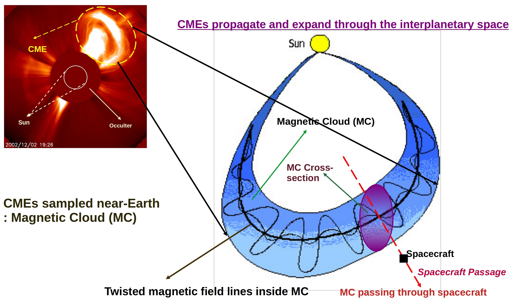
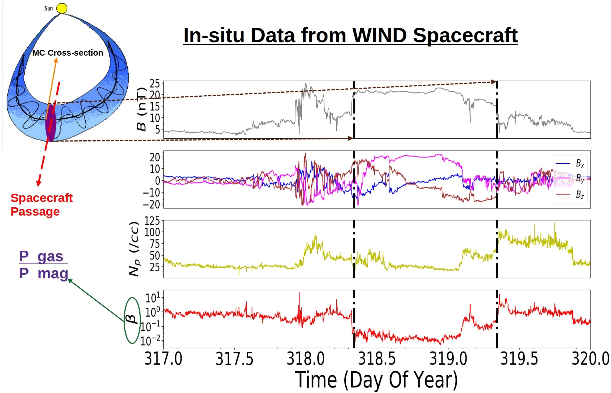
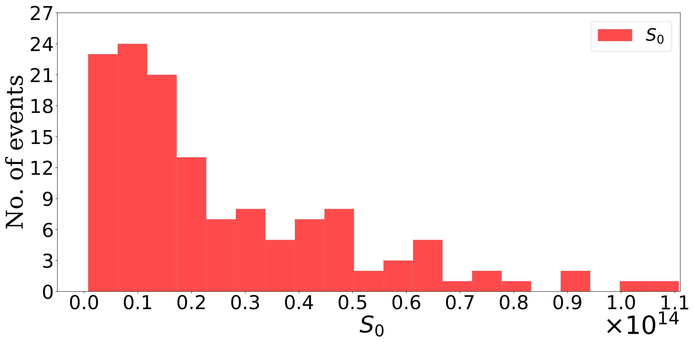

>
This article is about investigating the characteristics of Interplanetary Coronal Mass Ejections using in-situ observation. ICMEs are well-known to expand as they propagate through the heliosphere. Despite this, their cross-sections are usually modeled as static plasma columns within the magnetohydrodynamics (MHD) framework. We test the validity of this approach using in-situ plasma data from 151 magnetic clouds (MCs) observed by the WIND spacecraft and 45 observed by the Helios spacecraft. We find that the most probable cross-section expansion speeds for the WIND events are only ≈ 0.06 times the Alfvén speed inside the MCs, while the most probable cross-section expansion speeds for the Helios events is ≈ 0.03. MC cross-sections can thus be considered to be nearly static over an Alfvén crossing timescale. Using estimates of electrical conductivity arising from Coulomb collisions, we find that the Lundquist number inside MCs is high (≈ 1013 to 1014), suggesting that the MHD description is well justified. The Joule heating rates using our conductivity estimates are several orders of magnitude lower than the requirement for plasma heating inside MCs near the Earth. While the (low) heating rates we compute are consistent with the MHD description, the discrepancy with the heating requirement points to possible departures from MHD and the need for a better understanding of plasma heating in MCs.
>
---

You might wonder what is *in-situ* and what are *ICMEs*. Don't worry, I am here to guide you
through this article. 'CMEs' or Coronal Mass Ejections are massive blobs of plasma along with
strong magnetic fields that erupt from the solar corona. Corona is the Latin word for 'crown' and
it is the outermost layer of our Sun. It has nothing to do with the awful COVID pandemic. Due to
the presence of the bright photosphere (the bright yellow disk we see during daytime), we cannot
see the corona with our naked eyes. However, during a total solar eclipse, we can have a glimpse
of it. Remember that beautiful aura encircled the sun during a total solar eclipse? Yes, that is
solar corona (see Figure 1). It is extremely hot (temperature around a few million Kelvin (K)),
much hotter than the photosphere (temperature ~ 6000 K). Why the corona is so hot, remains a
mystery to the solar astrophysicists. Throughout this article, you will encounter the word,
'plasma'. A plasma is a medium filled with charged particles and due to its higher conductivity,
the charged particles often gyrate closely to the magnetic field lines present in that medium.
Hence, the charged particles can follow the motion of the magnetic field. Although made of
charged particles, the plasma can be overall neutral.

  

(<em>Figure 1: Total solar eclipse during April 1999. Picture courtesy: <a href="https://lucnix.be/">Luc Viatour </a></em>)

One of the most spectacular events that come out from this ever-changing dancing dynamics of corona is the CME. CMEs are the largest-scale eruptive phenomena in the solar system. The huge lump of plasma of mass 1013-1015 kg, accompanied with strong magnetic fields, is hauled up out of the corona all the way into the interplanetary space with a typical velocity ranging from several hundred to more than 1000 km per second. Due to their high velocities, CMEs are often accompanied by shocks in front of them. A typical CME has a kinetic energy of around 1022-1025 Joules. Broadly, CME observation methods can be divided into two categories: 1) remote observations and 2) in-situ observations. The first kind, as the name suggests, observes the CMEs from far away, usually when they come out of the Sun. We need to rely on the CME images as none of the spacecraft can go that much close to the Sun. This is because, as of now, we do not have the technology which can survive the extreme environment (the million K coronal temperature, the strong electromagnetic fields, the bombardment of highly accelerated charged particles, strong radiation hazards, etc.) in the proximity of the Sun. One of the key techniques used in this method is the use of 'coronagraphs'. A coronagraph acts like an artificial total solar eclipse by blocking the bright solar disk so that we can observe the dynamics of the CME while it is getting ejected out into the interplanetary space. Figure 2 shows two coronagraph images of a CME on February 27, 2000, observed by the Large Angle and Spectrometric COronagraph (LASCO) instrument on board the SOlar and Heliospheric Observatory  <a href="https://www.nasa.gov/mission_pages/soho/index.html">(SOHO) </a>, a joint mission by NASA and ESA. The left panel is an image from the C2 coronagraph with a field of view (FOV) of 2.2 - 6.0 R&#x2299; (R&#x2299; is the radius of the Sun) and the right panel is from the C3 coronagraph with FOV from 3.7 to 30 R&#x2299;. In both images, the inner circle represents the Sun while the outer circle signifies the occulter of the coronagraph. 

  

Figure 2: The coronagraph image of a CME eruption. Image courtesy: LASCO instrument
aboard SOHO

When the CME travels through the interplanetary space, it expands and interacts with the solar wind. In the propagation phase, CMEs are often called 'Interplanetary CMEs' or ICMEs. Due to its humongous size and low plasma density during this phase, it becomes almost impossible to capture the entire ICME using any imaging technique. Here the second method, the in-situ observation, becomes useful. In this method, the spacecraft passes through the ICME cross-section and directly measures the important parameters of a propagating ICME. During its propagation, the plasma entangled with the smooth and twisted magnetic field lines (which resemble the telephone cord) forms a huge cloud-like structure known as the Magnetic Cloud or MC. Figure 3 shows a cartoon describing an MC associated with an ICME as it travels through interplanetary space. An example of the in-situ data measured close to 1 astronomical unit (The distance between the Sun and the Earth is called 1 astronomical unit or AU. It is approximately 15 crore km) by the <a href="https://wind.nasa.gov/">WIND </a> spacecraft as shown in Figure 4.  
 

  

Figure 3: A cartoon diagram of a magnetic cloud associated with an ICME.

This article aims at understanding the ICME expansion and heating (using in-situ observation) during their propagation through the interplanetary space by asking three questions:

1. *How Good Is the Static Assumption for ICMEs?*
2. *How Good is the Ideal MHD Assumption for ICMEs?*
3. *Can Joule Heating Meet the Heating Budget of ICME plasma?*

All three questions are addressed in detail in their respective paragraphs. 
 

  

Figure 4: An example of the in-situ data from the WIND spacecraft. 

The spacecraft measures the parameters (total magnetic field (B), magnetic field components (Bx,By,Bz), proton number density (Np), plasma beta (&beta;), etc.). The plasma beta is the ratio between gas pressure (Pgas,) and magnetic pressure (Pmag,). The vertical lines depict the width of the MC.

Though it is evident from the observations that ICMEs do expand (i.e., their cross-sections
increase with time) as they propagate through the heliosphere, a lot of studies (Lundquist(1951),
Burlaga (1988), Möstl et al., 2009; Isavnin, Kilpua, and Koskinen, 2011) assumed the ICME
cross-sections to be ‘**static plasma columns**’! (In simpler words, it means the plasma inside the
ICMEs are at rest.) This is because this assumption leads to the magnetohydrostatic (it is similar
to hydrostatic equilibrium which is a certain type of equilibrium used for fluids when they are at
rest, the only difference is, it is used for a plasma, not for a regular fluid) equilibrium. We know
that physicists love equilibrium as it makes mathematical computations a lot easier. So, though
we all know that the ICME cross-sectional expansion speed is never strictly zero, it is assumed to
be zero (the scientists assumed that the expansion speed is very small) and hence we get the
equilibrium. But no one to date has ever investigated the validity of this approximation. And so,
in the first part of this study, we are aiming at the question: *How Good Is the Static Assumption for ICMEs?*

For that, we compare the cross-sectional expansion speed (vexp) of MCs with the Alfven speed (vA)
inside them. Alfven speed is the measure of the propagation of the magnetic perturbations
perpendicular to the magnetic field. We know that the sound speed of a medium is the
characteristic speed of that particular medium. Similarly, is one of the characteristic speeds of
the plasma. If vexp is sufficiently smaller than vA, or in other words, if the Alfven crossing timescale is much smaller than the cross-sectional expansion timescale, the magnetostatic assumption can be
considered to be approximately valid inside the propagating ICMEs. We have taken a large
sample of well-observed ICMEs: 151 events close to the Earth (using the data from the WIND
spacecraft close to 1 AU) and 45 events in the interplanetary space between the Sun and the
Earth (using the Helios data from 0.29 AU to close to 1 AU). We estimate RA, the ratio between vexp
and vA and found that the most probable values of are of RA the order of 0.01. The statistical results
are described in Figure 5. Our findings show that the ICME cross-sections can be assumed to be
static (to a fairly good extent) over an Alfven crossing timescale.

  
    

Figure 5: Histograms of <em>RA</em>: the top panel shows the results for the WIND events while the bottom panel shows the results for the Helios events.

Solar astrophysicists use a fluid-like prescription for plasma dynamics; it is known as magnetohydrodynamics (MHD). The conventional treatment assumes that the CME plasma obeys the ideal MHD, i.e., the magnetic field never diffuses and remains attached with the plasma particles. However, this assumption, too, had not been verified earlier. In the second part of our study, we ask: *How Good is the Ideal MHD Assumption for ICMEs?*

The estimation of the Lundquist number (S0) is one way to do this. S0 is the ratio between the magnetic diffusion timescale (t𝜂) and the Alfven crossing timescale (𝑡𝐴). For the ideal MHD condition, t𝜂 (which means that the magnetic fields take infinite time to diffuse, in other words, they never diffuse), implying 𝑆0. So, the larger the magnitude of S0, the more the plasma will follow the assumptions of the ideal MHD. We have found that S0 is significantly large inside the ICME plasma (≅1013 ), suggesting a good justification for the use of the ideal MHD approximations (see Figure 6) to describe the motion of the ICMEs.

  
    

Figure 6: Histograms of <em>S0</em>: the top panel shows the results for the WIND events while the bottom panel shows the results for the Helios events.

So far, we have seen that the ICME plasma fairly obeys the assumptions of the ideal MHD. However, there is a cache! The ideal MHD assumes zero heating of the plasma. But numerous observations confirm that the temperature of the near-Earth ICME can reach as high as ≅105
K! Hence, the ideal MHD framework cannot explain the heating of CME plasma. Joule heating is the simplest type of heating mechanism we can investigate. In the last part of this study, we ask: *Can Joule Heating Meet the Heating Budget of ICME plasma?*
To answer this question, we have evaluated the Joule heating (which is like the 𝐼2𝑅 heating inside an electrical wire, where I is the current and R is the resistance of the wire) rate inside all the ICMEs in our sample. We have found that the Joule heating rate (which we have found to be ≅10-6𝐽𝑘𝑔-1𝑠-1) is significantly smaller than the required heating budget (≅103𝐽𝑘𝑔-1𝑠-1) of the CME plasma. It proves that the Joule heating is not the right candidate for CME heating! One needs to look for another heating mechanism. CME thermodynamics is one of the most exciting topics under solar astrophysics and to date, no one knows the exact mechanism of CME heating. There are important approaches like, whether the CMEs are expanding adiabatically or getting heated isothermally via the thermal conduction from the solar corona, or whether turbulence plays a role in the local heating of CME plasma. But overall, this remains an unsolved mystery. 
 
You might wonder why we are so bothered about these giant plasma blobs. The reason is, Earth-directed ICMEs are the primary drivers of strong geomagnetic storms leading to space weather disturbances.  Such disturbances affect a wide range of technologies and communication systems we rely on. Starting from the damage to satellites, telecommunication systems, GPS, and electrical power supply to the radiation hazards on the human body. These disturbances can also cause red alerts for the astronaut's safety. In order to mitigate these effects, we need to predict the arrival times and other important information (such as the strength and rotation of the magnetic field, ICME speed, their energy, etc.) of these ICMEs as realistically as possible. To do that, a good understanding of the CMEs is crucial. With the launch of the Aditya L1 mission, which is India's first mission dedicated to solar astronomy, we hope to have a new milestone in the advancement of CME research.

---

**Original paper:**
<a href="https://link.springer.com/article/10.1007/s11207-022-01982-x" target="_blank">On Modeling ICME Cross-Sections as Static MHD Columns</a>

**First Author:**  Debesh Bhattacharjee

**Co-authors:**  Prasad Subramanian, Volker Bothmer, Teresa Nieves-Chinchilla & Angelos Vourlidas  

**First author’s Institution:** Indian Institute of Science Education and Research, Pune; Dr. Homi Bhabha Road, Pashan, Pune
411008, India.

<noscript>Please enable JavaScript to view the <a href="https://disqus.com/?ref_noscript">comments powered by Disqus.</a></noscript>