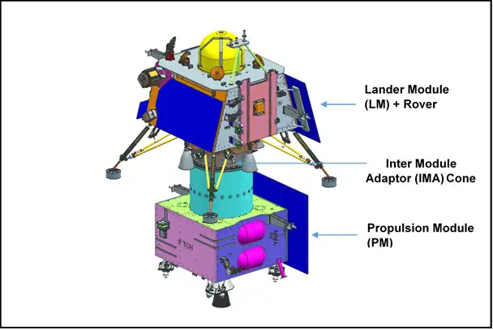
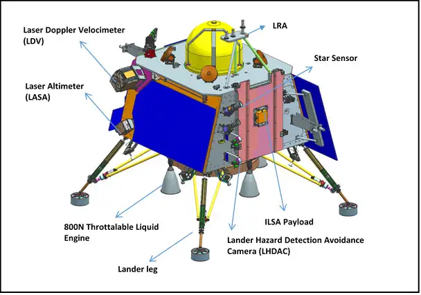

>
India's ambitious space program reaches new heights as Chandrayaan-3, the eagerly anticipated lunar exploration mission, prepares for launch. Get ready to witness history in the making as India embarks again on an extraordinary journey towards the Moon, marking a remarkable milestone for the nation and igniting a wave of excitement across the country.
>
---

<b>Chandrayaan-3</b> is the planned 3rd lunar exploration mission by the Indian Space Research Organisation (ISRO), with the aim of demonstrating the end-to-end capability in safe landing and roving on the lunar surface along with the development and demonstration of new technologies intended towards inter-planetary missions. The developed system for the mission consists of an indigenous Lander module (Vikram), a Rover (Pragyan) and a Propulsion module.

  

Figure 1: A schematic illustration of the Integrated Module. <em>Credits:</em> ISRO

 

The launcher identified for Chandrayaan-3 is LVM3-M4 (Launch Mark 3 - Mission 4), which will place the integrated module in an Elliptic Parking Orbit (EPO). The pri- mary function of the Propulsion module is to transport the Lander from the launch vehicle injection till its entry into the lunar polar orbit at an altitude of 100 kms from the lunar surface, after which the Lander separates from the Propulsion module and begins its descent. The Lander is equipped with the capability to perform a soft land at a specified lunar site (69.367621 S, 32.348126 E) and deploy the Rover which will then carry out in-situ chemical analysis of the lunar surface during the course of its planned lifetime of 14 Earth days (1 Lunar Day). The Propulsion Module also has one scientific payload as a secondary function which will be operated post separation of Lander module. 

  

  

Figure 2: A schematic illustration of the Chandrayaan-3 Lander (Top) and Rover (Bottom). <em>Credits:</em> ISRO

 

The mission objectives of Chandrayaan-3 are:
1. To demonstrate Safe and Soft Landing on Lunar Surface
2. To demonstrate Rover roving on the moon
3. To conduct in-situ scientific experiments

The Propulsion module, the Lander and the Rover hosts a total of 7 scientific payloads
in order to carry out experiments on the lunar surface and atmosphere. They are listed
below.

1. <b>Radio Anatomy of Moon Bound Hypersensitive ionosphere and Atmosphere
(RAMBHA)</b> - [Lander] - This experiment makes use of a Langmuir Probe in order to measure the near surface plasma density and its changes with time.
2. <b>Chandra’s Surface Thermo physical Experiment (ChaSTE)</b> - [Lander] - To measure the thermal conductivity and temperature of the lunar surface.
3. <b>Instrument for Lunar Seismic Activity (ILSA)</b> - [Lander] - An experiment to measure the seismicity of the lunar surface and delineating the structure of the lunar crust and mantle.
4. <b>Laser Retroreflector Array (LRA)</b> - [Lander] - A passive experiment to understand the dynamics of Moon system.
5. <b>Alpha Particle X-Ray Spectrometer (APXS)</b> - [Rover] - To determine the elemental composition of the surface in the immediate vicinity of the landing site.
6. <b>Laser Induced Breakdown Spectroscope (LIBS)</b> - [Rover] - To infer the mineralogical composition of the lunar surface through elemental analysis.
7. <b>Spectro-polarimetry of HAbitable Planet Earth (SHAPE)</b> - [Propulsion module] - To observe the Earth in reflected light in an attempt to decipher future discoveries of Exo-planets which would qualify for habitability.

Within the predecessors to the Chandrayaan-3, Chandrayaan-2 boasted a 'significant technological leap' compared to the Chandrayaan-1. The Vikram Lander onboard the Chandrayaan-2 accomplished its intended descent trajectory, smoothly transitioning from an orbit of 35 km to a position slightly below 2 km above the lunar surface. During this phase, all systems and sensors of the Lander operated flawlessly, demonstrating the successful utilization of groundbreaking technologies, such as the innovative variable thrust propulsion system. Unfortunately, communication with the Lander was lost during the final descent phase. Subsequent investigations confirmed that the lander experienced a hard landing on the lunar surface, resulting in the loss of the lander itself. Chandrayaan-3 aims to address the challenges of its predecessors and enhance the current understanding of the Moon. On successful landing at the specified site, India will immortalise herself as the fourth country to land its spacecraft on the surface of the Moon and the first country to land near the South Pole of the Moon.

The launch of Chandrayaan-3 has been scheduled for <b>July 14, 2023, at 2:35 pm IST</b> from the <b>Satish Dhawan Space Centre, Sriharikota</b>. The spacecraft is expected to reach the moon by the 23rd − 24th August.

Live telecast of the launch can be viewed on the <a href="https://www.youtube.com/live/q2ueCg9bvvQ?feature=share" target="_blank"> official ISRO YouTube channel.</a>

---

<noscript>Please enable JavaScript to view the <a href="https://disqus.com/?ref_noscript">comments powered by Disqus.</a></noscript>
