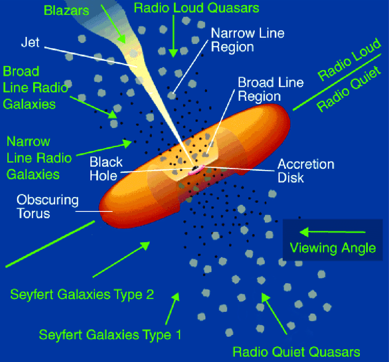
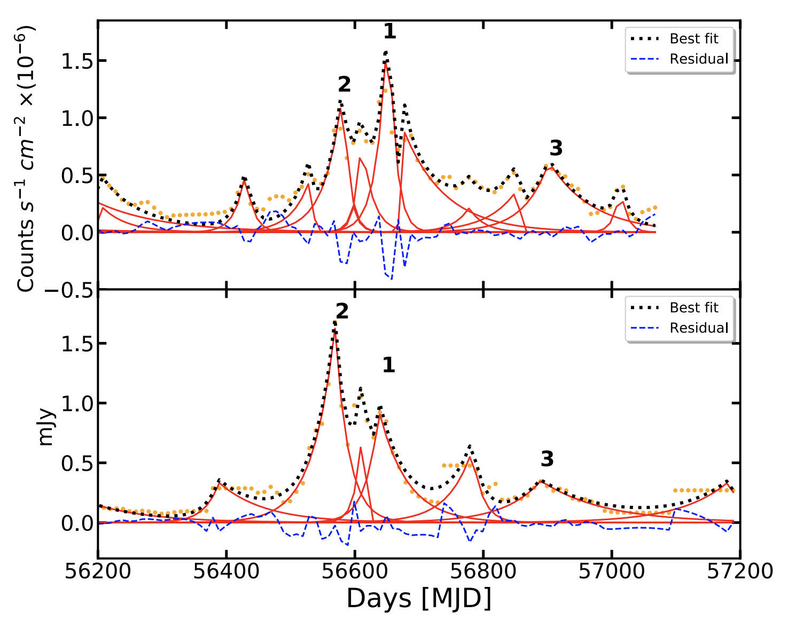
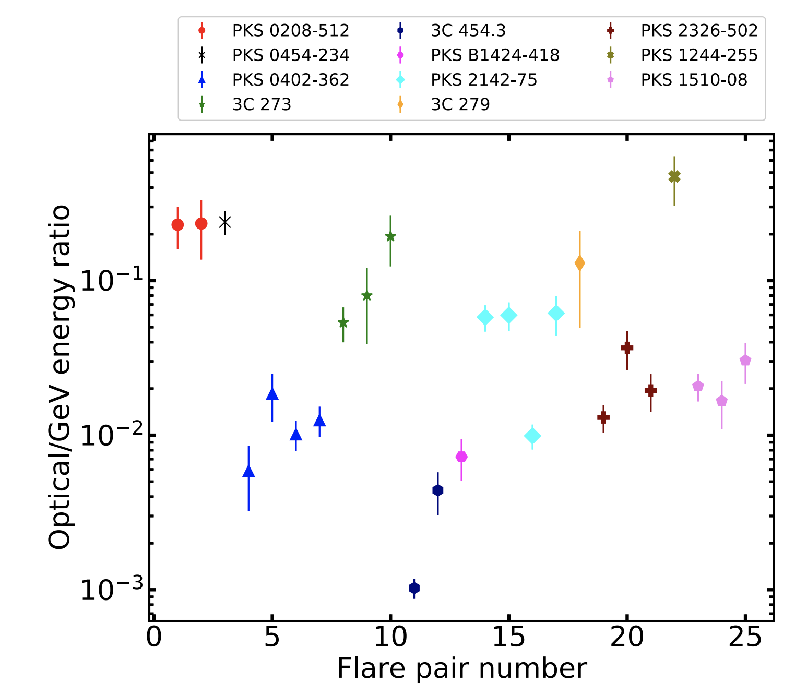
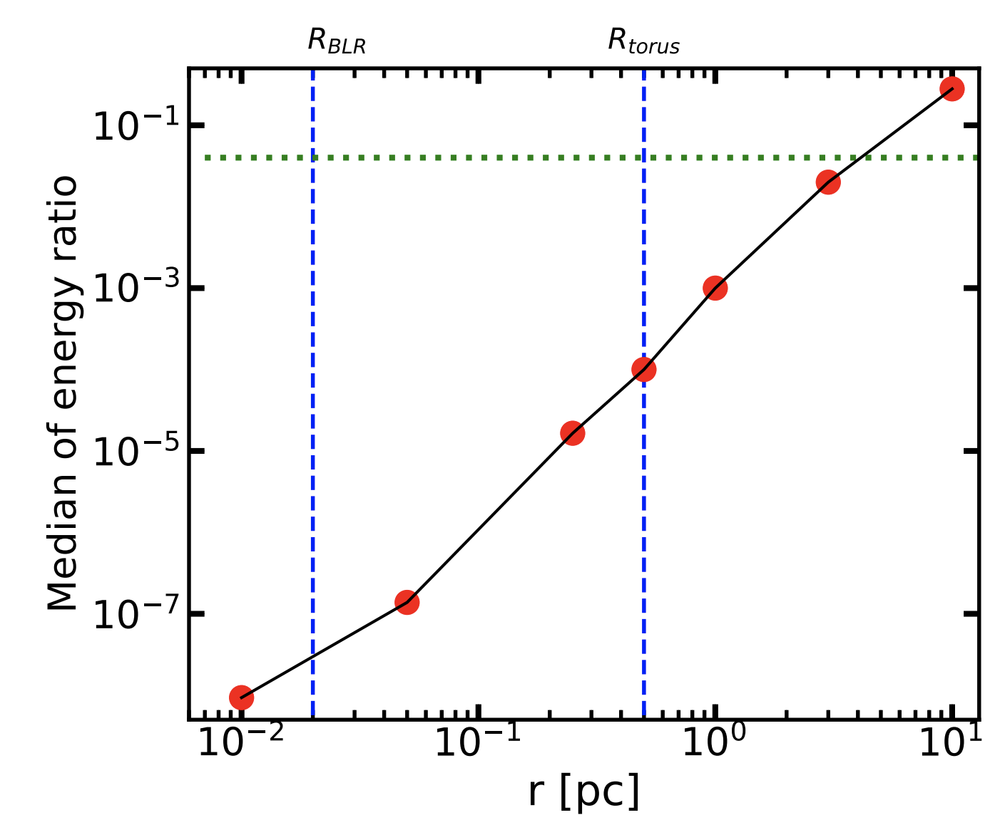

>
Blazars are a rare class of active galactic nuclei (AGN), in which the jets are pointed directly toward our line of sight, making them one of the brightest yet extremely compact sources. Relativistic effects such as beaming makes the jet emission the dominant component. Blazars exhibit multiwavelength variability across several timescales (varying from hours to years). However, the location of the emission region with respect to the central engine is an open question. <a href="https://ui.adsabs.harvard.edu/abs/2022MNRAS.515.1655B/abstract" target="_blank">Barat et. al (2022)</a> try to address this question by combining information from multiwavelength variability of a sample of 11 blazars. Comparing the energy of the detected flares in multiple wavelength bands to state-of-the-art numerical models we put constraints on the location of the emission region.
>
---

# What are blazars?

Blazars are the most luminous non-transient objects known in the universe; they often emit across all electromagnetic bands from radio all the way to gamma-rays, which is unlike any other astrophysical source studied till date. Blazars also exhibit multiwavelength variability over timescales of a few hours to months and years. 

Every galaxy is known to host a super massive black hole (SMBH, weighing a million to billion times more than our Sun) at its center. Sometimes, these giant monsters can feed off gas in the interstellar medium by forming large accretion disks. These accretion disks convert the gravitational potential energy of the infalling material to electromagnetic radiation, making them extremely bright, outshining the entire galaxy consisting of billions of stars. The inner compact region of a galaxy hosting a supermassive black hole is only a few astronomical units (AU) in size (roughly the scale of the solar system), which is negligible compared to the rest of the galaxy, which can be tens of thousands of light years across (1 ly = 63421 AU). Thus, a compact yet extremely luminous inner region of a galaxy, powered by the accretion of the SMBH at its heart is called an Active Galactic Nucleus (AGN). It has been observed that in roughly 10% of the cases, these AGNs are accompanied by large scale jets or outflows, orthogonal to the accretion disk which can extend as far out as thousands of light years.

  

    Artists’ impression of accretion black hole. <em>Credits: European Space Agency (ESA)</em> 

According to the unification model proposed by <a href="https://ui.adsabs.harvard.edu/abs/1995PASP..107..803U/abstract" target="_blank">Urry and Padovani (1995)</a>, blazars are a sub-class of AGNs, where the jets are pointed towards our line of sight (see Figure 1). The jets are composed of ultra-relativistic plasma powered by the accretion energy and are launched very close to the SMBH. The situation is comparable to staring down the vent of an active volcano; because of relativistic effects, the radiation from the jet is beamed towards us making it extremely bright and outshining the contribution from any other region of the SMBH. Infact, most of the extragalactic high energy (gamma-ray) radiation we detect can be attributed to blazars. Till date, we have detected over 2000 blazars.

  

    Figure 1: A schematic diagram showing the AGN unification model <a href="https://ui.adsabs.harvard.edu/abs/1995PASP..107..803U/abstract" target="_blank">Urry and Padovani (1995)</a>. The central Super Massive Black Hole (SMBH) is powered by the infalling material through the accretion disk. The AGN is also accompanied by fast and slow moving gas clouds in its vicinity (Broad-Line and Narrow-Line regions respectively) and a relativistic plasma jet launched close to the SMBH. The existence of a distant gas-dust envelope, called the torus is also known for such objects. Depending on the orientation of the SMBH with respect to our line of sight, we perceive it as a different object. In blazars, the jet is oriented along our line of sight, the entire emission is dominated by the beamed radiation from the jet, making them the brightest non-transient objects in the universe. <em>Image: <a href="https://arxiv.org/abs/1412.1177" target="_blank">Reynolds et. al (2014)</a></em> 

# Characterizing a blazar

There are two generic characteristics of blazar emissions:
<ol>
<li>Blazars are known to be highly variable sources, exhibiting variability across all wavelengths and a wide array of timescales starting from hours to months and years. A typical time-series of blazars (see Figure 2) shows `flares’ or sporadic outbursts of varying amplitudes.</li>
<li>Blazars have a characteristic double-peaked spectral energy distribution (SED), with a lower energy peak around optical-UV frequencies and a higher energy peak around X-rays and gamma rays (see Figure 3).</li>
</ol>

The variability seen in blazar light curves is explained by the rapid energization of the underlying plasma. The reason for such rapid acceleration is an active area of research. However, the rapid acceleration and subsequent cooling of the plasma can explain the ‘outbursts’ we observe in the blazar lightcurves. The shape of the SED points towards non-thermal modes of emission (i.e., not like a blackbody spectrum which results from a thermalized object like a star). 

The lower energy peak in the SED can be explained by synchrotron emission by the relativistic plasma particles (electrons, positrons or possibly even protons).  In the presence of a magnetic field, charged particles are known to ‘gyrate’ due to Lorentz force, and as a result emit electromagnetic radiation (Maxwell’s laws predict that charged particles produce electromagnetic radiation). In the relativistic limit, this radiation due to charged particles is called <a href="https://www.exul.ru/education/1/Note3f.pdf" target="_blank">synchrotron emission</a>.

The higher energy peak is produced due to inverse-Compton scattering of low energy photons by the same ultra-relativistic particles in the plasma which produce the synchrotron emission. As photons interact with charged particles, there is an exchange of energy and momentum between them. In the low energy regime, the photon imparts energy to the charged particle (Compton scattering), however if the charged particle is ultra-relativistic, it can upscatter the low energy photon to very high energies <a href="https://www.exul.ru/education/1/Note3f.pdf" target="_blank">(Inverse Compton scattering)</a>. In this process, low energy optical photons can be energized to X-rays/gamma-rays producing the second peak in blazar SEDs. 

  

    Figure 2: Gamma-ray time-series observations of well known blazars 3C-279 (upper panel), PKS-1510-089 (middle panel) and PKS 2155-304 (bottom panel) taken using the <a href="https://fermi.gsfc.nasa.gov/" target="_blank">Fermi telescope</a>. The red circles represent the observed flux. The time series is characterized by multiple sporadic outbursts or flares of varying sizes and durations. The entire lightcurve can be decomposed into a cumulative effect of a number of such flares (green spikes) and each flaring activity could be connected to an energy injection event within the jet. Blazars exhibit such variability across a wide range of electromagnetic frequencies (radio, IR, optical and X-rays) and often such multiwavelength variability is found to be correlated. <em>Image: <a href="https://academic.oup.com/mnras/article/482/1/743/5126366" target="_blank">Roy et. al (2019)</a></em> 

  

    Figure 3: The observed spectral energy distribution (SED) of the blazar Mrk 421 <a href="https://ui.adsabs.harvard.edu/abs/2011ApJ...736..131A/abstract" target="_blank">(Abdo et. al 2011)</a>. The lower energy peak around the optical-UV wavelengths is attributed to synchrotron emission and the higher energy peak (X-ray/𝝲-ray) can be explained using the inverse-Compton mechanism (See text for detailed explanation).  This double humped SED is a universal characteristic of all blazars. <em>Image: <a href="https://arxiv.org/abs/2105.08401" target="_blank">Tavecchio 2021</a></em> 

# Where does the blazar emission originate?

The location of the emission site within a blazar jet is an open question; several astronomers have suggested that the emission region is located near the Broad Line Region (BLR) within ~1 parsec (3.26 lightyears) of the central SMBH. However, there is also strong evidence suggesting that the emission site could be located further downstream (1-10 parsec), for e.g., the detection of extremely high energy gamma-rays from these sources which would have been absorbed within the BLR and never made it to our telescopes. Therefore, a constraint on the location of the emission zone within a jet would be extremely important for refining our theoretical understanding of blazars and their emission mechanisms. 

<a href="https://ui.adsabs.harvard.edu/abs/2022MNRAS.515.1655B/abstract" target="_blank">Barat et. al (2022)</a> proposed a new and complimentary prescription to constrain the location of the emission region within the blazar’s jet. The same population of ultra-relativistic particles is responsible for both the synchrotron (low energy) and inverse-Compton (high energy) emission. Therefore, any outburst in high energy gamma-rays can be accompanied by a similar outburst in lower energies such as optical and such events can be considered to have originated at the same location. Such simulatemous outburst events are termed ‘flare pairs’ (see Figure 4). In this paper, we analyzed simultaneous gamma-ray light curves from the <a href="https://fermi.gsfc.nasa.gov/" target="_blank">Fermi space telescope</a> and optical light curves from the <a href="http://www.astro.yale.edu/smarts/" target="_blank">Yale-SMARTS program</a> for 11 blazars and identified 25 flare pairs. We found that the ratio of the energy dissipated in the optical to gamma-ray flares roughly varies between 1-10% (Figure 4). 

The high energy emission, coming from Inverse Compton scattering, requires a supply of low energy photons. This seed photon field could either be provided by the synchrotron photons produced within the jet itself, or could be externally supplied from the Broad-Line Region (BLR) and/or the molecular torus (See Figure 1). For lower energy blazars, up-scattering of the external seed field dominates the gamma-ray emission. The density and energy of the seed photon field is strongly distance dependent, therefore the location of the emission region with respect to the BLR and molecular torus determines the total energy output in the gamma-rays compared to optical frequencies.  We developed detailed numerical models to simulate blazar outbursts from optical to gamma-ray energies. The ratio of the optical to gamma-ray flare energies were estimated from the simulated light curves for a range of distances from near the BLR up to 10 parsecs (Figure 5). From this, we were able to conclude that for most of the flare pairs identified, the emission region was likely to be located farther away compared to the BLR.

#  Conclusion

Constraining the emission site of blazars has important implications for the underlying physics of these extreme objects. In this paper, we develop an idea to constrain the location of emission by comparing the energy dissipated in gamma-rays and optical frequencies for outburst events where we have simultaneous optical and gamma-ray flare detections. Our numerical models suggest that most of the events we detected are likely to have originated beyond the BLR region, close to the molecular torus. This approach is a novel and complementary approach to determine the emission location and application to a broader sample of blazar flare pairs is necessary to validate this approach.

  
  

    Figure 4: Top: Simultaneous gamma-ray (upper panel) and optical (lower panel) light curves of the blazar PKS 2326-502 observed using the Fermi space telescope and in the Yale-SMARTS program, respectively (orange points). The decomposed flares in both the light curves are shown with red lines and the identified flare pairs are numbered. Bottom: Raxtio of observed energy ratio of optical and gamma-ray flares identified as ‘flare pairs’ for the sample of 11 blazars analyzed in this study. The ratio varies between 1-10% approximately. <em>Image:<a href="https://ui.adsabs.harvard.edu/abs/2022MNRAS.515.1655B/abstract" target="_blank"> Barat et. al (2022)</a></em> 

  

    Figure 5:  Dependence of optical to gamma-ray outburst energy ratio for ‘flare pairs’ simulated for the blazar PKS 2326-502. The position of the BLR and the molecular torus have been shown with blue dashed lines. The green dotted line shows the median value of the energy ratio observed for this blazar (Figure 4, right panel). The simulated light curves were generated using detailed numerical models of dominant emission mechanisms like synchrotron and inverse-Compton scattering. The simulations show that the observed energy ratio of the flare pairs is more consistent with an emission region located farther downstream of the jet from the BLR. <em>Image:<a href="https://ui.adsabs.harvard.edu/abs/2022MNRAS.515.1655B/abstract" target="_blank"> Barat et. al (2022)</a></em>

---

**Further resources**
<a href="https://www.frontiersin.org/articles/10.3389/fspas.2017.00006/full" target="_blank">https://www.frontiersin.org/articles/10.3389/fspas.2017.00006/full</a>
, <a href="https://ui.adsabs.harvard.edu/abs/1986rpa..book.....R/abstract" target="_blank">Rybycki Lightman (1986)</a>
, <a href="https://ui.adsabs.harvard.edu/abs/2020mbhe.confE..35C/abstract" target="_blank">Costamate 2020</a>
, <a href="https://www.mdpi.com/2075-4434/10/1/35" target="_blank">Prandini 2022</a>

**Original paper:** <a href="https://ui.adsabs.harvard.edu/abs/2022MNRAS.515.1655B/abstract" target="_blank">Locating the GeV emission region in the jets of blazars from months time-scale multiwavelength outbursts</a>

**First Author:** Saugata Barat

**Co-authors:** Ritaban Chatterjee, Kaustav Mitra

**First author’s Institution:** 
Anton Pannekoek Institute for Astronomy, University of Amsterdam, Netherlands
Presidency University, Kolkata, India

<noscript>Please enable JavaScript to view the <a href="https://disqus.com/?ref_noscript">comments powered by Disqus.</a></noscript>
