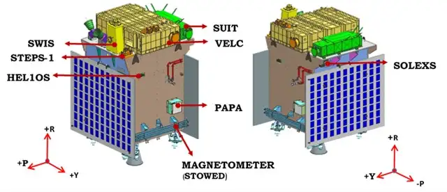
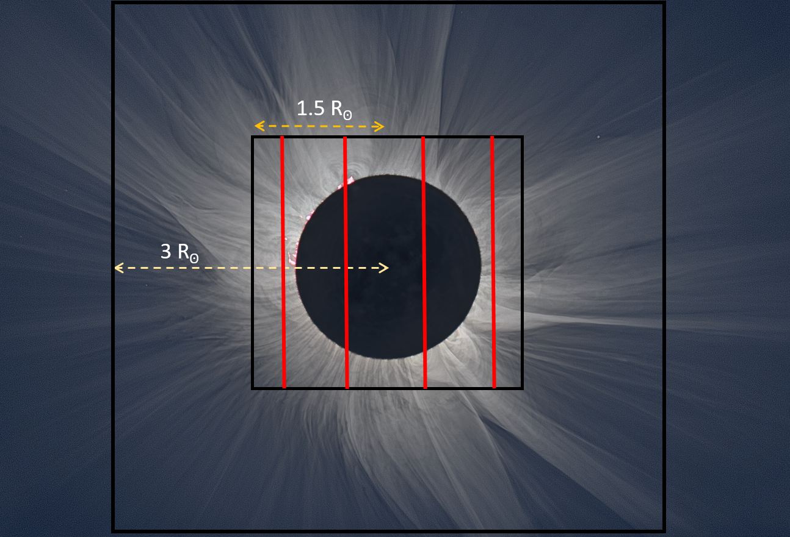

>
The Sun has fascinated mankind since the dawn of civilization. From famines to fertile farms, every aspect of life on Earth was defined by it. Unaware of the true nature of the Sun, humans have worshipped this mighty celestial being for thousands of years.
>
---

It was not until 400 years ago, when Galileo first looked at the Sun through his telescope, that humans realized the Sun is very dynamic and has its style of fluctuations. This triggered the genesis of observing the Sun by the 'scientific method'. Over this time, we have realized that the Sun has several layers in its atmosphere and that they look very different when observed at different wavelengths. This led us to the pursuit of understanding the sun's activity in its various layers, from the photosphere to the outer atmosphere and further out in space.

To enable these studies, several organizations all over the globe have established telescopes on the ground and in space. India has been a part of this huge network of observatories, with contributions from telescopes like MAST at Udaipur Solar Observatory, radio observations with the Ooty Radio Telescope and Gauribandur Radio Observatory, and the rich historical data of the Sun from the Kodaikanal Observatory, spanning over three solar cycles. India is next venturing into space to observe the Sun with its first dedicated space-based solar observatory, Aditya-L1. It will be traveling to the Sun-Earth Lagrange 1 point, making the Indian Space Research Organisation (ISRO) the third space agency to send a spacecraft to L1, after NASA, ESA, and the Chinese CNSA.

The spacecraft will be placed in a halo orbit around L1, located 1.5 million km from the Earth towards the Sun. One might wonder why there's a need to observe the Sun from space when it's feasible to do so from the Earth. While ground-based observations rely on the prevailing atmospheric conditions at the observation site, they are also limited in continuous monitoring. The Earth's atmosphere scatters the incoming sunlight, causing the day sky to be bright and blue, making the million times fainter corona of the Sun invisible from the Earth's surface. The corona is made visible by a total solar eclipse, however, restricting the duration of observation to a couple of minutes. Moreover, the atmosphere cuts a significant portion of UV light and charged particles from the Sun, necessary to support life on the surface of the Earth. Therefore, uninterrupted observation of the solar corona and UV radiance and detection of the charged particle flux from the Sun justify the need for a space-based vantage point at L1.

  

    Figure 1: A schematic diagram of Aditya-L1 Payloads (credits: ISRO)

## Aditya-L1 Payloads

Aditya-L1 has a collection of 7 instruments to study various aspects of the Sun. ASPEX, PAPA and MAG are in-situ in nature, which detects multiple conditions happening locally at the L1 vantage point. In contrast, VELC, SUIT, SoLEXS and HEL1OS detect the real-time activity on the Sun, making them ex-situ in nature. The significance and functionality of the various payloads are discussed in detail in the coming sections.

### Visible Emission Line Coronagraph (VELC)

Visible Emission Line Coronagraph (VELC) is a payload on Aditya-L1 with simultaneous imaging and spectroscopic diagnostics capability. VELC contains a multi-slit spectrograph that will perform spectral observation in three visible emission lines, 5303 Å, 7892 Å, and 10747 Å, which are emitted at very high temperatures when iron loses many of its electrons.

  

    Figure 2: The imaging (3 Rⵙ) and spectroscopic (1.5 Rⵙ) field of view of VELC along with the slits. (Credits: IIA)

The field of view of VELC starts from 1.05 Rⵙ (1.05 Solar Radius), close to the solar limb, and it can perform spectroscopic measurement in corona up to 1.5 Rⵙ. Furthermore, VELC can diagnose temperature at slit positions, using intensity ratio of spectral lines and magnetic field using spectropolarimetry observations. These unique capabilities of VELC will help us to understand the initiation mechanism of Coronal Mass Ejections (CMEs) and the forces responsible for their evolution in the corona, which still needs to be fully understood.

### Solar Ultraviolet Imaging Telescope (SUIT)

The Solar Ultraviolet Imaging Telescope (SUIT) is an off-axis Ritchey-Chretien type telescope built to observe the sun in eight narrow and three broad bandpasses within the 200-400 nm wavelength spectrum. The specific scientific targets of these filters are tabulated below:

<table style="width:100%; border-collapse: collapse;">
  <tr style="border: 1px solid black; text-align: center;">
    <th style="border: 1px solid black;">Spectral Channel (nm)</th>
    <th style="border: 1px solid black;">Solar Feature</th>
    <th style="border: 1px solid black;">Bandpass (nm)</th>
  </tr>
  <tr style="border: 1px solid black; text-align: center;">
    <td style="border: 1px solid black;">NB1- 214</td>
    <td style="border: 1px solid black;">Photosphere</td>
    <td style="border: 1px solid black;">11.55</td>
  </tr>
  <tr style="border: 1px solid black; text-align: center;">
    <td style="border: 1px solid black;">NB2- 276.6</td>
    <td style="border: 1px solid black;">Wing of MgII K line</td>
    <td style="border: 1px solid black;">~0.4</td>
  </tr>
  <tr style="border: 1px solid black; text-align: center;">
    <td style="border: 1px solid black;">NB3- 279.6</td>
    <td style="border: 1px solid black;">Mg II k line</td>
    <td style="border: 1px solid black;">~0.4</td>
  </tr>
  <tr style="border: 1px solid black; text-align: center;">
    <td style="border: 1px solid black;">NB4- 280.3</td>
    <td style="border: 1px solid black;">Mg II h line</td>
    <td style="border: 1px solid black;">~0.4</td>
  </tr>
  <tr style="border: 1px solid black; text-align: center;">
    <td style="border: 1px solid black;">NB5- 283.2</td>
    <td style="border: 1px solid black;">Wing of Mg II h line</td>
    <td style="border: 1px solid black;">~0.4</td>
  </tr>
  <tr style="border: 1px solid black; text-align: center;">
    <td style="border: 1px solid black;">NB6- 300</td>
    <td style="border: 1px solid black;">Sunspots</td>
    <td style="border: 1px solid black;">1.5</td>
  </tr>
  <tr style="border: 1px solid black; text-align: center;">
    <td style="border: 1px solid black;">NB7- 388</td>
    <td style="border: 1px solid black;">Lower Photosphere</td>
    <td style="border: 1px solid black;">1.5</td>
  </tr>
  <tr style="border: 1px solid black; text-align: center;">
    <td style="border: 1px solid black;">NB8- 396.85</td>
    <td style="border: 1px solid black;">Ca II line</td>
    <td style="border: 1px solid black;">0.1</td>
  </tr>
  <tr style="border: 1px solid black; text-align: center;">
    <td style="border: 1px solid black;">BB1- 200-242</td>
    <td style="border: 1px solid black;">Continuum</td>
    <td style="border: 1px solid black;">40</td>
  </tr>
  <tr style="border: 1px solid black; text-align: center;">
    <td style="border: 1px solid black;">BB2- 242-300</td>
    <td style="border: 1px solid black;">O3v Hartley Band</td>
    <td style="border: 1px solid black;">58</td>
  </tr>
  <tr style="border: 1px solid black; text-align: center;">
    <td style="border: 1px solid black;">BB3- 320-360</td>
    <td style="border: 1px solid black;">O3 Hartley-Huggins Band</td>
    <td style="border: 1px solid black;">40</td>
  </tr>
</table>
 

SUIT is designed to continuously take images of the sun in all of its 11 scientific bandpasses every two hours. Additionally, SUIT has the capability for 2x2 on-chip binning and shall take binned full disk images in the Mg-II h band every minute for a more dynamic view. It also enables user-defined region of interest (RoI) selection, enabling the possibility for a faster cadence while observing a small area of the Sun. SUIT has a pixel resolution of 0.7”/pixel, comparable to that of SDO/AIA (0.6”/pixel) and SDO/HMI (0.5”/pixel), making it easy to co-align them without much rescaling.

SUIT electronics offer high flexibility and come packed with a "Flare mode" dedicated to observing the emergence of a solar flare in NUV. So, it has the means to detect a solar flare in its early stages and image them as they develop.

### Aditya Solar Wind Particle EXperiment (ASPEX)

ASPEX is an in-situ payload with multi-directional data acquisition capabilities. Within ASPEX, there are two distinct subsystems: SWIS (Solar Wind Ion Spectrometer) and STEPS (SupraThermal and energetic Particle Spectrometer), comprising two and six units, respectively. The principal research aim of SWIS is to analyze solar wind plasma particles, while STEPS focuses on examining suprathermal and solar energetic particles (Goyal et al. 2018). Multiple units of these spectrometers are strategically mounted across the spacecraft to enable simultaneous measurements from various directions.

The novelty of ASPEX lies in its multi-directional, high-cadence, and proton-alpha differentiated measurements. SWIS will continually monitor low-energy (100 eV - 20 keV) proton and alpha particles individually in radial and azimuthal directions and integrated flux in the meridional direction. It possesses an extensive field of view (FOV) of 360 degrees in and across the ecliptic plane, along with a modest latitudinal coverage of 6 degrees. Conversely, STEPS will measure higher-energy (20 keV/n - 5 MeV/n) ion flux from six directions: Sun-radial, Intermediate, Parker Spiral, North Pointing, South Pointing, and Earth Pointing.

This unique payload, developed by the Physical Research Laboratory (PRL), Ahmedabad, will contribute to our understanding of solar wind ion variations and aid in identifying their source mechanisms. It will be especially valuable in studying the variation in ion abundance ratios during transient events like CME, CIR, and interplanetary shocks. Additionally, it will effectively examine the variations and disparities in the thermal anisotropy of protons and alpha particles. Moreover, it will be crucial to explore the origins of suprathermal particles in the solar wind and their association with SEPs. Its specialized design will also allow for the assessment of the role of Earth's bow shock in generating suprathermal particles.

### Plasma Analyser Package for Aditya L1 (PAPA)

PAPA is another in-situ payload on the spacecraft and is engineered by the Space Physics Laboratory (SPL) at VSSC, Thiruvananthapuram. This payload consists of two subsystems: the Solar Wind Electron Energy Probe (SWEEP) and the Solar Wind Ion Composition Analyser (SWICAR). Both sensors are mounted perpendicularly to each other and share a unified processing unit within the same chassis. PAPA will be instrumental in studying the composition and energy distribution of solar wind particles. The payload is specifically designed to investigate the velocity distribution and temperature anisotropy of solar wind.

### Magnetometer (MAG)

The Fluxgate Magnetometer (MAG) is one of three in-situ payloads on the Aditya L1 spacecraft, alongside ASPEX and PAPA. This triaxial magnetic sensor is mounted on a 6-meter, 5-segment deployable boom and is situated on the Sun-facing deck of the spacecraft. One set of MAG sensors is located at the tip of the boom, while a second set is positioned midway along the boom, 3 meters from both the tip and the spacecraft. This payload was developed by the Laboratory of Electro-Optics Systems (LEOS) in Bangalore.

This apparatus renders the Aditya L1 spacecraft a comprehensive observational platform. It enhances the data collected by other in-situ payloads on board, providing measurements of both the magnitude and direction of the interplanetary magnetic field. The primary aim of MAG is to investigate the magnetic characteristics of the surrounding solar wind as well as transient phenomena like Corotating Interaction Regions (CIR) and Coronal Mass Ejections (CME) at the Sun-Earth L1 point.

### SoLEXS

SoLEXS is a soft X-ray spectrometer built to detect an energy range of 1 keV to 22 keV at a resolution of 250 eV (at 6 keV and < 0 deg C). This signifies that spectral features separated by 250 eV can be distinctly detected. Two apertures of 10 mm^2 and 0.1 mm^2 provide a field of view of 1.8 sq deg and 1.3 sq deg, respectively, with two separate silicon drift detectors to cover from A class to X class flares.

### HEL1OS

HEL1OS, on the other hand, operates in the 10-150 keV range, with a significant spectral overlap with SoLEXS. Aimed at detecting hard X-rays, it offers a spectral resolution of 1 keV at 13.81 keV through its CdTe detector and ~7 keV at 59.5 keV through its CZT detector. The X-rays are collimated by a stainless steel collimator, giving the payload a field of view of 6 x 6 degrees. It is the only payload mounted inside the panels of the satellite, increasing the criticality severalfold. It was necessary to first mount HEL1OS and close the satellite body. Other payloads and equipment could be mounted on the panels. Thus, any modifications in the HEL1OS would require removing all the payloads and sensitive equipment on the satellite and opening the satellite body.

SoLEXS and HEL1OS shall operate both as independent payloads, and their functionality shall be augmented with SUIT for early detection of solar flares.

## Summary

If seen in a broader sense, all the payloads on board Aditya-L1 shall simultaneously observe the Sun and make in-situ and ex-situ measurements. The data from SUIT can be combined with VELC to get a broad view of the Sun, from the photosphere to the corona. Additionally, augmentation of SoLEXS and HEL1OS triggers with SUIT electronics can help detect flares at an early stage for faster imaging and flare emergence (Sarkar et al., Poster, ASI 2022). This nature of several instruments augmenting the functionality of several others gives us the ability to generate scientifically exclusive data, keeping the true spirit of an observatory class mission alive.

  

    Figure 3: Field of view of VELC and SUIT. Correlation of NUV solar photosphere and chromosphere with solar corona (Credits: Sreejith P., SUIT Team/ MCNS.)

---

**Acknowledgements:** The article has been jointly authored by Arpit Kumar Shrivastav of ARIES, Nainital, Janmejoy Sarkar of IUCAA, Pune and Tezpur University, along with Prateek Mayank of IIT Indore. Arpit primarily works on the observations of magnetohydrodynamic waves in the solar corona. Janmejoy is a research fellow and was responsible for the optical alignment, mechanical integration, calibration and complete optical testing of the SUIT payload onboard Aditya-L1. Prateek, a Prime Minister's Research Fellow working on the MHD simulation of solar wind and CME, extends his gratitude for the invaluable support received from Dr. Dibyendu Chakrabarty of PRL, Ahmedabad, the Principal Investigator of ASPEX. We are also thankful to Abhilash Sarwade of the Space Astronomy Group, URSC, ISRO, one of the prime members of the SoLEXS team, for helping us with critical information about SoLEXS and HEL1OS.

---

<noscript>Please enable JavaScript to view the <a href="https://disqus.com/?ref_noscript">comments powered by Disqus.</a></noscript>
