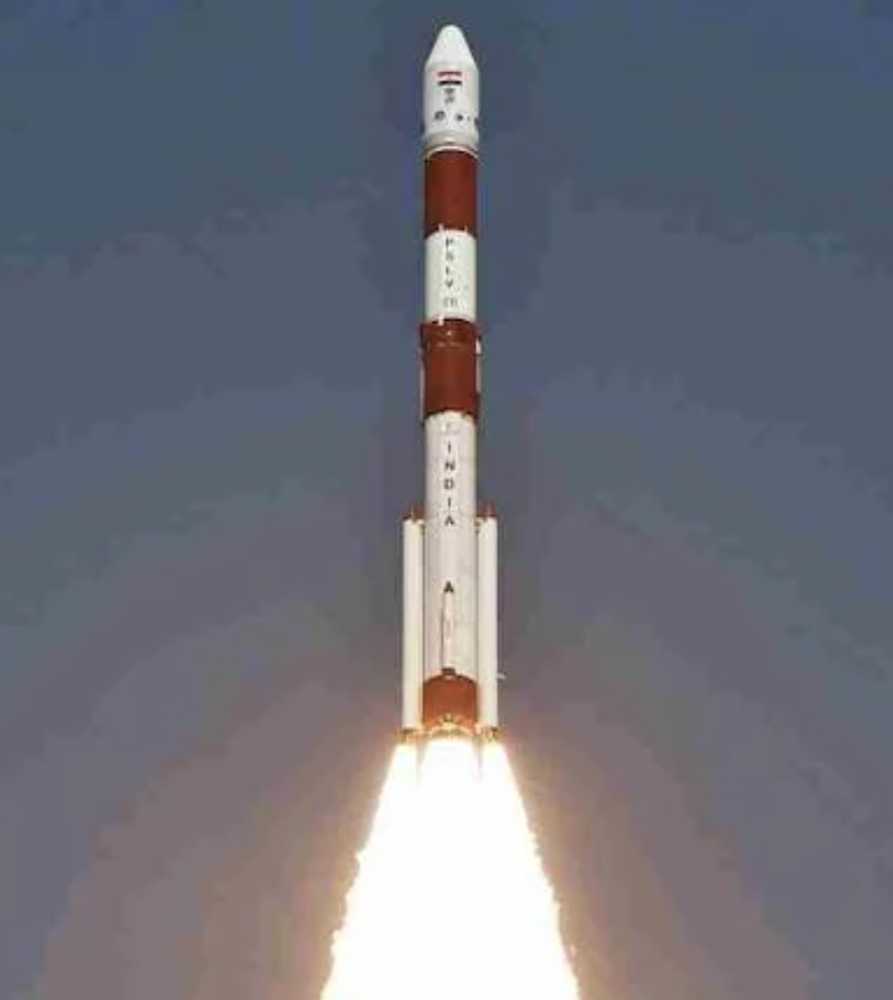
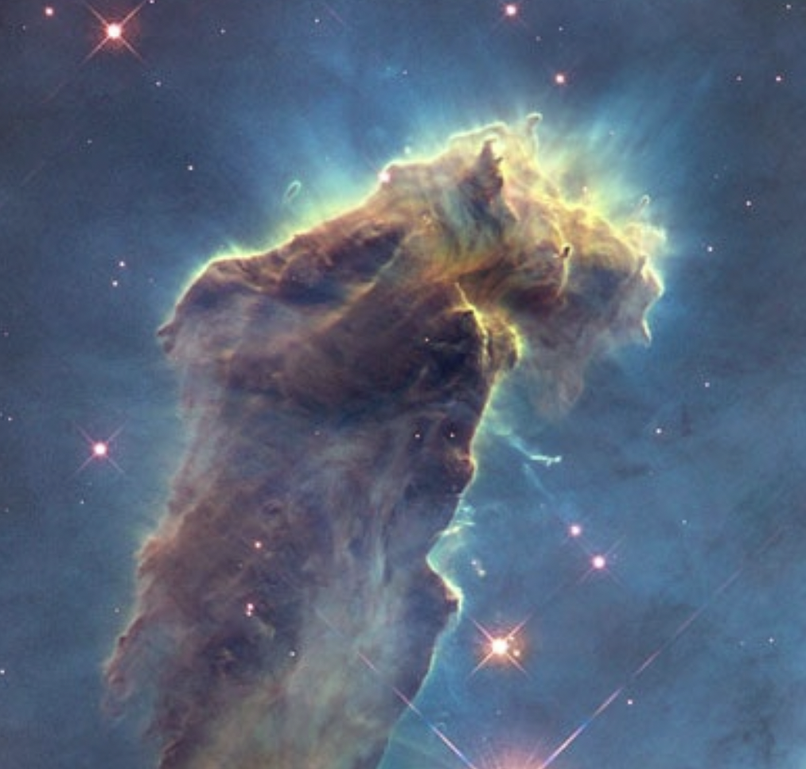
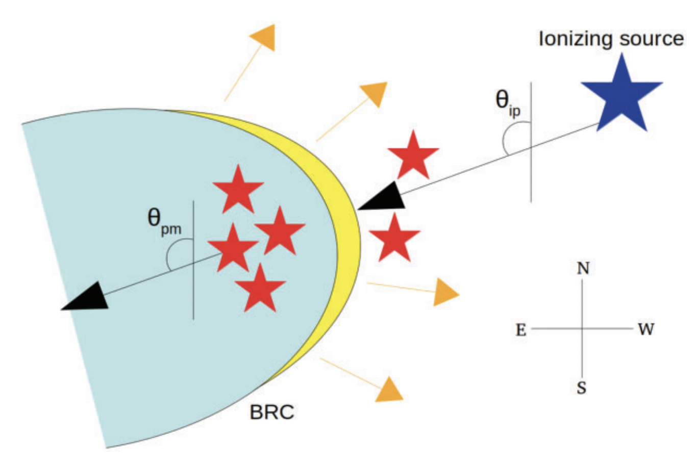

>
Space vehicles are propelled by rocket engines that generate thrust by expelling exhaust at extremely rapid speeds. As Newton's third law states “For every action, there is an equal and opposite reaction”, the engines help to accelerate the rockets forward by the effect of the thrust. Interestingly, we can see a phenomenon similar to the motion of a rocket in the sky. The dense and cold molecular clouds are found to show the rocket effect in the presence of the nearby massive ionising stars. The ultraviolet photons emitted from the massive stars ionise the surfaces of the surrounding molecular clouds facing the stars. The hot and ionised material tends to photo-evaporate away from the clouds, accelerating them in the opposite direction, similar to the motion of a rocket. In this work, we found evidence of the rocket effect in several bright-rimmed clouds in the plane of sky.
>
---

# Introduction
The motion of a rocket is solely based on Newton's third law: “For every action, there is an equal and opposite reaction”. The engines propel rockets forward by expelling exhaust in the opposite direction at extremely rapid speeds. As the rocket engines ignite, the thrust from the rocket helps the rocket to ascend. Figure 1 (top) shows a rocket launching as an example.

Now, not only man-made rockets, one can visualise a phenomenon similar to the motion of a rocket in the interstellar medium (ISM), too. ISM is the area between the stars that often consists of dense clouds in molecular form. These molecular clouds can transform themselves into the birthplaces of young stellar objects (YSOs) through rapid contraction by the dominance of gravity.

The birth and evolution of massive stars (mass >= 8Mⵙ) can immensely affect the immediate ISM. Their strong stellar winds or supernova explosions at the end stage of life can compress nearby molecular clouds, turning into a shock that eventually develops non-uniform cloud structures, for example, Bright-Rimmed Clouds (BRCs), cometary globules (CGs), pillars, etc. The heating of the surface layer of the dense cold molecular clouds by the nearby massive star/s has a profound dynamical impact. If the temperature (T) of the surface rises by a factor of 100, the pressure (p) will also increase by the same for a fixed density (ρ), as P ∝ ρ and T. Because of this enhanced pressure the hot and ionised surface of the cloud would try to expand. The expansion will be stopped soon along the direction away from the massive star/s by a large amount of dense material because the density towards that direction is even higher. In contrast, along the direction towards the massive star/s, the cloud surface can “see” a low-density (low-pressure) medium. Therefore, the hot and ionised cloud material starts to flow out of the cloud surface towards the massive star/s, which is known as photo-evaporation flow. As a back reaction of the expelled ionised gas, the cloud starts escalating away from the massive ionising star/s, which is typically known as the ‘Rocket Effect’ (RE). In Figure 1 (bottom), we show an example of the rocket effect in the molecular cloud “Eagle Nebula”. We can see that the surface of the cloud facing the nearby ionising star is relatively bright because of the photo-evaporation, causing the cloud to propel away from the direction of the ionising star, similar to a rocket.

  
    

Figure 1: (Top) An example of a rocket launch PSLV C-51 by ISRO from the Sriharikota spaceport. Image credit: <em>Twitter/@ISRO</em>. (Bottom) An example rocket effect in the molecular cloud, Eagle Nebula. The bright surface facing the massive stars is being ionised and heated up, therefore photo-evaporating away from the cloud. Image credit: <em>NASA, ESA/Hubble and the Hubble Heritage Team</em>.

The YSOs forming within these accelerating clouds should share the kinematics similar to the clouds. Therefore, the YSOs would also accelerate radially away from the nearby massive star/s, which is/are responsible for ionising the cloud and triggering the star formation in it.

Figure 2 shows a cartoon diagram of a system consisting of a BRC and one ionising source, where we depict the angles used in our analysis. θip and θpm represent the angle of ionising photons and the angle of the relative proper motion (PM) of YSOs, respectively. By relative proper motion, we mean the motion of the YSOs in the plane of the sky with respect to the ionising massive star/s. The θpm is estimated by the median angle made by the relative proper motion of the candidate YSOs, starting from the celestial north (the point about which all the stars in the northern hemisphere are seen to revolve) and increasing eastward. We estimate the θip as the angle made by the line joining the ionising source and the central IRAS source residing in each BRC. The θip values are also measured following the same convention as it was done for θpm. Considering an ideal RE scenario, θip is expected to be similar to θpm, i.e. \| θip − θpm \|~ 0◦, on the sky plane.

  

Figure 2: An illustration of a system consisting of a BRC (blue cloud with a thick yellow-coloured rim) and an ionising source (blue star) (not to scale). The YSOs distributed towards the BRC are presented using red star symbols. The direction of photoevaporation flow of the cloud material is shown using yellow-coloured arrows. The black-coloured arrow, making an angle θip with respect to the north and directing away from the ionising star, is the direction of ionising photons. Another black-coloured arrow making an angle θpm with respect to the same and directing away from the YSOs presents the angle of their relative PM. Image credit:<em><a href="https://academic.oup.com/mnras/article/513/2/2039/6580586"> Saha et al. (2022)</a></em>.

#  The sources studied in this work
From the catalogue of <a href="https://articles.adsabs.harvard.edu/pdf/1991ApJS...77...59S"> Sugitani et al. 1991</a> and <a href="https://articles.adsabs.harvard.edu/pdf/1994ApJS...92..163S"> Sugitani et al. 1994</a>, we collected a total of 89 BRCs. Among them, we selected 22 BRCs that are suitable for our analysis (please see <a href="https://academic.oup.com/mnras/article/510/2/2644/6460503"> Saha et al. 2021</a> and <a href="https://academic.oup.com/mnrasl/article/515/1/L67/6640430?login=true"> Saha et al. 2022</a> for selection details). We conducted a pilot study in <a href="https://academic.oup.com/mnras/article/510/2/2644/6460503"> Saha et al. 2021</a> to investigate the θip and θpm in BRC 18 as it is one of the closest BRCs and also a well-studied candidate. The YSOs towards BRC 18 are collated from literature, and their distances and proper motions were obtained from a space-based telescope named Gaia (for details, see <a href="https://solarsystem.nasa.gov/missions/gaia/in-depth/"> here</a>). We performed the same analysis for other BRCs in <a href="https://academic.oup.com/mnrasl/article/515/1/L67/6640430?login=true"> Saha et al. 2022</a>.

# Results and Discussion
In Figure 3, we show the relative proper motions of the YSOs in BRC 18 on the Wide-field Infrared Survey Explorer (WISE) colour composite image using 3.6 (blue), 4.5 (green), and 12 (red) μm images. The arrows in yellow represent the relative proper motion vectors of the candidate YSOs with respect to the ionising source λ Ori. The dashed line in cyan represents the direction of the ionising radiation from λ Ori with respect to the IRAS (Infrared Astronomical Satellite) source (‘ + ’ symbol in green) embedded in BRC 18. The median value of the relative proper motions of the candidate YSOs (i.e. θpm) and the direction of ionising photons (i.e. θip) are indicated using vectors in green and white, respectively. All the angles are measured from the celestial north.

  

Figure 3: The relative proper motion properties of the YSOs in BRC 18 on the WISE colour composite image using 3.6 (blue), 4.5 (green), and 12 (red) μm images. The arrows in yellow represent the relative proper motion vectors of the candidate YSOs with respect to λ Ori. The dashed line in cyan represents the direction of the ionising radiation with respect to the IRAS source (‘ + ’ symbol in green) embedded in BRC 18. The median value of the relative proper motions of the candidate YSOs and the direction of ionising photons are indicated using vectors in green and white, respectively, in the lower right corner (not to scale). Figure credit: <em><a href="https://academic.oup.com/mnras/article/510/2/2644/6460503"> Saha et al. (2021)</a></em>.

We found \|θip − θpm\|=1◦ ± 14◦ in BRC 18, i.e. the directions of the ionising photons and the median relative proper motion of the YSOs are almost parallel. Motivated by this result, we tried to perform the same analysis on the remaining BRCs. As discussed in the previous section, we studied 21 more BRCs, excluding BRC 18.

Our analysis found that ∼64% of the BRCs show \| θip − θpm \|≤ 45◦. This is to note that, as the proper motion of the YSOs is along the plane of the sky, we miss the information of motion along the line of sight (radial component). Therefore, the \| θip − θpm \|∼ 0◦ might not always be satisfied because of the possible presence of a significant component of motion of the YSOs in the BRCs/ionising sources along the line of sight.

Despite the lack of information about radial motion of the YSOs/ionising sources, we found that most of the BRCs follow our assumption, confirming the presence of the “Rocket Effect”.

This work has been published in the Letter of Monthly Notices of the Royal Astronomical Society.

# Acknowledgements
The authors sincerely thank the reviewer, Dr. Alexander Slater Binks, for his constructive remarks, which significantly improved the manuscript. The authors also thank the CosmicVarta team for showing interest in this work and invitation to write about it.

---

**Original paper:**
<a href="https://academic.oup.com/mnrasl/article/515/1/L67/6640430" target="_blank">Investigation of rocket effect in bright-rimmed clouds using Gaia EDR3</a>

**First Author:**  Piyali Saha

**Co-authors:**  G Maheswar, D K Ojha, Tapas Baug, Sharma Neha

**First author’s Institution:** Satyendra Nath Bose National Centre for Basic Sciences, Salt Lake, Kolkata 700 106, India

<noscript>Please enable JavaScript to view the <a href="https://disqus.com/?ref_noscript">comments powered by Disqus.</a></noscript>

