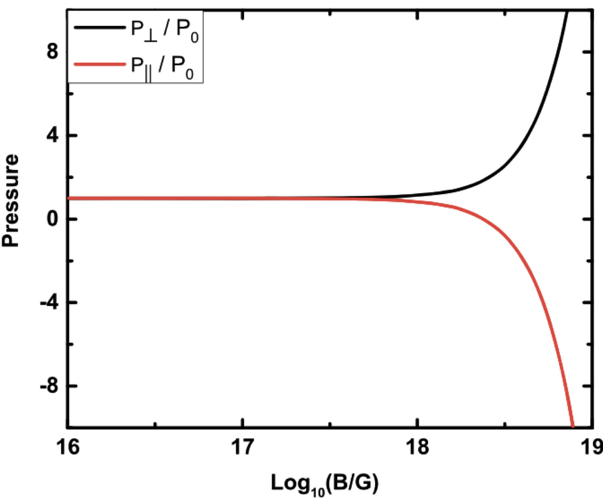

>
The neutron star is the most well known compact object in the Universe. It has several macroscopic properties such as mass (M), radius (R), compactness (C), tidal deformability (Λ), and moment of inertia (I), which can be observed using different telescopes and terrestrial detectors. Some of them have already been measured, and others can be done soon. However, there is another way to obtain the magnitude of such properties, which are difficult to measure using just observational techniques. One such way to do it is with the help of a universal relation between those properties. This article discusses one such relation known as I-Love-C for the anisotropic neutron star.
>
---

# Introduction
Different stars are formed in a process called supernovae. It is mainly of two types: (i) Type-I and Type-II. A Type-I supernova occurs when a white dwarf, a dense remnant of a star, accumulates enough mass to reach a critical limit. This results in a sudden and complete explosion without any remaining stellar core. Type I supernovae do not involve the collapse of the core. However, Type-II supernovae occur when massive stars, typically at least eight times the mass of our Sun, reach the end of their life cycles. The core of the star collapses under its own gravity, leading to a massive explosion. Type-II supernovae are characterized by the presence of a collapsed core. Mainly, neutron stars (NS) and black holes are formed in this type. 

After the formation of the NS, having its temperature of ~1014 K, it emits very high energy thermal photons and neutrinos, which cools the NS very fast, and its final temperature comes  to ~ 109 − 1011 K. The internal composition of the NS is much more complex (see Fig. 1), which requires different areas of expertise such as nuclear physics, astrophysics, high energy physics, etc. It is a unique place in the Universe where four fundamental forces meet.

Besides their structural compositions, there are some exotic phenomena that happen, as mentioned in the following:

- **Hyperons Production**: Inside NSs, the intense pressure and density cause some of the building blocks of matter called “hyperons” to form. These hyperons are like exotic cousins of protons and neutrons (<a href="https://iopscience.iop.org/article/10.1088/1742-6596/668/1/012031" target="_blank"> reference</a>).

- **Kaon Condensation**: NSs have so much matter squeezed into a tiny space that it can cause particles called “kaons” to clump together, creating a kind of condensed state.

- **Phase Transitions (Nucleon to Quarks)**: Deep inside neutron stars, the pressure is so extreme that protons and neutrons can change into even smaller particles called “quarks.” 

- **Very High Magnetic Fields (1017 − 1019 G)**: Neutron stars have insanely powerful magnetic fields because they are the remnants of massive stars that collapsed. These fields are billions of times stronger than Earth's magnetic field.

Due to those processes, the difference arises between the magnitude of radial (P||) and tangential (P⟂) pressure in the local region inside the star (see Fig. 1). Therefore, it is defined as the pressure anisotropy inside the star is a more realistic case than the isotropic one. In this article, we discuss the properties of such compact objects having anisotropic pressure inside their core.

  

Figure 1: Schematic figure for the neutron star. It is taken from this <a href="https://www.astro.umd.edu/~miller/Images/NStarInt.jpeg" target="_blank"> URL</a>.

  

Figure 2: Variation of pressure (scaled with the no-field value P0) in directions parallel and perpendicular to the magnetic field at 4 times nuclear saturation density. This image is taken from the <a href="https://iopscience.iop.org/article/10.3847/1538-4357/aba8fc" target="_blank"> ApJ 900, 49 (2020)</a>.

The properties such as mass (M), radius (R), compactness (C), <a href="https://www.ligo.org/science/Publication-GW170817ModelSelection/index.php" target="_blank"> tidal deformability (Λ)</a>, and <a href="https://articles.adsabs.harvard.edu/pdf/1994ApJ...424..846R" target="_blank"> moment of inertia (I)</a> of a star mainly depend on both internal compositions and processes that happen inside of it. One such relation, which takes into account all of these properties, is called the equation of state (EOS) of a star. The EOS is the main ingredient to obtain the magnitude of these properties of the anisotropic NS, and it depends on the model. Therefore, physicists around the globe are always trying to find a good EOS that includes all interactions and satisfies the various observational constraints available to date. However, work is still going in this direction.

Different observations have been done by various telescopes in space (like <a href="https://www.et-gw.eu" target="_blank"> Einstein telescope</a>, <a href="https://www.elisascience.org" target="_blank"> LISA</a>), and the detectors on Earth (such as  <a href="https://www.ligo.caltech.edu" target="_blank"> LIGO</a>/<a href="https://www.virgo-gw.eu" target="_blank"> Virgo</a>), etc. Using the <a href="https://doi.org/10.1051/0004-6361/201015532" target="_blank"> pulsar measurement data</a> one can estimate both the mass and radius of the star. Gravitational wave measurements by <a href="https://www.ligo.caltech.edu" target="_blank"> LIGO</a>/<a href="https://www.virgo-gw.eu" target="_blank"> Virgo</a>/<a href="https://gwcenter.icrr.u-tokyo.ac.jp/en/" target="_blank"> KAGRA</a> have in turn  measured the tidal deformability, which directly puts constraints on the EOS of the NS. However, the moment of inertia of the NS is still unobserved. Therefore, scientists looked for another way to estimate the moment of inertia of the NS with the help of the “Universal relation”.

# Methodology and Results
In literature, there are several universal relations (URs) already proposed. The URs are <a href="https://journals.aps.org/prd/abstract/10.1103/PhysRevD.88.023009#:~:text=On%20a%20gravitational%2Dwave%20front,large%20signal%2Dto%2Dnoise%20ratio" target="_blank"> I−Love−Q</a>, <a href="https://journals.aps.org/prd/abstract/10.1103/PhysRevD.101.124006" target="_blank"> I−Love−C</a>, <a href="http://dx.doi.org/10.1103/PhysRevD.90.124023" target="_blank"> I − f − C</a>, etc. The URs that have been obtained between any two properties are mainly EOS-independent, i.e., they do not depend on the internal structure mechanism. Therefore, if we find any of the quantities from observation, we can estimate the magnitude of the other one with the help of the corresponding UR.

The UR between the moment of inertia (Ī = I/M3) and tidal deformability (Λ) is shown in Fig. 1. To get a relationship between them, we fit these data with the equation given in the following:

  

  

Figure 3: Ī − Λ relation is shown for different values of anisotropy parameter λBL = 0 for 60 EOSs. The orange dashed line is fitted using the Eq. (1). The magenta-shaded region is the tidal deformability observational data taken from the GW170817 (Λ = 70 − 580). The lower panel is the residuals for the fitting calculated using the formula in Eq. (2). The figure is taken from <a href="https://ui.adsabs.harvard.edu/abs/2022PhRvD.106j3518D/abstract" target="_blank"> Phys.Rev.D 106 (2022) 10, 103518</a>. 

and the coefficients are a0(10−1, a1(10−2), a2(10−2)), a3(10−3), and a4(10−4) are 7.5026, 4.1857, 8.0495, -8.9478, and 5.4767 respectively. The residuals in the lower panel of the figure are computed with the formula:

  

where 𝛘r2 the reduced chi-squared error is defined as equal to the ratio of the observed experimental variance divided by the theoretical variance.

# Methodology and Results
In 2017, the LIGO/Virgo detected the gravitational waves from the merger of the two binary NSs. They inferred the tidal deformability value in the range of 70 to 580. We estimated the value of the moment of inertia (Ī1.4 = 1.77-0.09+0.17 × 1045 g cm2) with the help of the LIGO/Virgo data by inserting the value in Eq. 1. In this case, we choose the NS with no anisotropic pressure. However, one can estimate the value of the moment of inertia for different values of anisotropy inside the star.

# Conclusion
In conclusion, we calculated some macroscopic properties of the anisotropic NS with different models. We choose the different degrees of anisotropy inside the star with the help of the BL-model. The universal relation is studied in between the moment of inertia and the tidal deformability of the star. With the help of the GW170817 tidal deformability data, we estimated the magnitude of the moment of inertia for the star. Like the moment of inertia, one can also estimate the magnitude of other properties, such as compactness (mass/radius), frequency of the oscillations, etc., with the help of other URs that are not detectable by the detectors. Therefore, the URs are very crucial, which help us to study the different properties of the star. 

---

**Original paper:**
<a href="https://ui.adsabs.harvard.edu/abs/2022PhRvD.106j3518D/abstract" target="_blank">I-Love-C relation for an anisotropic neutron star</a>

**First Author:**  H. C. Das

**First author’s Institution:** 1) Institute of Physics, Bhubaneswar,India 2) Homi Bhabha National Institute, Mumbai, India

<noscript>Please enable JavaScript to view the <a href="https://disqus.com/?ref_noscript">comments powered by Disqus.</a></noscript>

